# 存储学习合集 🗄️（资深级别）

> 系统梳理 **MySQL / Redis** 等存储组件的核心面试知识，**资深级别**——讲透原理、底层数据结构、日志与并发控制、缓存实战与集群方案，不停留在命令用法。**一个存储产品一个文件夹，一个知识点一个 md，按顺序编号**。基准 MySQL 8.0（InnoDB）/ Redis 7.x。

姊妹项目：[`java-learning`](../java-learning) · [`jvm-learning`](../jvm-learning) · [`spring-learning`](../spring-learning) · [`jdk-learning`](../jdk-learning)。

---

## 一、产品总览

| 产品 | 类型 | 面试重点 | 目录 |
|---|---|---|---|
| **MySQL** | 关系型数据库（磁盘） | 索引 B+树、事务与 MVCC、锁、redo/undo/binlog、主从、分库分表 | [`mysql`](mysql) |
| **Redis** | 内存 KV / 缓存 | 数据结构、持久化、过期淘汰、缓存三大问题、分布式锁、哨兵/Cluster | [`redis`](redis) |

> 结构可扩展：将来可加 `elasticsearch/`、`mongodb/`、`kafka/` 等同级目录。每个产品目录下有自己的 `README.md`（知识点索引 + 学习路线）。

---

## 二、知识地图

```mermaid
graph TD
    subgraph MySQL
      M1[架构 & 执行流程] --> M2[InnoDB & Buffer Pool]
      M2 --> M3[索引 B+树/回表]
      M3 --> M4[事务/隔离/MVCC]
      M4 --> M5[锁 & 死锁]
      M5 --> M6[redo/undo/binlog<br/>两阶段提交]
      M6 --> M7[主从复制/分库分表/高可用]
    end
    subgraph Redis
      R1[为什么快<br/>单线程/IO多路复用] --> R2[数据类型 & 底层结构]
      R2 --> R3[持久化 RDB/AOF]
      R3 --> R4[过期 & 内存淘汰]
      R4 --> R5[缓存三大问题<br/>穿透/击穿/雪崩]
      R5 --> R6[一致性 & 分布式锁]
      R6 --> R7[主从/哨兵/Cluster]
    end
```

---

## 三、资深面试冲刺路线

- **MySQL 必考手撕原理**：一条 SQL 的执行流程、B+树为什么/回表与覆盖索引、索引失效场景、MVCC（ReadView + undo 版本链）、RR 如何用 Next-Key Lock 解决幻读、redo+binlog 两阶段提交、主从延迟成因与解决。
- **Redis 必考手撕原理**：为什么快（内存/单线程/IO 多路复用/高效结构）、跳表 vs B+树、RDB fork+COW、AOF 重写、过期删除 + 8 种淘汰策略、缓存穿透/击穿/雪崩解法、缓存与 DB 一致性（Cache Aside/延迟双删/binlog 订阅）、分布式锁（Redlock/Redisson 看门狗）、Cluster 16384 槽与重定向。

---

## 四、常考"存储选型 & 场景题"

1. 什么时候用 Redis 缓存？如何保证缓存与数据库一致性？
2. 亿级数据如何分页？深分页怎么优化？
3. 分库分表后的全局 ID、跨库 JOIN、分布式事务怎么解决？
4. 秒杀/热点 key 场景怎么扛？大 key 如何治理？
5. MySQL 主从延迟导致读到旧数据怎么办？

> 规范见 [`_CONVENTIONS.md`](_CONVENTIONS.md)。
