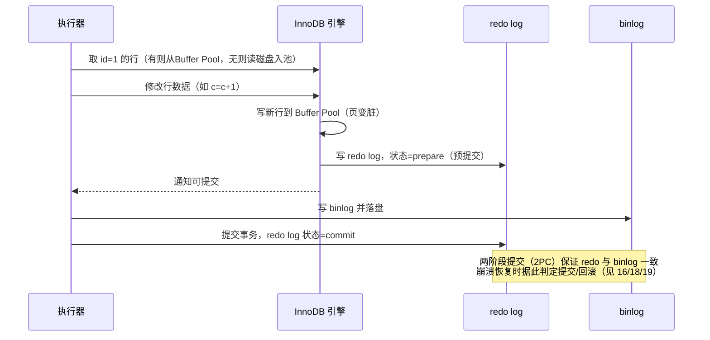

# 01 · MySQL 逻辑架构与执行流程（Architecture & Query Execution）

> MySQL 分「连接层 / Server 层 / 存储引擎层」三层；一条 SQL 要穿过连接器→分析器→优化器→执行器再到引擎。面试重要度 ⭐⭐⭐（几乎必问「一条 SQL 是怎么执行的」）。

## 📖 核心原理

MySQL 最大的架构特点是 **Server 层与存储引擎层分离**：Server 层负责连接管理、SQL 解析、优化、执行、内置函数、以及所有跨引擎的通用能力（如 binlog）；存储引擎层以**插件式**提供数据的存储与读写（InnoDB / MyISAM / Memory…），通过统一的 **Handler API** 与 Server 层对接。这种分层让「一套 SQL 语法适配多种存储引擎」成为可能，也解释了为什么 binlog 在 Server 层（所有引擎通用），而 redo log 在 InnoDB 层（引擎私有）。

**连接层**：负责客户端连接、认证、权限校验、线程管理。MySQL 为每个连接分配一个线程（默认 thread-per-connection），可用线程池插件复用。连接建立后权限就固定了，中途 `GRANT` 不影响已建立的连接。长连接能省去握手开销，但会累积内存（连接对象、临时结果集），需靠定期 `mysql_reset_connection` 或断连来释放。

**Server 层**核心组件：
- **连接器（Connector）**：管理连接、校验账号密码与权限。
- **查询缓存（Query Cache）**：把 SQL 文本与结果做 KV 缓存。因为「任意写都会清空整表相关缓存」导致命中率极低、维护成本高，**MySQL 8.0 已彻底移除**（5.7 起默认关闭）。
- **分析器（Parser）**：词法分析（识别关键字、表名列名）+ 语法分析（构建语法树、检查语法合法性）。此阶段报「You have an error in your SQL syntax」。
- **优化器（Optimizer）**：基于**成本模型（cost-based）** 决定索引选择、多表 JOIN 顺序、是否用临时表/排序等，产出执行计划。
- **执行器（Executor）**：先做权限校验（是否有该表的读写权限），再按执行计划调用存储引擎的 Handler API 逐行取数、过滤、聚合。

**存储引擎层**：真正读写磁盘/内存数据，管理 Buffer Pool、索引 B+树、事务与锁（InnoDB）。执行器与引擎之间以「一行一行」的接口交互，`rows_examined` 就是执行器向引擎要了多少行。

## 🔄 原理图 / 流程剖析

**一条 SELECT 的执行流程（MySQL 8.0）：**

```mermaid
flowchart TD
    C[客户端] -->|建立连接/认证/权限| CN[连接器 Connector]
    CN --> QC{查询缓存<br/>8.0 已移除}
    QC -.5.7及以前.-> HIT[命中则直接返回]
    QC -->|8.0 直接跳过| P[分析器 Parser<br/>词法+语法分析→语法树]
    P --> O[优化器 Optimizer<br/>选索引/定 JOIN 顺序/成本估算]
    O --> E[执行器 Executor<br/>权限校验→调用引擎接口]
    E -->|Handler API 逐行读取| SE[存储引擎 InnoDB<br/>Buffer Pool / B+树 / 事务锁]
    SE -->|返回行| E
    E -->|结果集| C
```

**一条 UPDATE 的执行流程（为后续日志章节铺垫）：**



UPDATE 相比 SELECT 多了「更新 Buffer Pool 脏页 + 写 redo（WAL，先写日志后刷盘）+ 写 binlog + 两阶段提交」。这是理解 crash-safe 的入口。

## 🔑 面试要点

- **三层架构**：连接层（连接/认证/线程）、Server 层（分析器/优化器/执行器/binlog）、存储引擎层（数据读写/事务/锁），Server 与引擎通过 **Handler API** 解耦，引擎**插件式**可插拔。
- **8.0 移除查询缓存**：因写操作会失效整表缓存，命中率低、反成负担；不要在面试里说 8.0 还会走查询缓存。
- **分析器 vs 优化器**：分析器管「语法对不对、表列存不存在」，优化器管「怎么执行更快（选哪个索引、JOIN 顺序）」。
- **优化器是 cost-based**：可能选错索引（统计信息不准时），可用 `FORCE INDEX`、`ANALYZE TABLE` 更新统计、或改写 SQL 干预。
- **执行器在优化器之后做权限校验**：所以「有语法/优化但无权限」的错误在执行阶段报。
- **redo 在引擎层、binlog 在 Server 层**：这是「为什么需要两阶段提交」的根因——两份日志要保持逻辑一致。

## ❓ 高频面试题

**Q：说一下一条 SELECT 语句在 MySQL 内部的完整执行流程。**
A：客户端经连接器完成 TCP 连接、认证与权限获取；8.0 直接跳过（5.7 前会查）查询缓存；分析器做词法+语法分析生成语法树并校验表/列；优化器基于成本模型选择索引、确定多表连接顺序、决定是否用临时表或排序，生成执行计划；执行器先做表级权限校验，再按计划调用存储引擎 Handler API 逐行读取、过滤、聚合，最终把结果集返回客户端。要点是「Server 层与引擎层分离、逐行交互」。

**Q：为什么 MySQL 8.0 要移除查询缓存？**
A：查询缓存以 SQL 文本为 key 缓存结果，一旦表有任何写入（INSERT/UPDATE/DELETE/DDL），该表相关缓存全部失效。对写多或大表场景命中率极低，反而带来加锁和失效维护开销，弊大于利，因此 5.7 默认关闭、8.0 彻底删除。高频更新的表尤其不适合，缓存收益几乎为零。

**Q：UPDATE 和 SELECT 在执行流程上有什么关键不同？**
A：SELECT 只走「读」路径，逐行取数返回。UPDATE 在执行器修改数据后，会更新 Buffer Pool 里的数据页（页变脏），并遵循 WAL 先写 redo log（prepare 状态），再写 binlog，最后提交 redo（commit 状态），即**两阶段提交**，以保证崩溃后 redo 与 binlog 一致、可 crash-safe 恢复。

## ⚠️ 易错点 / 加分项

- **误区**：以为查询缓存能加速普通查询——8.0 根本没有它；聊优化别提查询缓存。
- **加分**：点明「插件式存储引擎 + Handler API」是 Server/引擎分离的关键抽象，也是 binlog（Server 层，跨引擎）与 redo（InnoDB 私有）分处不同层的根因。
- **加分**：分析器只保证语法/对象存在，语义/性能问题（索引选择）归优化器；能把「报错阶段」对应到具体组件（语法错→分析器、无权限→执行器）显专业。
- **坑**：长连接会导致 Server 层内存持续上涨（连接对象、临时表），生产上要限制连接寿命或用 `mysql_reset_connection` 重置资源而非重连（重连要重新认证）。
- **加分**：优化器选错索引时的干预手段（`ANALYZE TABLE` 重算统计、`FORCE INDEX`、优化器提示 `/*+ INDEX(...) */`、直方图）能体现实战深度。
