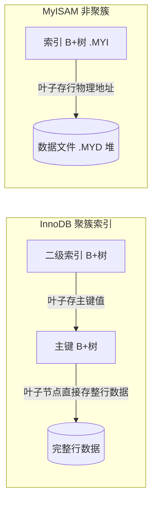

# 02 · 存储引擎（Storage Engines：InnoDB vs MyISAM）

> 存储引擎是「插件式」的数据读写实现，InnoDB 支持事务/行锁/外键/崩溃恢复且索引即数据（聚簇），是 8.0 唯一合理选择。面试重要度 ⭐⭐（对比题常考）。

## 📖 核心原理

存储引擎决定「数据在磁盘/内存里怎么组织、怎么加锁、是否有事务与崩溃恢复」。MySQL 支持多种引擎（InnoDB、MyISAM、Memory、Archive、CSV、NDB 等），但生产场景 99% 是 **InnoDB**。引擎是**表级别**的：`CREATE TABLE ... ENGINE=InnoDB`，同库不同表可用不同引擎（不推荐混用，跨引擎无法保证事务）。

**InnoDB** 的核心能力：
- **事务（Transaction）**：完整支持 ACID，通过 redo/undo/MVCC/锁实现；默认隔离级别 RR。
- **行级锁**：并发写只锁涉及的行（配合 MVCC 读写不阻塞），高并发写性能远优于表锁。
- **外键（Foreign Key）**：唯一原生支持外键约束的常用引擎。
- **崩溃恢复（Crash Recovery）**：基于 redo log（WAL），异常宕机后能恢复到一致状态。
- **聚簇索引（Clustered Index）**：数据行**就存在主键 B+树的叶子节点**，「索引即数据」，主键查询无需回表。

**MyISAM** 的特点（8.0 已边缘化）：
- **不支持事务、不支持外键**，崩溃后可能表损坏需 `REPAIR TABLE`。
- **表级锁**：任何写操作锁整张表，读写互斥，高并发写是灾难。
- **非聚簇（堆表 + 独立索引）**：索引叶子存的是数据行的物理地址（行指针），数据与索引分离存于 `.MYD`/`.MYI`。
- 维护了 **row count**，`SELECT COUNT(*)`（无 WHERE）是 O(1)；早期在只读/全文检索场景有一席之地。

**为什么 8.0 默认且几乎只用 InnoDB**：现代业务普遍需要事务与高并发写，InnoDB 的行锁 + MVCC 提供高并发，redo log 保证 crash-safe，聚簇索引让主键查询极快；MySQL 5.5 起默认引擎就从 MyISAM 换成 InnoDB，8.0 更是把系统表（数据字典）也改为 InnoDB 存储（`mysql` 库表），MyISAM 基本退场。

## 🔄 原理图 / 流程剖析

**InnoDB vs MyISAM 核心对比：**

| 维度 | InnoDB | MyISAM |
|---|---|---|
| 事务 | ✅ 支持 ACID（redo/undo/MVCC） | ❌ 不支持 |
| 锁粒度 | **行级锁** + 表锁（并发写强） | **表级锁**（写并发差） |
| 外键 | ✅ 支持 | ❌ 不支持 |
| 崩溃恢复 | ✅ redo log crash-safe | ❌ 可能损坏，需 REPAIR |
| 索引结构 | **聚簇索引**（数据存于主键叶子） | 非聚簇（叶子存行地址） |
| 数据文件 | `.ibd`（表空间，索引+数据一体） | `.MYD` 数据 + `.MYI` 索引 |
| COUNT(*) 无条件 | 需扫描（8.0 有并行/缓存优化） | O(1)（维护了行数） |
| MVCC | ✅ 支持，读写不阻塞 | ❌ 无 |
| 全文索引 | ✅ 5.6+ 支持 | ✅ 支持 |
| 适用场景 | 绝大多数 OLTP 事务型业务 | 只读/日志归档（现已淘汰） |

**存储结构差异（聚簇 vs 非聚簇）：**

InnoDB 二级索引叶子存**主键值**（需回表到主键树取整行），MyISAM 索引叶子统一存**行地址**（主键索引与二级索引结构对称，都指向 `.MYD`）。

## 🔑 面试要点

- **InnoDB 四大优势**：事务、行锁、外键、崩溃恢复（redo log）；再加聚簇索引「索引即数据」。
- **MyISAM 是表锁 + 无事务 + 崩溃易损**，只在纯只读、极简场景有历史价值，8.0 里连系统字典表都改用 InnoDB。
- **聚簇索引含义**：InnoDB 数据行随主键 B+树叶子存放，主键查一次到位；二级索引查询要「回表」。
- **COUNT(\*) 差异**：MyISAM 维护行数返回极快，InnoDB 因 MVCC（不同事务可见行数不同）无法维护单一计数，需扫描（可用二级索引扫更快）。
- **选型结论**：需要事务/高并发写/外键/崩溃恢复→InnoDB；这几乎覆盖所有现代业务，所以默认 InnoDB。

## ❓ 高频面试题

**Q：InnoDB 和 MyISAM 的核心区别是什么？**
A：四个关键差异：① 事务——InnoDB 支持 ACID，MyISAM 不支持；② 锁——InnoDB 行锁并发写强，MyISAM 表锁写并发差；③ 崩溃恢复——InnoDB 有 redo log 可 crash-safe，MyISAM 崩溃可能损坏需修复；④ 索引组织——InnoDB 是聚簇索引（数据存主键叶子、二级索引需回表），MyISAM 非聚簇（索引叶子存行地址、数据与索引分离）。此外 InnoDB 支持外键和 MVCC。结论：现代 OLTP 业务用 InnoDB。

**Q：为什么 MyISAM 的 `SELECT COUNT(*)` 比 InnoDB 快，InnoDB 怎么优化？**
A：MyISAM 把总行数直接存在元信息里，无 WHERE 的 COUNT(\*) 是 O(1)。InnoDB 因 MVCC，不同事务看到的有效行数不同，无法维护统一计数，必须实时统计；优化上 InnoDB 会选择**最小的二级索引**做全扫描（比扫聚簇索引的整行数据快），8.0 还支持并行读聚簇索引。若业务需要精确高频计数，可用单独的计数表 + 事务维护，或近似值 `SHOW TABLE STATUS` 的 rows（估算值）。

**Q：为什么 8.0 默认用 InnoDB？**
A：现代业务普遍需要事务、高并发写、崩溃恢复。InnoDB 的行锁 + MVCC 让读写不互相阻塞、并发写只锁涉及行；redo log 保证宕机可恢复；聚簇索引让主键点查/范围查极快。MyISAM 的表锁和无事务无法满足 OLTP。因此 5.5 起默认改 InnoDB，8.0 更把数据字典也迁到 InnoDB。

## ⚠️ 易错点 / 加分项

- **误区**：说「MyISAM 查询一定比 InnoDB 快」——只在无索引全表扫或无并发的只读场景才可能，且早已被 InnoDB Buffer Pool 抹平；有并发写时 MyISAM 表锁反而更慢。
- **加分**：指出 8.0 连 `mysql` 系统库的数据字典表都换成 InnoDB（引入事务型数据字典），是 InnoDB 彻底成为主线的标志。
- **坑**：混用引擎会破坏事务——同一事务里操作 InnoDB 表和 MyISAM 表，MyISAM 的改动**不会回滚**。
- **加分**：能说清「InnoDB 二级索引叶子存主键值（回表），MyISAM 索引叶子存行地址」这一结构差异，直接关联到回表与索引设计。
- **坑**：InnoDB 表若无显式主键，会用第一个非空唯一索引，否则生成隐藏的 6 字节 `DB_ROW_ID` 作聚簇键——所以建表最好显式定义自增主键。
