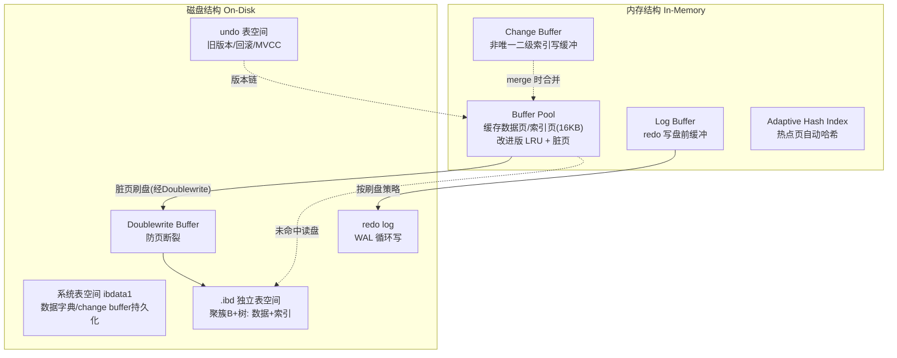

# 03 · InnoDB 体系架构（InnoDB Architecture）

> InnoDB = 内存结构（Buffer Pool / Change Buffer / Log Buffer / 自适应哈希）+ 磁盘结构（系统表空间 / 独立表空间 / redo / undo），WAL 把随机写变顺序写。面试重要度 ⭐⭐⭐（原理全景题）。

## 📖 核心原理

InnoDB 的架构可以拆成**内存（In-Memory Structures）** 和**磁盘（On-Disk Structures）** 两大块，中间用 **WAL（Write-Ahead Logging，预写日志）** 串起来：数据修改先改内存页并顺序写 redo log，脏页异步刷回磁盘，从而把「随机写数据页」转化为「顺序写日志 + 后台批量刷盘」，这是 InnoDB 高性能的根基。

**内存结构：**
- **Buffer Pool（缓冲池）**：最核心的内存区，缓存表数据页和索引页（默认页 16KB），读写都先走它。命中则不碰磁盘。用改进版 LRU 管理，脏页由后台线程刷盘。参数 `innodb_buffer_pool_size`（生产常设物理内存 50%~80%），可分多个实例 `innodb_buffer_pool_instances` 降锁竞争。详见 [04](04-buffer-pool.md)。
- **Change Buffer（变更缓冲）**：针对**非唯一二级索引**的写（INSERT/UPDATE/DELETE），当目标页不在 Buffer Pool 时，先把变更缓存下来，等该页因读被载入时再合并（merge），避免每次都随机读盘。唯一索引因需即时判重不能用。是 5.x 的 Insert Buffer 的泛化。
- **Log Buffer（日志缓冲）**：redo log 写盘前的内存缓冲，按 `innodb_flush_log_at_trx_commit` 策略刷到 redo log 文件；大事务调大 `innodb_log_buffer_size` 可减少刷盘次数。
- **Adaptive Hash Index（自适应哈希索引，AHI）**：InnoDB 监控热点索引页访问，自动为频繁访问的等值查询建立**哈希索引**，把 B+树的多次比较变成一次哈希定位。由引擎自动管理，`innodb_adaptive_hash_index` 控制开关（热点集中时提升明显，热点分散或频繁变更时可能反成负担）。

**磁盘结构：**
- **系统表空间（System Tablespace，`ibdata1`）**：存放数据字典（8.0 前）、双写缓冲（Doublewrite，8.0 起独立成 `#ib_16384_*.dwr` 文件）、change buffer 的持久化部分等。
- **独立表空间（File-Per-Table，`.ibd`）**：`innodb_file_per_table=ON`（默认）时每张表一个 `.ibd`，存该表的数据 + 索引（聚簇 B+树）；便于单表回收空间（`DROP`/`TRUNCATE` 直接删文件）。
- **通用表空间 / undo 表空间 / 临时表空间**：通用表空间可多表共享；undo 8.0 起默认独立成 undo 表空间可回收；临时表空间存放临时表和排序中间结果。
- **redo log**：`#innodb_redo/` 下的日志文件（8.0.30 前是 `ib_logfile0/1`），循环写，WAL 的落地，保证 crash-safe。见 [16](16-redo-log.md)。
- **undo log**：存旧版本数据，服务事务回滚与 MVCC 版本链；逻辑上属于 undo 表空间。见 [17](17-undo-log.md)。
- **Doublewrite Buffer（双写缓冲）**：刷脏页前先把页顺序写到 doublewrite 区，再写到真正位置，防止「页写一半」（partial page write）的坏页——因为 OS 4KB 与 InnoDB 16KB 页不对齐，宕机可能写坏页，redo 无法修复坏页，故需 doublewrite 兜底。

## 🔄 原理图 / 流程剖析

**InnoDB 体系架构全景：**

**WAL 写路径（为什么快）：** 修改数据 → 改 Buffer Pool 页（内存，快）→ 顺序写 redo（Log Buffer→redo file，顺序 IO）→ 事务提交返回 → 脏页由后台线程择机批量刷回 `.ibd`（随机 IO 但异步）。用户请求的关键路径上没有随机写数据页，这就是「WAL 把随机写变顺序写」。

## 🔑 面试要点

- **两大块 + WAL**：内存（Buffer Pool/Change Buffer/Log Buffer/AHI）+ 磁盘（系统表空间/独立表空间/redo/undo/doublewrite），WAL 先写日志、异步刷脏页。
- **Buffer Pool 是心脏**：所有数据读写都过它，命中率决定性能；生产设物理内存 50%~80%。
- **Change Buffer 只服务非唯一二级索引写**：唯一索引要即时判重必须读页，用不了。写多读少的表收益大；也可能拉长崩溃恢复。
- **redo vs undo**：redo 记「页的物理修改」用于 crash 后重放（persistence）；undo 记「旧版本」用于回滚 + MVCC（atomicity + 一致性读）。
- **Doublewrite 解决 partial page write**：redo 是物理逻辑日志、无法修复「写了一半的坏页」，故需 doublewrite 先备份完整页。
- **AHI 自动管理**：对热点等值查询把 B+树查找变哈希查找，不需人工建。

## ❓ 高频面试题

**Q：InnoDB 的内存结构有哪些？各自作用？**
A：① Buffer Pool——缓存数据页/索引页，读写都先走它，用改进版 LRU 管理脏页；② Change Buffer——缓存非唯一二级索引的写，待页被读入时 merge，减少随机读盘；③ Log Buffer——redo log 写盘前的缓冲，按刷盘策略落 redo 文件；④ Adaptive Hash Index——为热点等值查询自动建哈希索引，加速定位。核心是 Buffer Pool，其余都是围绕它的性能优化。

**Q：Change Buffer 的作用和限制？什么场景收益大？**
A：作用是把「命中不到 Buffer Pool 的非唯一二级索引写」缓存起来，等目标页因查询被读入内存时再合并，把多次随机读盘合并成一次，提升写性能并减少 IO。限制是**只适用于非唯一二级索引**——唯一索引写入必须立刻读页判断是否冲突，无法缓冲。收益大的场景：写密集、二级索引多、且这些页短期内不会被立刻查询的表（如日志类）。副作用：未 merge 的 change buffer 会拉长崩溃恢复时间，且占用 Buffer Pool 空间。

**Q：为什么有了 redo log 还需要 Doublewrite Buffer？**
A：redo log 记录的是「对某页做了什么物理逻辑修改」，它依赖页本身是完好的。若刷脏页时发生「页写一半」（InnoDB 页 16KB，OS/磁盘按更小单位写，宕机可能只写入部分），这个页已经损坏，redo 在损坏页上重放没有意义、无法修复。Doublewrite 让脏页先顺序写到一块共享的 doublewrite 区（这次写坏了原页还在），再写到真实位置；恢复时若发现真实页损坏，就用 doublewrite 里的完整副本还原，再应用 redo。这是保证 crash-safe 的重要一环。

## ⚠️ 易错点 / 加分项

- **误区**：把 redo 当成「能修一切」——它修不了物理断裂的页，那是 doublewrite 的职责；两者配合才 crash-safe。
- **加分**：说清 WAL 的本质是「随机写 → 顺序写 + 异步刷脏」，redo 顺序写是性能关键，而不是「日志本身让数据更安全」这么笼统。
- **坑**：`innodb_file_per_table` 关闭时所有表挤在 `ibdata1`，删表不回收空间且文件无限膨胀，生产务必保持默认开启。
- **加分**：Change Buffer 在 SSD 上收益下降（随机读盘代价小），且崩溃恢复时要 merge 全部 change buffer，超大 change buffer 会让恢复变慢，可按业务权衡 `innodb_change_buffer_max_size`。
- **加分**：AHI 在热点分散或 DDL 频繁的负载下可能因维护哈希表反而降速，出现 `btr_search_latch` 竞争时可考虑关闭——体现调优经验。
