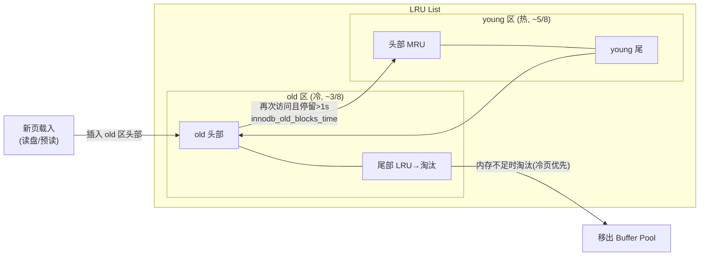
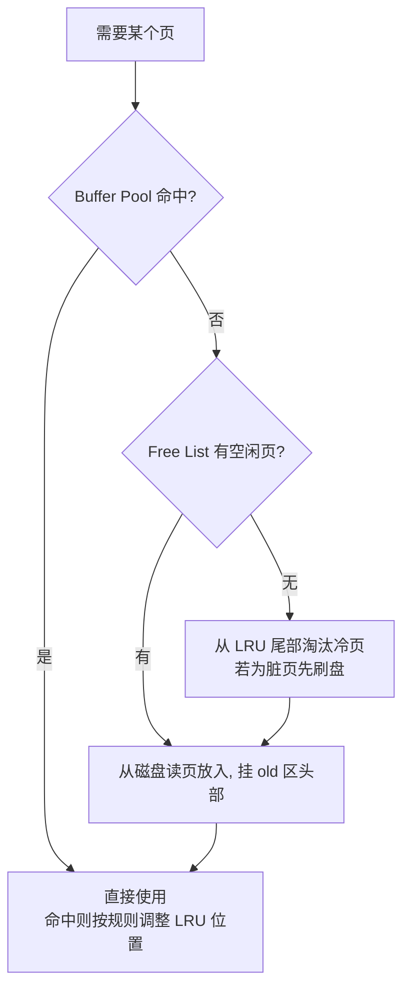

# 04 · Buffer Pool（缓冲池与改进版 LRU）

> Buffer Pool 是 InnoDB 的内存缓存核心，用「young/old 分区的改进版 LRU」抗住预读失效和缓冲池污染，脏页由后台异步刷盘。面试重要度 ⭐⭐⭐（原理深挖题）。

## 📖 核心原理

InnoDB 以**页（Page，默认 16KB）** 为磁盘与内存交换的最小单位。Buffer Pool 就是一大块内存，按页缓存数据页和索引页；任何读写都先在 Buffer Pool 里进行，命中就不碰磁盘，未命中才从 `.ibd` 读页载入。它是决定 MySQL 性能的最关键内存区，`innodb_buffer_pool_size` 生产上常设为物理内存的 50%~80%。

**三大管理链表：**
- **Free List（空闲链表）**：管理当前空闲、可直接分配的缓存页（帧）。载入新页时从这里取。
- **LRU List（最近最少使用链表）**：管理已缓存页的冷热顺序，内存不够时从冷端淘汰。
- **Flush List（脏页链表）**：被修改过、与磁盘不一致的页（脏页）挂在这里，等待后台线程按顺序刷盘。一个页可能同时在 LRU 和 Flush 链表上。

**为什么不用朴素 LRU**：如果直接用「访问就挪到头部、淘汰尾部」，会有两个致命问题：
1. **预读失效（Read-Ahead）**：InnoDB 有预读机制（线性预读 `innodb_read_ahead_threshold`、随机预读），会一次性把相邻页也载入。若预读的页最终没被访问，朴素 LRU 会让它们占据头部，把真正的热点页挤到尾部淘汰。
2. **缓冲池污染（Buffer Pool Pollution）**：一条 `SELECT * FROM big_table`（全表扫描）会把海量只用一次的页塞进 Buffer Pool 头部，瞬间冲刷掉长期热点数据，命中率暴跌。

**改进版 LRU（young/old 两段式）** 解决之：把 LRU 链表按比例分成 **young 区（热数据，约 5/8）** 和 **old 区（冷数据，约 3/8，由 `innodb_old_blocks_pct` 控制，默认 37%）**。
- **新页先插到 old 区头部**，而不是整个链表头部——这样预读但没被用的页只污染 old 区，很快被淘汰，不影响 young 区热点。
- **old 区的页再次被访问时，要满足「停留时间超过 `innodb_old_blocks_time`（默认 1000ms）」才提升到 young 区头部**。全表扫描时同一页在极短时间内被连续访问（一页有多行），但停留不足 1 秒，不会升入 young，扫描结束后从 old 区淘汰，从而**保护 young 区热点不被污染**。
- young 区内部还做了优化：只有访问的页处于 young 区**后 1/4** 之后才移到头部，避免频繁移动链表头的开销。

**脏页与刷盘**：修改页后页变脏（挂 Flush List），并不立即写盘（WAL 保证 redo 已落盘即安全）。后台由 Page Cleaner 线程在以下时机刷脏：redo log 快写满（推进 checkpoint）、脏页比例超 `innodb_max_dirty_pages_pct`（默认 90%，可调低平滑 IO）、系统空闲、正常关库（`innodb_fast_shutdown`）。刷盘经 Doublewrite 防页断裂。刷盘节奏由 `innodb_io_capacity` 控制。

**Change Buffer**：见 [03](03-innodb-architecture.md)，针对非唯一二级索引的写做缓冲合并，本质也是减少随机读盘。

## 🔄 原理图 / 流程剖析

**改进版 LRU（young/old 分区）：**

**读取一个页的决策流程：**

## 🔑 面试要点

- **Buffer Pool 缓存单位是页（16KB）**，三链表：Free（空闲）、LRU（冷热淘汰）、Flush（脏页待刷）。
- **改进版 LRU = young/old 两段**：新页进 old 头部；old 页需「再次访问 + 停留超 `innodb_old_blocks_time`」才升 young。
- **解决两个问题**：old 区隔离**预读失效**页；停留时间门槛隔离**全表扫描造成的缓冲池污染**，保护 young 热点。
- **脏页不立即刷盘**：WAL 下 redo 已落盘即可恢复，脏页由 Page Cleaner 异步批量刷（checkpoint 推进 / 脏页超阈值 / 空闲 / 关库），经 Doublewrite。
- **调优参数**：`innodb_buffer_pool_size`（内存 50%~80%）、`innodb_buffer_pool_instances`（多实例降锁竞争）、`innodb_old_blocks_pct`/`_time`、`innodb_io_capacity`、`innodb_max_dirty_pages_pct`。
- **命中率**：`Innodb_buffer_pool_read_requests`（逻辑读）与 `Innodb_buffer_pool_reads`（物理读）算命中率，低了要么加内存要么优化 SQL 减少页访问。

## ❓ 高频面试题

**Q：InnoDB 的 Buffer Pool 为什么要改造 LRU，改成什么样？**
A：朴素 LRU 有两个问题：预读失效（预读进来的页没被访问却占着链表头，挤掉热点）和缓冲池污染（全表扫描把大量一次性页塞满，冲走长期热点）。改进版把 LRU 分成 young（约 5/8）和 old（约 3/8）两区：新页先进 old 区头部，只有在 old 区「被再次访问且停留超过 `innodb_old_blocks_time`（默认 1s）」才提升到 young 头部。这样预读没用的页只污染 old 区很快淘汰；全表扫描的页因停留不足 1 秒无法升入 young，扫描完就被淘汰，从而保护了 young 区的真实热点。

**Q：脏页什么时候刷盘？刷盘太频繁或太慢有什么影响？**
A：脏页不随事务提交立即刷（WAL 保证 redo 落盘即可 crash-safe），由后台 Page Cleaner 线程异步刷，触发时机：redo log 快满需推进 checkpoint、脏页比例超过 `innodb_max_dirty_pages_pct`、系统空闲、正常关库。刷太频繁会占用 IO 影响正常读写、放大写；刷太慢会让脏页堆积、redo 逼近写满时被迫「同步刷脏」造成性能抖动甚至短暂 hang。调优靠 `innodb_io_capacity`（匹配磁盘真实 IOPS）和适当调低脏页阈值使刷盘更平滑。

**Q：Buffer Pool 命中率怎么算？低了怎么办？**
A：命中率 ≈ 1 − `Innodb_buffer_pool_reads`(物理读磁盘次数) / `Innodb_buffer_pool_read_requests`(逻辑读请求次数)。生产一般要求 99% 以上。偏低说明工作集放不进内存或 SQL 扫描了太多页：先看是不是慢 SQL 全表扫/回表过多（优化索引减少页访问），再考虑增大 `innodb_buffer_pool_size`。8.0 支持在线调整 buffer pool 大小和预热（`innodb_buffer_pool_dump_at_shutdown`/`load_at_startup`）避免重启后冷启动。

## ⚠️ 易错点 / 加分项

- **误区**：以为脏页事务一提交就刷盘——恰恰相反，WAL 下提交只需 redo 落盘，脏页异步刷；这也是 InnoDB 快的原因。
- **加分**：能说出 old 区新页停留门槛 `innodb_old_blocks_time`（默认 1000ms）如何精准挡住「同一页短时间内多行连续访问」的全表扫描，显示对机制理解到位。
- **坑**：一个页既可能在 LRU 链表又在 Flush 链表（脏页未淘汰）；淘汰时如果尾部是脏页要先刷盘再复用，所以脏页堆积会拖慢淘汰进而拖慢新页载入。
- **加分**：`innodb_buffer_pool_instances` 把缓冲池分片，每片独立 LRU/mutex，降低高并发下的 latch 竞争（大内存实例才有意义，每实例至少 1GB）。
- **加分**：重启预热——`dump_at_shutdown`+`load_at_startup` 把热点页 ID 落盘、重启后异步预载，避免「重启后命中率骤降、DB 被打挂」的冷启动问题，是生产必备配置。
