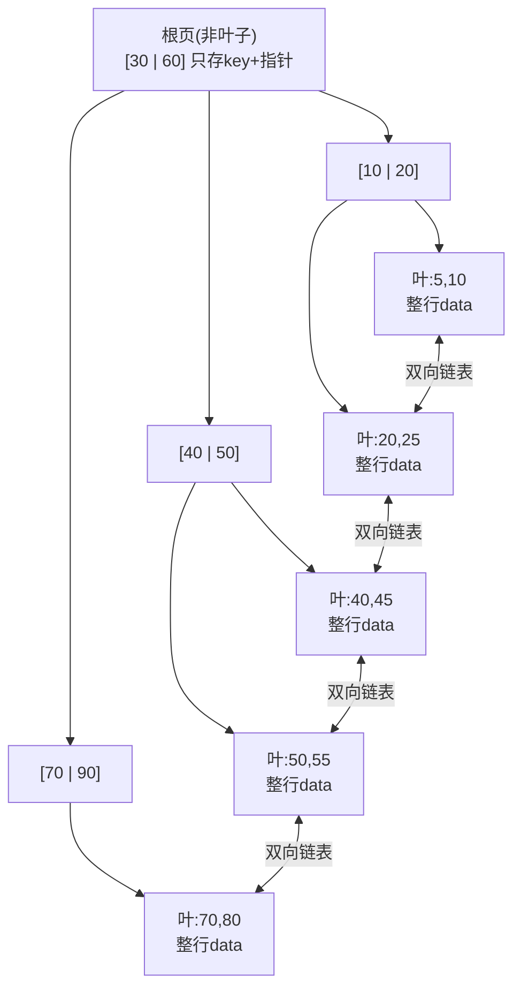
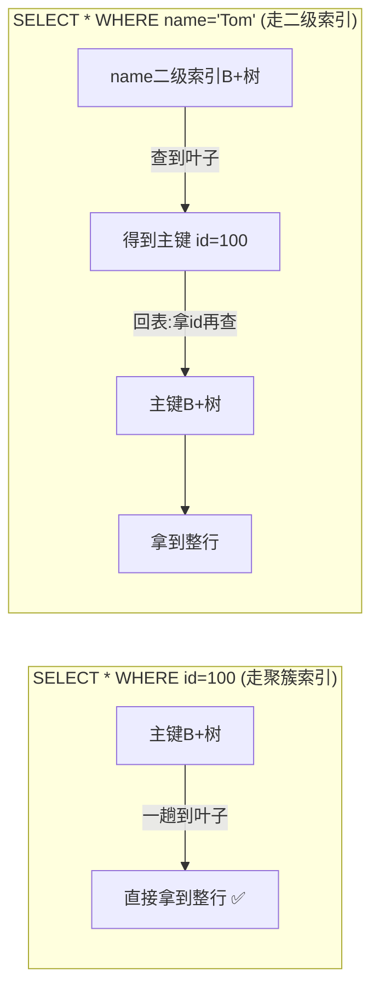

# 05 · 索引原理·为什么用 B+树（Index & B+ Tree）

> 索引本质是「用空间换时间、以更少磁盘 IO 定位数据」的有序数据结构。InnoDB 选 **B+树** 而非 B 树/红黑树/哈希，核心是**矮胖多叉降 IO + 叶子链表扛范围查询**；再叠加**聚簇索引**决定了「查主键最快、二级索引要回表」。面试重要度 ⭐⭐⭐（MySQL 第一高频题）。

## 📖 核心原理

**索引要解决的根本矛盾是「磁盘 IO 慢」。** 数据在磁盘上，无索引时查一行要全表扫描（顺序读所有页）。索引就是一棵**预先排好序的树**，让查找从 O(n) 变成 O(树高)。因此评价一种索引数据结构的唯一标准是：**查一条数据要读几次磁盘页**。InnoDB 以**页（Page，默认 16KB）** 为磁盘与内存交换的最小单位——**每读一个树节点 = 一次磁盘 IO**，所以「树越矮 = IO 越少 = 越快」。这是理解一切的钥匙。

**为什么不用这些结构（层层淘汰）：**

- **二叉搜索树 / 红黑树**：每个节点只有 2 个分支，数据量一大树就**又高又瘦**。百万数据红黑树高约 20 层，等于一次查询最多 20 次磁盘 IO，灾难。问题的本质是**叉太少 → 树太高**。
- **B 树（多叉平衡树）**：把「一个节点存多个 key、有多个分支」，树一下变矮。但 B 树**每个节点都存 data**，导致单页能放的 key 变少（扇出小），树没能矮到极致；且**范围查询要中序遍历回溯**，很慢。
- **哈希索引**：O(1) 等值查最快，但**不支持范围查询、`ORDER BY`、最左前缀**，且哈希冲突。InnoDB 只在内存里对热点页自动建**自适应哈希索引（AHI）**，主索引仍是 B+树。
- **B+树**：在 B 树基础上做两个关键改造，恰好补齐所有短板 → 最终选它。

**B+树相对 B 树的两个决定性改造：**
1. **非叶子节点只存 key + 指针，不存 data**；所有 data 只存在**叶子节点**。→ 非叶子页能塞下极多 key，**扇出巨大、树极矮**。
2. **所有叶子节点用双向链表串联**，且叶内 key 有序。→ 范围查询/排序/分页时，定位到起点后**顺着链表顺序扫**即可，无需回溯。

**InnoDB B+树到底多矮——「三层存两千万」估算：**
- 非叶子节点一条记录 = `key(如 BIGINT 8B) + 页指针 6B ≈ 14B`，一个 16KB 页可存 `16384/14 ≈ 1170` 个 key。
- 叶子节点存整行，假设一行约 1KB，一页存约 16 行。
- **两层非叶子 + 一层叶子 = 1170 × 1170 × 16 ≈ 2190 万行**。即**千万级表，查一条数据也只需 3 次磁盘 IO**（且根节点常驻 Buffer Pool，实际更少）。

**聚簇索引 vs 二级索引（InnoDB 的灵魂设定）：**
- **聚簇索引（Clustered Index）**：InnoDB 表数据**本身就按主键组织成一棵 B+树**，叶子节点直接存**整行数据**。所以「表 = 主键索引」，按主键查一次到叶子就拿到全部字段，最快。没有显式主键时，InnoDB 用第一个非空唯一索引，再没有就生成隐藏的 6 字节 `RowID`。
- **二级索引（Secondary Index，即普通/辅助索引）**：叶子节点**不存整行，只存索引列 + 主键值**。所以用二级索引查非索引字段时，先在二级索引树查到主键，再拿主键**回聚簇索引树查一遍完整行**——这就是**回表（回表 = 两棵树各走一趟）**。
- **覆盖索引**：如果要查的字段二级索引里全都有（如 `SELECT id, name` 且 `name` 上有索引），二级索引叶子就够了，**无需回表**，`EXPLAIN` 显示 `Using index`。这是索引优化的核心手段（详见 [07](07-index-optimization.md)）。

## 🔄 原理图 / 流程剖析

**B+树结构（非叶子只当路标，data 全压叶子，叶子拉链表）：**

**B 树 vs B+树（同样存一批数据，B+树更矮、范围查询更强）：**

| 维度 | B 树 | B+树 |
|---|---|---|
| data 存哪 | **每个节点都存** | **只有叶子存** |
| 非叶子节点 | key + data | **只有 key + 指针**（扇出大） |
| 叶子之间 | 无连接 | **双向链表串联** |
| 树高（同数据量） | 更高 | **更矮**（IO 更少） |
| 单次查询耗时 | 抖动（可能中间层命中） | **稳定**（必到叶子，路径等长） |
| 范围查询/排序 | 中序遍历 + 回溯，慢 | **叶子链表顺序扫**，快 |
| 全表遍历 | 跳遍所有层节点 | **只扫叶子层链表** |

**聚簇索引查询 vs 二级索引回表：**

## 🔑 面试要点

- **一句话讲清 B+树**：非叶子只存 key 当路标、data 全在叶子、叶子拉双向链表。换来三件事——**树矮（IO 少）、查询稳、范围查询顺链表扫**，全是数据库最需要的。
- **为什么不是 B 树**：B 树非叶子也存 data，单页放不下几个 key，扇出小、树更高、IO 更多；且无叶子链表，范围查询要回溯。
- **为什么不是红黑树/二叉树**：只有 2 叉，数据量大时树太高（百万数据 20+ 层），每层一次磁盘 IO，扛不住。B+树是「矮胖多叉」专治磁盘 IO。
- **为什么不是哈希**：不支持范围、排序、最左前缀；InnoDB 仅内存自适应哈希（AHI）加速热点等值查，主索引仍是 B+树。
- **树高只有 3~4 层**：千万级表查一行 ≤ 3 次 IO，根/枝节点常驻 Buffer Pool，实际磁盘 IO 更少。
- **聚簇索引**：InnoDB 表数据按主键组织成 B+树，叶子存整行；「表即主键索引」。
- **二级索引 + 回表**：二级索引叶子存「索引列 + 主键」，查非覆盖字段要拿主键回聚簇索引再查一次（回表）。覆盖索引可免回表（`Using index`）。

## ❓ 高频面试题

**Q：MySQL 索引为什么用 B+树而不是 B 树？**
A：核心是**降低磁盘 IO**。① B+树非叶子节点只存 key 和指针、不存 data，单个 16KB 页能存上千个 key，扇出极大、树极矮（千万级数据也就 3~4 层），而 B 树每个节点都存 data，一页放不下几个 key，同样数据树更高、IO 更多。② B+树所有 data 在叶子且叶子用双向链表串联，范围查询/排序/分页只要定位起点后顺着链表扫（顺序 IO），B 树没有叶子链表，范围查询要不断回溯做中序遍历（随机 IO），慢一个数量级。③ B+树每次查询都走到叶子、路径等长，性能稳定可预测。数据库场景恰恰大量是范围查询和排序，所以选 B+树。

**Q：什么是聚簇索引？二级索引查询为什么要回表？**
A：InnoDB 的表数据本身就按主键组织成一棵 B+树，叶子节点直接存整行数据，这棵树就是聚簇索引，所以「表 = 主键索引」，按主键查一次到叶子即拿到整行。二级索引（普通索引）的叶子节点不存整行，只存「索引列 + 主键值」；当用二级索引查询的字段不全在索引里时，先在二级索引树查到主键，再用主键去聚簇索引树查一遍完整行，这个「查两棵树」的过程就是回表。如果查询字段刚好被二级索引完全覆盖（覆盖索引），就不用回表，`EXPLAIN` 的 Extra 显示 `Using index`。

**Q：InnoDB 的 B+树一般有几层？能存多少数据？为什么？**
A：通常 3 层就能支撑千万级数据。估算：非叶子节点一条记录约 `key 8B + 指针 6B = 14B`，16KB 页可存约 1170 个 key；叶子存整行，一行约 1KB 则一页约 16 行。两层非叶子 + 一层叶子 = 1170×1170×16 ≈ 2000 多万行。所以查一条数据最多 3 次磁盘 IO，加上根节点和枝节点常驻 Buffer Pool，实际磁盘 IO 往往只有 1 次。这也是「表设计时行不宜太宽、主键不宜太大」的原因——主键越大，非叶子能存的 key 越少，扇出变小、树可能变高。

**Q：为什么建议用自增主键，不用 UUID 做主键？**
A：因为聚簇索引按主键顺序存放。自增主键是顺序写，新行总是追加到当前页尾部，页满了开新页，很少发生页分裂，B+树紧凑、写入快；UUID 是随机值，新行会插到 B+树中间的随机位置，频繁触发**页分裂**（把已满页拆成两页、搬移数据）和碎片，写入慢、空间浪费，还会撑大二级索引（二级索引叶子都存主键值，主键越大占用越多）。详见 [06 索引类型](06-index-types.md)。

## ⚠️ 易错点 / 加分项

- **误区**：以为「非叶子节点也存数据」——B+树非叶子**只存 key + 指针**，data 只在叶子；这正是它比 B 树矮的原因。
- **加分**：能把「树矮」翻译成「磁盘 IO 少」，并给出「16KB 页 × 14B/key ≈ 1170 扇出 → 三层两千万」的量化估算，比只背结论深一层。
- **加分**：指出根节点和非叶子节点常驻 Buffer Pool，所以「3 层」不等于「3 次磁盘 IO」，实际物理 IO 通常仅 1 次（结合 [04 Buffer Pool](04-buffer-pool.md)）。
- **坑**：`SELECT *` 走二级索引一定回表；能用**覆盖索引**（只查索引包含的列）避免回表，是 SQL 优化的高频加分点（详见 [07](07-index-optimization.md)）。
- **加分**：MyISAM 的索引是「非聚簇」——主键索引叶子也只存行的地址指针，data 单独存在 `.MYD` 文件，所以 MyISAM 主键查询也要「再按地址取数据」，与 InnoDB 聚簇索引「叶子即数据」形成对比（见 [02 存储引擎](02-storage-engines.md)）。
- **坑**：范围查询、`ORDER BY`、`GROUP BY`、最左前缀匹配之所以能用索引加速，全靠 B+树「叶子有序 + 链表相连」；哈希索引这些都做不到——这是「为什么不用哈希」的落地解释。

## 🔗 关联

- 索引类型（主键/唯一/联合/覆盖/前缀，自增 vs UUID）→ [06-index-types](06-index-types.md)
- 索引优化与失效（最左前缀、ICP、覆盖索引、失效全集）→ [07-index-optimization](07-index-optimization.md)
- 页、Buffer Pool 与树节点常驻内存 → [04-buffer-pool](04-buffer-pool.md)
- 存储引擎对比（InnoDB 聚簇 vs MyISAM 非聚簇）→ [02-storage-engines](02-storage-engines.md)
