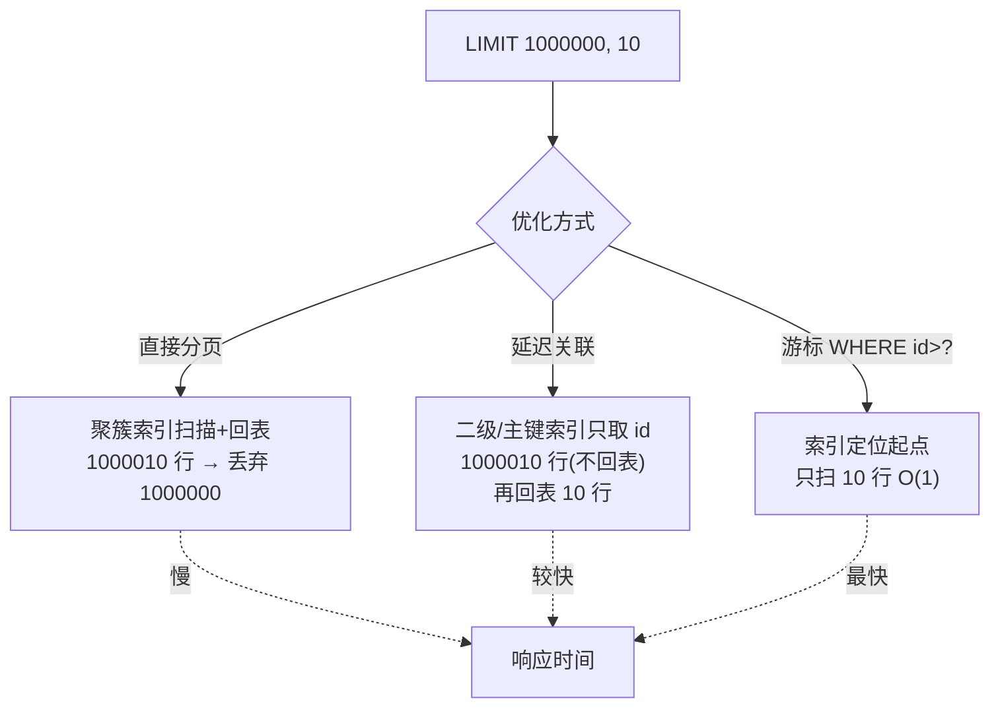
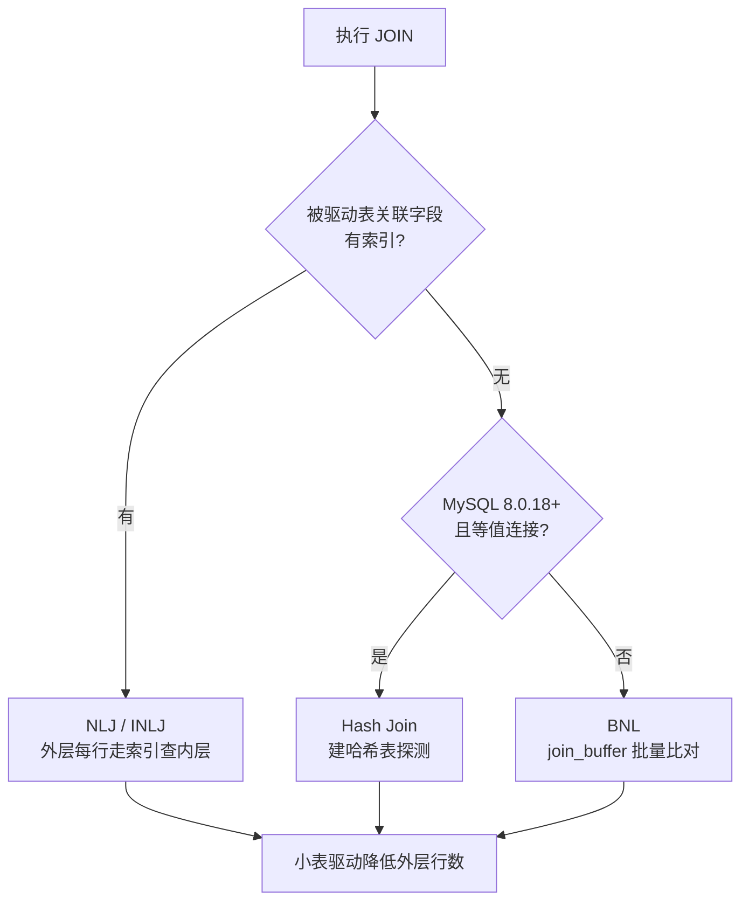

# 09 · SQL 优化实战（SQL Optimization in Practice）

> 从"慢查询定位"到"具体改写"：深分页、count(*)、order by filesort、join 驱动顺序，全是高频实战题。面试重要度：⭐⭐⭐ 高频。

## 📖 核心原理

SQL 优化的本质是**减少扫描的数据行数**和**避免昂贵的额外操作**（回表、filesort、临时表、全表扫描）。优化前必须先定位，靠猜没有意义，标准流程是：慢查询日志锁定慢 SQL → `EXPLAIN` 看执行计划 → 针对 `type / rows / Extra` 下手。

**慢查询日志定位。** 开启后 MySQL 会把执行时间超过 `long_query_time`（默认 10s，生产常调到 1s 甚至更低）的语句记录下来。关键参数：

```sql
SET GLOBAL slow_query_log = ON;
SET GLOBAL long_query_time = 1;                 -- 阈值 1 秒
SET GLOBAL log_queries_not_using_indexes = ON;  -- 未走索引的也记（谨慎，会刷屏）
SHOW VARIABLES LIKE 'slow_query_log_file';
```

原始日志用 `mysqldumpslow` 或 `pt-query-digest`（Percona Toolkit）聚合分析，后者能按"响应时间总和"排序，找出真正拖垮系统的 SQL（不是单次最慢，而是次数 × 耗时最高的）。

**深分页优化。** `LIMIT 1000000, 10` 的痛点在于：MySQL 必须先扫描并回表取出前 100 万 + 10 行，再丢弃前 100 万行。偏移越大越慢，且做了大量无用回表。三种优化手段：

- **子查询 / 延迟关联（deferred join）**：先在覆盖索引上只查主键，把回表推迟到只剩 10 行时。
- **游标 / 书签记录（seek method）**：记住上一页最后一条的 `id`，用 `WHERE id > ?` 代替 `OFFSET`，把 O(offset) 降为 O(1)，是最优解，但要求排序列有序且唯一。

```sql
-- 差：扫描并回表 1000010 行
SELECT * FROM t ORDER BY id LIMIT 1000000, 10;

-- 好：延迟关联，先走主键索引拿 10 个 id，再回表
SELECT t.* FROM t
  JOIN (SELECT id FROM t ORDER BY id LIMIT 1000000, 10) AS tmp
  ON t.id = tmp.id;

-- 最好：游标翻页，无 OFFSET
SELECT * FROM t WHERE id > 1000000 ORDER BY id LIMIT 10;
```

**count(\*) 优化。** InnoDB 不像 MyISAM 维护表行数（因为 MVCC 下每个事务看到的行数不同），`count(*)` 需要遍历。优化点：`count(*)`、`count(1)`、`count(主键)` 语义都是"统计非 NULL 行数"，InnoDB 会**选择最小的二级索引**来扫（而非聚簇索引），因为二级索引叶子更小、每页装的记录更多、IO 更少。`count(字段)` 会跳过该字段为 NULL 的行，语义不同。性能排序：`count(*)` ≈ `count(1)` > `count(主键)` > `count(字段)`。对精度要求不高的大表，可用 `SHOW TABLE STATUS` 的估算值或单独维护计数表 / Redis 计数。

**order by 优化（避免 filesort）。** `Extra` 里出现 `Using filesort` 说明排序无法用索引完成，需要在 `sort_buffer` 里排序（超出则用磁盘临时文件，极慢）。核心是让排序**利用索引的有序性**：排序字段建联合索引且顺序、方向与 `ORDER BY` 一致（8.0 支持降序索引），并遵守最左前缀。MySQL 有两种 filesort 算法：**单路排序**（把 select 的所有列一次性放进 sort_buffer，减少回表）和**双路/回表排序**（只放排序列 + 主键，排完再回表）。可调 `max_length_for_sort_data` 与 `sort_buffer_size` 影响选择。

**join 优化。** 原则是**小表驱动大表**（小结果集做外层循环）。InnoDB 的 join 算法：

- **NLJ（Nested-Loop Join）**：被驱动表关联字段**有索引**时使用，外层每行去内层走索引查找，复杂度 O(N外 × log N内)。
- **INLJ（Index Nested-Loop Join）**：NLJ 的索引版本，即上面这种。
- **BNL（Block Nested-Loop Join）**：被驱动表**无索引**时，MySQL 把驱动表批量读入 `join_buffer`，再扫描被驱动表逐行与 buffer 比对，避免多次全表扫描；但仍是笛卡尔式比较，很慢。看到 `Using join buffer (Block Nested Loop)` 就该给被驱动表的关联字段加索引。
- MySQL 8.0.18+ 引入 **Hash Join**：等值 join 且无可用索引时，替代 BNL，用哈希表大幅提速。

## 🔄 原理图 / 流程剖析

深分页三种方案的扫描代价对比：



join 算法选择逻辑：



## 🔑 面试要点

- 优化四步：**慢查询日志定位 → EXPLAIN 看 type/rows/Extra → 判断问题类型（回表/filesort/临时表/全表）→ 针对性改写或加索引**。
- 深分页：`OFFSET` 越大越慢因为要扫+回表并丢弃；最优是**游标翻页（WHERE id > ?）**，其次延迟关联，两者都靠覆盖索引减少回表。
- `count(*)` 是 SQL 标准的"统计行数"写法，InnoDB 会自动挑**最小二级索引**扫描，不比 `count(1)` 慢，别迷信 `count(1)`。
- `Using filesort` ≠ 一定用磁盘：可能在内存 `sort_buffer` 排序；但能用索引消除排序永远最优。8.0 支持**降序索引**解决混合排序方向。
- join **小表驱动大表**，务必给被驱动表关联字段加索引让其走 NLJ；出现 BNL/Block Nested Loop 是加索引信号，8.0 可靠 Hash Join 兜底。
- `EXPLAIN` 关键列：`type`（system>const>eq_ref>ref>range>index>ALL，至少到 range）、`Extra`（`Using index` 覆盖索引好，`Using filesort`/`Using temporary` 需警惕）。

## ❓ 高频面试题

**Q：`LIMIT 100000, 10` 很慢，怎么优化？为什么快？**
A：慢因是要扫描并回表前 100010 行再丢弃前 10 万行。最优用**游标/书签翻页**：记住上一页最后的 `id`，`WHERE id > ? ORDER BY id LIMIT 10`，直接用索引定位起点，只扫 10 行，代价与页码无关。若必须支持跳页，用**延迟关联**：子查询在覆盖索引里只取主键（不回表，扫得快），外层再用这 10 个主键回表取完整行，把回表从 10 万次降到 10 次。

**Q：`count(*)`、`count(1)`、`count(主键)`、`count(字段)` 有什么区别？**
A：`count(*)` 和 `count(1)` 统计所有行（含 NULL），InnoDB 都会选最小的二级索引遍历，性能基本相同——`count(*)` 是被专门优化的语法，不需要取值。`count(主键)` 要读主键并判空（主键非空但仍走流程），略慢。`count(字段)` 只统计该字段非 NULL 的行，语义不同且要读该字段。所以推荐 `count(*)`。

**Q：怎么判断 SQL 走没走索引排序、需不需要 filesort？**
A：`EXPLAIN` 看 `Extra`。没有 `Using filesort` 说明 MySQL 直接利用了索引的有序性输出，是理想状态。出现 `Using filesort` 说明要额外排序，此时应检查 `ORDER BY` 字段是否命中联合索引、是否满足最左前缀、排序方向是否一致（8.0 前混合 ASC/DESC 无法用索引，8.0 可用降序索引）。

## ⚠️ 易错点 / 加分项

- **误区："count(1) 比 count(\*) 快"**——错。InnoDB 对两者优化等价，`count(*)` 甚至是标准推荐写法。真正慢的是大表全量 count，该用估算或计数表。
- **延迟关联的前提是覆盖索引**：子查询里 `ORDER BY` + 取的列必须都在同一索引上，否则子查询自身仍要回表，优化失效。
- **`Using filesort` 不代表用磁盘**：数据量小时在 `sort_buffer_size` 内存内完成；只有超出才落磁盘临时文件。别一看到就恐慌，先看数据量和 buffer 大小。
- **BNL 会拖慢被驱动表并可能占用 MDL 更久**：大表 join 无索引时，`join_buffer` 装不下会分多趟扫被驱动表。加索引走 NLJ 或升级到 8.0 用 Hash Join 是正解。
- **加分点**：能说出 `EXPLAIN ANALYZE`（8.0.18+）可看到**真实执行耗时与行数**而非估算，用来验证优化是否生效；`pt-query-digest` 按响应时间总和聚合找"真凶"，比只看单条最慢更专业。
