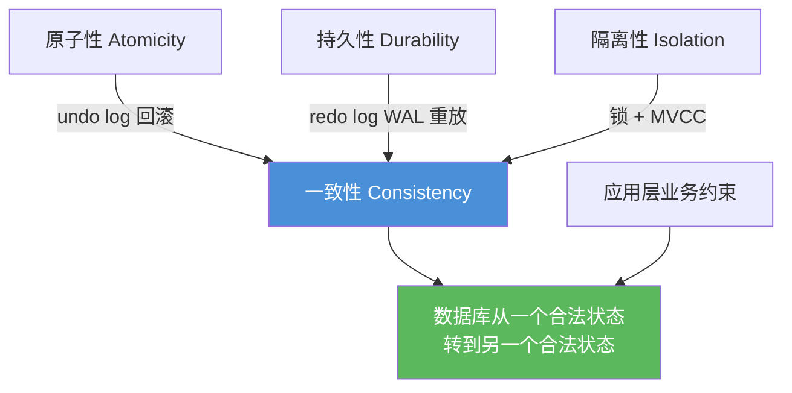
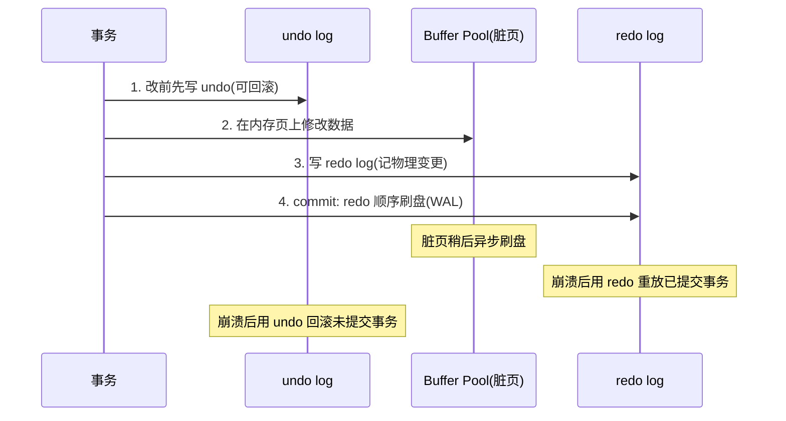

# 10 · 事务与 ACID（Transaction & ACID）

> ACID 四特性分别由什么保证——原子性 undo log、持久性 redo log、隔离性 锁+MVCC、一致性 前三者共同达成。面试重要度：⭐⭐⭐ 高频。

## 📖 核心原理

事务是**一组要么全部成功、要么全部失败的操作序列**，是并发控制和故障恢复的基本单位。ACID 是事务的四个特性，面试的核心不是背定义，而是**说清每个特性由 InnoDB 的哪个机制实现**。

**A - Atomicity 原子性：靠 undo log。** 事务内的操作要么全做、要么全不做。InnoDB 在修改数据前，先把"如何撤销这次修改"记进 undo log（一条 INSERT 记逆向的 DELETE，一条 UPDATE 记旧值）。事务回滚（显式 `ROLLBACK` 或崩溃恢复中的未提交事务）时，按 undo 反向执行，把数据恢复到事务开始前的状态。所以**原子性的本质是"可回滚"，由 undo log 提供回滚能力**。

**C - Consistency 一致性：目的，由 AID 共同保证 + 应用层约束。** 一致性指事务把数据库从一个**合法状态**转到另一个合法状态（如转账前后总额不变、满足唯一约束/外键/非空）。它是**目的**而非独立机制：原子性保证不会做一半、持久性保证提交后不丢、隔离性保证并发不互相污染，三者共同维护一致性；同时还依赖应用层保证业务逻辑正确（数据库无法知道"转账金额应相等"这种业务规则）。所以一致性=前三者+应用约束的综合结果。

**I - Isolation 隔离性：靠 锁 + MVCC。** 多个并发事务互不干扰。InnoDB 用两套机制：**锁**（写-写、当前读的互斥，行锁/间隙锁/临键锁）保证写操作串行化；**MVCC（多版本并发控制）** 让快照读不加锁地读到一致性版本，实现"读不阻塞写、写不阻塞读"。隔离级别（RU/RC/RR/Serializable）就是"隔离性强弱"的档位，本质是锁范围与 ReadView 生成时机的组合。详见 11、12、13 篇。

**D - Durability 持久性：靠 redo log（WAL）。** 事务一旦提交，其修改永久保存，即使断电宕机也不丢。若每次提交都把脏页刷回磁盘，随机 IO 会极慢。InnoDB 用 **WAL（Write-Ahead Logging，预写日志）**：提交时只需把 redo log（物理日志，记"某页某偏移改成什么"）顺序写盘（顺序 IO 快），脏页可稍后异步刷。崩溃重启后用 redo log 重放，恢复已提交但未落盘的修改。所以**持久性的本质是"崩溃可恢复"，由 redo log 保证**。详见 15 篇。

一句话串起来：**undo 保原子（能回滚）、redo 保持久（能重放）、锁+MVCC 保隔离（能并发），三者共同实现一致性这个终极目标。**

## 🔄 原理图 / 流程剖析

ACID 与实现机制的映射：

一次事务提交涉及的日志协作（简化）：

## 🔑 面试要点

- **原子性 → undo log**：记录逆向操作，回滚/崩溃恢复时反向执行，本质是"可撤销"。
- **持久性 → redo log（WAL）**：提交只顺序写 redo，脏页异步刷；崩溃后重放，本质是"可重做"。
- **隔离性 → 锁 + MVCC**：锁管当前读/写的互斥，MVCC 管快照读的一致性版本。
- **一致性 → 目的**，由 A、I、D 三者 + 应用层约束共同保证，不是独立机制。
- 一句话记忆：**A 靠 undo、D 靠 redo、I 靠锁和 MVCC、C 是前三者的结果。**
- 崩溃恢复用到 **undo（回滚未提交）+ redo（重放已提交）** 两者配合，这是 crash-safe 的核心。

## ❓ 高频面试题

**Q：ACID 分别由什么保证？**
A：原子性由 **undo log** 保证——修改前记录回滚信息，失败就反向执行。持久性由 **redo log**（WAL 机制）保证——提交时顺序写日志，崩溃后重放已提交事务，脏页可异步刷盘。隔离性由**锁 + MVCC** 保证——锁处理写冲突和当前读，MVCC 通过版本链+ReadView 实现无锁一致性快照读。一致性是最终目的，由前三者加上应用层业务约束共同达成。

**Q：为什么说一致性是目的而不是手段？**
A：因为一致性描述的是"数据满足所有预期约束（业务规则、完整性约束）"这个**结果状态**，它没有对应的独立底层机制。原子性防止部分执行破坏一致、隔离性防止并发交叉破坏一致、持久性防止提交后丢失破坏一致；此外还需应用层保证业务逻辑本身正确。所以一致性是被其他特性"守护"出来的目标。

**Q：只有 redo log 能不能保证崩溃恢复？为什么还要 undo？**
A：不能。redo 只能"重放已提交事务的修改"，但崩溃时可能有**未提交事务**的脏数据已被写入（Buffer Pool 甚至磁盘），redo 重放后这些脏改动还在，必须用 **undo 回滚掉未提交事务**才能得到一致状态。所以恢复是"先 redo 重放到崩溃点，再 undo 回滚未提交事务"两步。

## ⚠️ 易错点 / 加分项

- **别把一致性当成有独立机制的特性**——它是 AID 的综合结果，答"一致性靠 XXX log"会扣分。
- **原子性 ≠ 持久性**：原子性关心"全或无"（undo），持久性关心"提交后不丢"（redo），两个不同问题。
- **隔离性不是只靠锁**：MVCC 是 InnoDB 隔离性的半壁江山，快照读全靠它才能"读写不互相阻塞"，只答锁不完整。
- **加分点**：能画出"undo（原子/MVCC 版本链）+ redo（持久/WAL）+ binlog（归档/主从）两阶段提交"的全景，说明 redo 保证 crash-safe、binlog 保证主从与数据恢复，两者用 XA 两阶段提交保持一致（详见 15 篇），是资深层次的答法。
- **加分点**：undo log 除了回滚，还**支撑 MVCC 版本链**（旧版本存在 undo 里供 ReadView 读取），一物两用，能点出来加分（详见 16 篇）。
