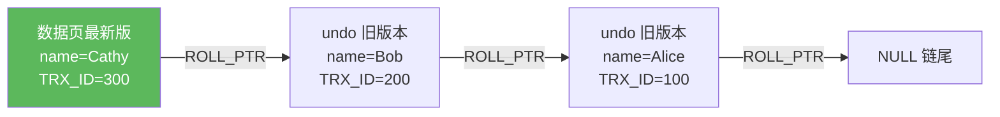
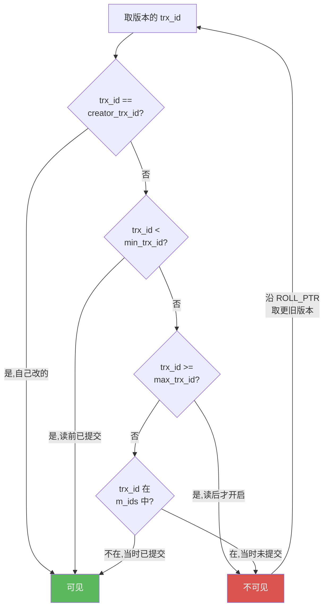
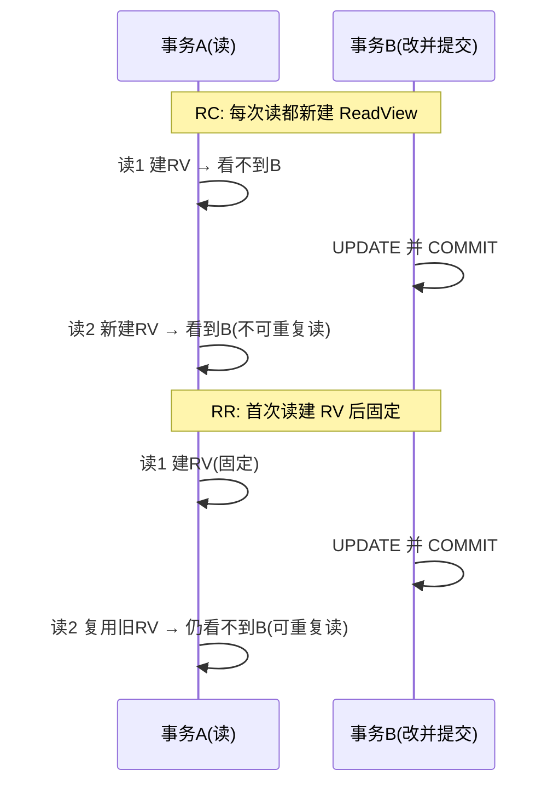

# 12 · MVCC 多版本并发控制（Multi-Version Concurrency Control）

> 隐藏字段 + undo 版本链 + ReadView 可见性算法，实现"读不加锁、读写不互斥"；RC 每次查生成 ReadView，RR 首次快照固定。面试重要度：⭐⭐⭐ 高频（重头戏，必问）。

## 📖 核心原理

MVCC 是 InnoDB 实现**高并发读**的核心：让每个事务的快照读（普通 `SELECT`）看到一份**一致性的、不加锁的数据版本**，从而"读不阻塞写、写不阻塞读"。它只在 **RC 和 RR** 两个隔离级别下工作（RU 直接读最新版、Serializable 全走加锁当前读）。MVCC 由三个组件协同实现：**隐藏字段、undo 版本链、ReadView**。

**一、行记录的隐藏字段。** InnoDB 每行数据除了业务列，还有三个隐藏字段：

- **`DB_TRX_ID`（6 字节）**：最近一次**修改（insert/update）该行**的事务 ID。事务 ID 是自增的，越大越新。
- **`DB_ROLL_PTR`（7 字节）**：回滚指针，指向该行**上一个版本**在 undo log 里的位置。多个版本靠它串成链。
- **`DB_ROW_ID`（6 字节）**：隐藏主键，仅当表没有定义主键也没有唯一非空索引时才用它生成聚簇索引，与 MVCC 无直接关系。

**二、undo 版本链。** 每次 UPDATE，InnoDB 不是原地覆盖，而是把**旧值写进 undo log**，新记录的 `DB_ROLL_PTR` 指向这条旧版本 undo，旧版本又指向更旧的……形成一条**从新到旧的版本链**。链头是最新数据（在数据页上），链身是历史版本（在 undo log 里）。这条链就是"多版本"的物理来源，也是不可重复读/快照读能读到"旧数据"的原因。（INSERT 产生的 undo 事务提交后即可删除，UPDATE/DELETE 的 undo 要等没有事务再需要它——即 MVCC 快照不再依赖——才由 purge 线程清理，见 16 篇。）

**三、ReadView（读视图/一致性视图）。** 快照读时，InnoDB 创建一个 ReadView，它是"这一刻**哪些事务的修改对我可见**"的判定依据。核心含 4 个字段：

- **`m_ids`**：创建 ReadView 时**当前所有活跃（未提交）事务的 ID 列表**。
- **`min_trx_id`**：`m_ids` 中的最小值（最早的活跃事务）。
- **`max_trx_id`**：创建 ReadView 时系统**将要分配给下一个事务**的 ID（即当前最大事务 ID + 1），注意不是 m_ids 里的最大值。
- **`creator_trx_id`**：创建该 ReadView 的事务自己的 ID。

**四、可见性判断算法。** 拿到某行某个版本的 `DB_TRX_ID`（记为 `trx_id`），沿版本链从新到旧逐个版本套用规则，找到第一个可见版本：

1. `trx_id == creator_trx_id`：这行是**自己改的**，可见（能看到自己的修改）。
2. `trx_id < min_trx_id`：该版本在 ReadView 创建前就已**提交**，可见。
3. `trx_id >= max_trx_id`：该版本由 ReadView 创建**之后才开启**的事务产生，不可见。
4. `min_trx_id <= trx_id < max_trx_id`：需看是否在 `m_ids` 里——
   - 在 `m_ids` 中：说明创建 ReadView 时该事务**还活跃（未提交）**，不可见；
   - 不在 `m_ids` 中：说明该事务当时**已提交**，可见。

若当前版本不可见，就顺着 `DB_ROLL_PTR` 到 undo 里取更旧版本，重复判断，直到找到可见版本或到链尾（DELETE 标记的行则表现为"查不到"）。**一句话：只有"在我拍快照前就已提交的修改"以及"我自己的修改"才可见。**

**五、RC vs RR 的唯一区别——ReadView 生成时机。** 算法完全一样，差别只在**什么时候创建 ReadView**：

- **RC（读已提交）**：**每次快照读都重新创建一个 ReadView**。所以每次读都能拿到"截至此刻已提交"的最新版本 → 同一事务内两次读结果可能不同 → 出现**不可重复读**（这正是 RC 的定义）。
- **RR（可重复读）**：**只在事务内第一次快照读时创建 ReadView，之后整个事务复用它**（快照固定）。所以后续读始终基于同一视图，别人提交的修改看不到 → **可重复读**，也天然屏蔽了快照读的幻读。

这就是为什么 RC 和 RR 用同一套 MVCC 却表现不同——**不是机制不同，而是快照拍摄的时机不同**。

## 🔄 原理图 / 流程剖析

**undo 版本链结构**（事务 100→200→300 依次修改同一行 name）：

**ReadView 可见性判断流程**：

**RC vs RR ReadView 生成时机对比**：

## 🔑 面试要点

- MVCC 三大件：**隐藏字段（DB_TRX_ID / DB_ROLL_PTR）+ undo 版本链 + ReadView**，只在 **RC/RR** 生效。
- 版本链：UPDATE 不覆盖，旧值进 undo，`DB_ROLL_PTR` 串成"新→旧"链；快照读沿链找第一个可见版本。
- ReadView 四字段：**m_ids（活跃事务列表）、min_trx_id（最小活跃）、max_trx_id（下一个待分配ID）、creator_trx_id（自己）**。
- 可见性口诀：**自己的可见；比 min 小的（已提交）可见；比 max 大的（后来的）不可见；在 min~max 之间看是否在 m_ids，在=未提交不可见，不在=已提交可见。**
- **RC 与 RR 唯一区别是 ReadView 生成时机**：RC 每次快照读新建（→不可重复读），RR 首次建后固定（→可重复读）。这是必答的核心区别。
- MVCC 只服务**快照读**；**当前读（FOR UPDATE / UPDATE / DELETE）读的是最新版并加锁**，不走 ReadView。

## ❓ 高频面试题

**Q：讲一下 MVCC 的实现原理。**
A：三部分。①每行有隐藏字段 `DB_TRX_ID`（最近修改的事务 ID）和 `DB_ROLL_PTR`（指向 undo 里的上一版本）。②每次修改把旧值存 undo，通过 ROLL_PTR 串成从新到旧的**版本链**。③快照读时创建 **ReadView**，含活跃事务列表 `m_ids`、`min_trx_id`、`max_trx_id`、`creator_trx_id`。读某行时沿版本链用可见性算法逐版本判断——只有"我自己改的"和"在我建 ReadView 前就已提交的"版本可见，否则顺 ROLL_PTR 找更旧版本。这样不加锁就读到了一致性快照，实现读写不互斥。

**Q：RC 和 RR 在 MVCC 上的区别？为什么 RR 能可重复读？**
A：算法一样，**区别只在 ReadView 创建时机**。RC 是每次执行快照读都新建 ReadView，所以每次都能看到"此刻已提交"的最新数据，两次读之间若有别的事务提交，结果就变了——这就是不可重复读。RR 是事务内**第一次快照读时创建 ReadView 并固定复用**，之后所有快照读都基于这个视图，别人后来提交的修改因为不满足可见性（要么 trx_id ≥ max_trx_id，要么在 m_ids 里）而看不到，所以多次读结果一致——可重复读。

**Q：ReadView 里 max_trx_id 是活跃事务里最大的那个吗？**
A：不是。这是常见误区。`max_trx_id` 是**创建 ReadView 时系统将要分配给下一个事务的 ID**，即"当前已分配的最大事务 ID + 1"，代表一个"未来分界线"。任何 trx_id ≥ max_trx_id 的版本都是 ReadView 创建之后才开启的事务产生的，一律不可见。而 `m_ids` 里的最大值只是当时最大的活跃事务，可能远小于 max_trx_id。

**Q：MVCC 能完全解决幻读吗？**
A：对**快照读**能解决——RR 下快照固定，新插入的行不在快照里，普通 SELECT 看不到幻影。但对**当前读**（FOR UPDATE / UPDATE / DELETE）不行，因为当前读读的是最新版本、不走 ReadView，此时防幻读要靠 **Next-Key Lock**（间隙锁）。所以 InnoDB RR 解决幻读是"MVCC 管快照读 + Next-Key Lock 管当前读"两者配合，MVCC 单独不够。

## ⚠️ 易错点 / 加分项

- **max_trx_id 不是最大活跃事务 ID**，是"下一个待分配的事务 ID"，答错是硬伤。
- **MVCC 不处理当前读**：`UPDATE/DELETE/SELECT...FOR UPDATE` 都是当前读，读最新版并加锁，与 ReadView 无关。混淆快照读和当前读是常见失分点。
- **RR 下"第一条快照读"才建 ReadView，不是事务 begin 就建**：所以 `START TRANSACTION` 后到第一条 SELECT 之间别人提交的数据，第一条 SELECT 是能看到的。要精确可用 `START TRANSACTION WITH CONSISTENT SNAPSHOT` 立即建视图。
- **DB_TRX_ID 记的是"修改"事务，不含纯读**：只读事务通常不分配真正的事务 ID（只读优化），不会污染版本链。
- **加分点**：能说清 undo 版本链既服务 MVCC 又服务回滚（一物两用），且长事务会导致版本链变长、undo 无法 purge、Buffer Pool 和磁盘膨胀——所以**要避免大/长事务**，这是把 MVCC 和线上问题联系起来的资深视角。
- **加分点**：当前读为什么能读到最新——因为它直接读版本链头（数据页最新记录）并加锁，若最新版本被未提交事务锁住则阻塞，这与快照读"绕过锁读历史版本"形成鲜明对比。
