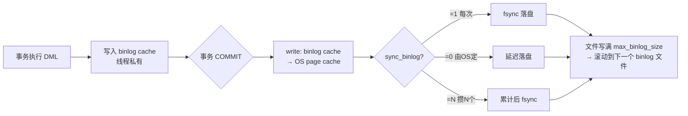

# 17 · 归档日志 binlog（Binary Log）

> binlog 是 MySQL **Server 层**的逻辑日志，记录所有改动数据的操作，用于**主从复制**与**数据恢复**；与 InnoDB 的 redo log 分属两层、职责迥异。面试重要度 ⭐⭐⭐ 高频。

## 📖 核心原理

binlog（Binary Log，二进制日志）由 **MySQL Server 层**产生，与存储引擎无关——即使用 MyISAM 也有 binlog；而 redo log 是 InnoDB 引擎独有。它记录了**所有对数据库做出更改的逻辑操作**（DDL + 变更类 DML），`SELECT`、`SHOW` 这类只读操作不会写入。

binlog 的写入时机：事务执行过程中，日志先写到线程私有的 **binlog cache**（由 `binlog_cache_size` 控制单事务缓存大小），事务提交时再把 binlog cache **原子地**追加到 binlog 文件（`write` 到 page cache，`fsync` 落盘）。落盘时机由 `sync_binlog` 控制：

- `sync_binlog=0`：只 write 到 page cache，由 OS 决定何时 fsync，性能最好但宕机可能丢多个事务；
- `sync_binlog=1`：每次事务提交都 fsync，**最安全**，一主多从生产标配；
- `sync_binlog=N`：累计 N 个事务才 fsync，折中，宕机丢最多 N 个事务。

binlog 是**追加写（append）**：一个文件写满（`max_binlog_size`，默认 1GB）就切换到下一个文件（`mysql-bin.000001` → `000002`……），不会覆盖旧日志。这与 redo log 的**循环写（覆盖）**根本不同——redo 是固定大小的环形缓冲，binlog 是可无限归档的历史流水，这也是它能做「全量+增量」时间点恢复（PITR）的前提。

**三种记录格式**（`binlog_format`）是高频考点：

- **statement**：记录原始 SQL 语句。日志量小，但存在**主从不一致风险**——如 `NOW()`、`UUID()`、`LIMIT` 无 `ORDER BY`、依赖 `AUTO_INCREMENT` 并发分配的语句，主从执行环境不同会得到不同结果。
- **row**：记录每一行**被修改前后的镜像**（前像/后像），不记录 SQL。**最安全**（主从必然一致），但日志量大——一条 `UPDATE ... WHERE` 影响 10 万行就写 10 万行记录。MySQL 8.0 默认即 row。
- **mixed**：MySQL 自动判断，能安全用 statement 的用 statement（省空间），有不确定性风险的自动切 row。

MySQL 8.0 默认 `binlog_format=ROW`，且默认 `binlog_row_image=full`（记录所有列），可改为 `minimal`（只记主键+被改列）省空间。生产强烈推荐 row：因为 statement 在主从、闪回、CDC（如 Canal/Debezium 订阅 binlog）场景下都可能出错。

## 🔄 原理图 / 流程剖析

**binlog 与 redo log 的核心区别（必背对比表）：**

| 维度 | redo log | binlog |
|------|----------|--------|
| 层次 | InnoDB **引擎层** | MySQL **Server 层** |
| 内容 | **物理日志**：某数据页做了什么修改 | **逻辑日志**：某行做了什么操作 / 原始 SQL |
| 写入方式 | **循环写**，固定大小写满覆盖 | **追加写**，写满切文件、永久归档 |
| 用途 | **crash-safe**，宕机重启恢复未刷盘的脏页 | **主从复制** + **数据备份恢复(PITR)** |
| 是否可缺省 | InnoDB 必需 | 可关闭（但主从/PITR 就没了） |
| 幂等性 | 物理日志，重放天然幂等 | 逻辑日志，需 row 格式保证幂等 |

**写入与归档流程：**



**为什么 statement 不安全（举例）：**

```sql
-- 主库执行，假设有 100 行满足条件
UPDATE t SET updated_at = NOW() WHERE status = 0 LIMIT 10;
-- 1) NOW() 主从时间可能有差异（虽同机器一般一致，但时区/延迟场景有坑）
-- 2) LIMIT 10 无 ORDER BY，主从选到的"哪 10 行"可能不同 → 数据分叉
```

## 🔑 面试要点

- binlog 是 **Server 层**日志，redo 是 **引擎层**日志——这是一切区别的根源，先答这句定调。
- 一句话记区别：redo「物理、循环写、引擎层、保证 crash-safe」；binlog「逻辑、追加写、Server 层、保证复制与恢复」。
- 三种格式：statement（省空间、有不一致风险）、row（安全、量大、8.0 默认）、mixed（自动切换）；生产用 **row**。
- `sync_binlog=1` + `innodb_flush_log_at_trx_commit=1` 称为 **「双 1」配置**，是不丢数据的黄金标准，代价是每事务两次 fsync。
- binlog 写入用**双缓冲两阶段**：先入线程私有 binlog cache，commit 时才整体 write+fsync，保证一个事务的 binlog 是**连续完整的一段**（复制/恢复需要事务完整性）。
- binlog 的两个用途：**主从复制**（从库拉取重放）+ **备份恢复**（全量备份 + binlog 增量重放到任意时间点，PITR）。
- redo log 保证的是「已提交事务不丢」的**持久性**（引擎内部），binlog 保证的是「集群/备份间数据一致」——两者要靠**两阶段提交**协同（见 18 篇）。

## ❓ 高频面试题

**Q：为什么有了 redo log 还需要 binlog？（或反过来）**
A：职责不同，缺一不可。① 层次不同：binlog 是 Server 层通用能力，所有引擎共享，主从复制、CDC 订阅都依赖它；redo 是 InnoDB 私有，别的引擎用不了。② redo 是**循环写**、会被覆盖，只能做「宕机恢复内存中未落盘的脏页」，**没法做归档式的时间点恢复**；binlog 追加永久保存，才能支持「拿三天前的全量备份 + 重放这三天 binlog」恢复到删库前一秒。③ 历史原因：binlog 早于 InnoDB 存在，MySQL 原生复制建立在 binlog 之上。所以 redo 保 crash-safe，binlog 保复制与归档恢复。

**Q：为什么生产环境推荐 row 格式而不是 statement？**
A：statement 记录原始 SQL，存在**不确定性函数/操作**导致主从执行结果分叉的风险：`NOW()`/`SYSDATE()`/`UUID()`/`RAND()`、无 `ORDER BY` 的 `LIMIT`、依赖存储引擎行顺序或 `AUTO_INCREMENT` 并发分配的语句等。row 记录的是每行的前像后像，与「怎么算出来的」无关，主从必然一致，也让 Canal/Debezium 这类 CDC 工具能精确解析出行级变更、甚至做闪回（反向生成补偿 SQL）。代价是日志量大，可用 `binlog_row_image=minimal` 缓解。

**Q：sync_binlog 和 innodb_flush_log_at_trx_commit 分别控制什么？为什么要「双 1」？**
A：前者控制 **binlog** 何时 fsync，后者控制 **redo log** 何时 fsync。两者都设 1 表示每次事务提交，binlog 和 redo 都各自强制落盘，任何时刻宕机都不丢已提交事务，且两阶段提交能据此在恢复时对齐两份日志。只要有一个不是 1，宕机就可能丢事务或出现主从/备份不一致，所以对数据安全要求高的核心库必须「双 1」。

## ⚠️ 易错点 / 加分项

- **误区**：以为 binlog 也能做 crash-safe。不能——crash-safe 靠 redo（能恢复未刷盘的脏页数据），binlog 是逻辑日志、且写入时机在事务提交点，无法恢复内存中未落盘的引擎内部状态。
- **误区**：把 redo 说成「追加写」。redo 是**固定大小循环写（环形）**，`write pos` 追 `checkpoint`，追上就必须先刷脏页推进 checkpoint，这也是 redo 不能做历史归档的原因。
- **加分点**：能说出 binlog 写入是**先入 binlog cache 再整体刷盘**，保证事务的 binlog 是不可分割的一段，否则复制拿到「半个事务」会出错。
- **加分点**：`binlog_row_image` 可调 full/minimal/noblob 权衡日志量与信息完整度；做闪回/CDC 时通常要 full 拿到完整前像。
- **加分点**：8.0 引入 `binlog_transaction_dependency_tracking=WRITESET`，基于行的写集合计算事务间依赖，让**从库并行复制**并发度大幅提升（见 19 篇主从延迟优化）。
- **加分点**：binlog 还有第三种「隐性用途」——很多数据同步/异构复制体系（ES 同步、缓存刷新、数仓入库）都通过订阅 binlog 实现，属于事实上的**数据总线**。
