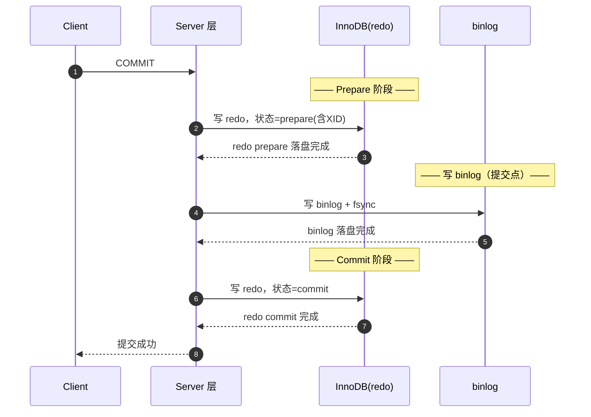
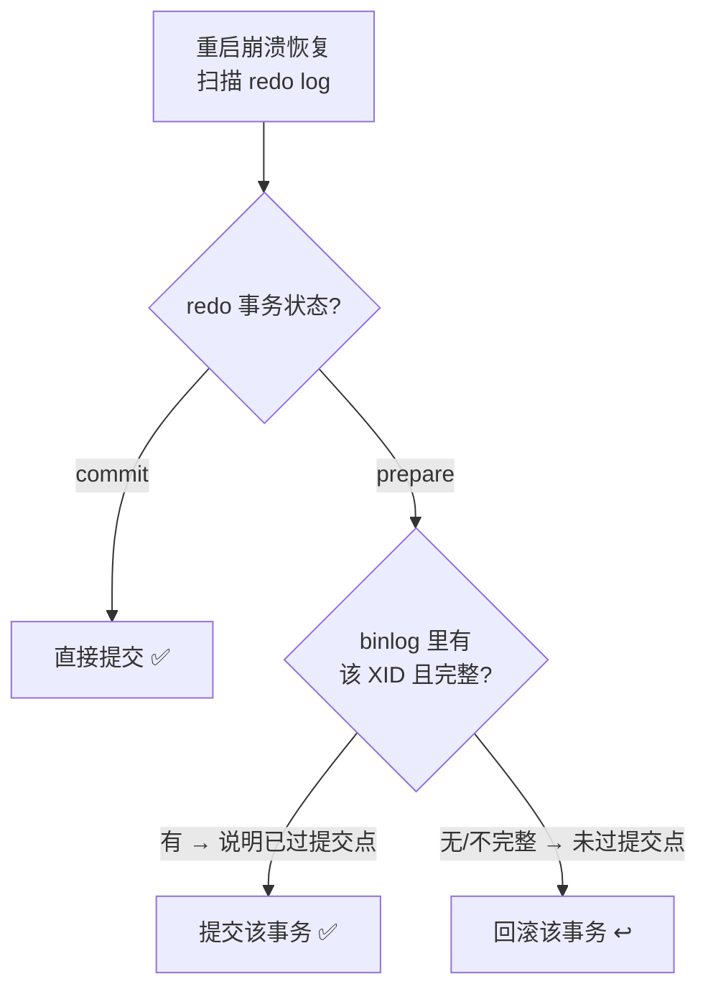

# 18 · 两阶段提交（Two-Phase Commit：redo + binlog）

> 为保证 **redo log 与 binlog 两份日志的一致性**，InnoDB 在事务提交时把 redo 的提交拆成 **prepare → 写 binlog → commit** 三步，宕机恢复时依据 binlog 完整性决定提交还是回滚。面试重要度 ⭐⭐⭐ 高频·压轴。

## 📖 核心原理

一个更新事务同时涉及两份日志：InnoDB 引擎层的 **redo log**（保证 crash-safe）与 Server 层的 **binlog**（保证主从复制与备份恢复）。问题在于：**如果只是「先写完一个再写另一个」，一旦在两次写之间宕机，两份日志就会不一致**，导致「主库有这条数据、从库没有」或「恢复出来的库和主库不一致」。

举反例说明危害。假设执行 `UPDATE t SET c=c+1 WHERE id=1`：

- **先写 redo 后写 binlog**：redo 写完、binlog 还没写就宕机。重启后 redo 让主库这行 c 已 +1，但 binlog 缺这条 → **从库没 +1、用 binlog 恢复的备份也没 +1 → 主从/备份丢数据**。
- **先写 binlog 后写 redo**：binlog 写完、redo 还没写就宕机。重启后 redo 没有这条、主库这行没 +1，但 binlog 有 → **从库和恢复库多 +1 → 数据凭空多出来**。

两种顺序都可能不一致，本质是「两次独立写入无法原子」。解决办法就是**两阶段提交（2PC）**——注意这里的 2PC 是 MySQL **内部**、跨 redo 与 binlog 两个「参与者」的分布式提交协议，不是应用层跨库的 XA（虽然思想同源）。

**两阶段提交的三步：**

1. **prepare 阶段**：InnoDB 把 redo log 写入并标记为 `prepare` 状态（含本事务的 XID），此时 redo 落盘但事务尚未真正提交。
2. **写 binlog**：Server 层把该事务的 binlog 从 binlog cache write + fsync 落盘。**这是整个提交的「提交点」**——binlog 写成功即视为事务逻辑上已提交。
3. **commit 阶段**：InnoDB 把 redo log 标记为 `commit` 状态（这一步的 redo 甚至不用马上 fsync，因为 binlog 已经是提交凭证了）。

关键在于**恢复逻辑**：MySQL 重启做崩溃恢复时，扫描 redo log，对每个处于 `prepare` 状态的事务，去 binlog 里查它对应的 XID：

- **binlog 里有完整该事务** → 说明第 2 步已完成，**提交（commit）**该事务；
- **binlog 里没有 / 不完整** → 说明宕机发生在写 binlog 之前，**回滚（rollback）**该事务。

处于 `commit` 状态的 redo，直接提交。这样就保证了 **redo 和 binlog 对「该事务是否提交」的判断永远一致**，从而主库、从库、备份恢复三者一致。

## 🔄 原理图 / 流程剖析

**两阶段提交时序图：**

**崩溃恢复决策（据 binlog 完整性）：**

**三个崩溃点分析（面试常追问）：**

| 宕机时机 | redo 状态 | binlog 状态 | 恢复动作 | 结果 |
|----------|-----------|-------------|----------|------|
| ① 写完 redo(prepare) 前 | 无/不完整 | 无 | 回滚 | 一致 |
| ② prepare 后、写 binlog 前 | prepare | 无 | 查 binlog 无 → **回滚** | 一致 |
| ③ 写完 binlog、commit 前 | prepare | 完整 | 查 binlog 有 → **提交** | 一致 |
| ④ commit 之后 | commit | 完整 | 直接提交 | 一致 |

## 🔑 面试要点

- 两阶段提交是为了解决 **redo 与 binlog 两份日志的一致性**，避免主从/备份数据与主库分叉。
- 三步：**redo prepare → 写 binlog（提交点）→ redo commit**。记住「binlog 落盘是真正的提交点」。
- 恢复依据：**redo 处于 prepare 时，用 binlog 是否完整来仲裁**——有则提交、无则回滚；redo 处于 commit 直接提交。
- binlog 如何判断「完整」：statement 格式看是否有结尾标记，8.0 事务性 binlog 有 `XID event` 收尾；MySQL 靠这个判断事务的 binlog 是否写全。
- 这是 MySQL **内部 2PC**（redo 与 binlog 两个参与者），与应用层跨数据库的 **XA 分布式事务**是两码事，别混。
- 「双 1」（`sync_binlog=1` + `innodb_flush_log_at_trx_commit=1`）是两阶段提交真正不丢数据的前提，否则 prepare/binlog 可能没真正落盘。
- 8.0 有 **binlog group commit（组提交）**：把多个事务的 prepare/binlog fsync/commit 分别合并成组，一次 fsync 刷多个事务，大幅降低 IO 次数、缓解「双 1」的性能损耗。

## ❓ 高频面试题

**Q：为什么需要两阶段提交？不用会怎样？**
A：因为一个事务要写 redo（引擎层）和 binlog（Server 层）两份独立日志，两次写入之间宕机会导致不一致：先 redo 后 binlog，宕机会让主库有数据而从库/备份没有（丢数据）；先 binlog 后 redo，宕机会让从库/备份多出主库没有的数据（凭空多数据）。两阶段提交通过「prepare → binlog → commit」并在恢复时用 binlog 完整性仲裁，保证无论宕机在哪一步，redo 和 binlog 对「事务是否提交」的判断都一致，从而主库、从库、备份三者数据一致。

**Q：崩溃恢复时，一个处于 prepare 状态的事务，MySQL 怎么决定提交还是回滚？**
A：去 binlog 里查该事务对应的 XID（8.0 事务 binlog 以 XID event 收尾）。① 如果 binlog 中存在且该事务 binlog 完整 → 说明已越过「写 binlog」这个提交点，从库将来会重放这条，为保持一致必须**提交**；② 如果 binlog 中不存在或不完整 → 说明宕机发生在写 binlog 之前，从库不会有这条，因此**回滚**。核心思想是「以 binlog 是否记录为准」，因为 binlog 决定了集群其余节点的最终状态。

**Q：两阶段提交的第二阶段 commit 时，redo 需要 fsync 吗？为什么第二次不那么关键了？**
A：不需要强制 fsync。因为 binlog 已经落盘、构成了提交凭证，即便 commit 标记的 redo 没来得及 fsync 就宕机，恢复时也会因为「redo 处于 prepare 且 binlog 完整」而提交该事务，结果一样正确。所以真正必须 fsync 的是 **redo prepare** 和 **binlog** 两次；这也是组提交能优化的空间。反过来讲，性能关键点就在这两次 fsync，group commit 把它们批量合并。

## ⚠️ 易错点 / 加分项

- **误区**：把 MySQL 内部 2PC（redo↔binlog）和应用层 XA 跨库事务混为一谈。前者是单机引擎与 Server 层的协调，后者是多个资源管理器（多个数据库）的分布式事务。跨库分布式事务方案见 `../../spring-learning/07-spring-cloud/08-distributed-transaction.md`。
- **易错**：说反宕机场景的结果。牢记「先 redo 后 binlog → 可能丢（从库少）」「先 binlog 后 redo → 可能多（从库多）」。
- **加分点**：真正的提交点是 **binlog 落盘那一刻**，不是最后的 redo commit。redo commit 只是打个标记方便恢复时快速判定。
- **加分点**：能讲 **group commit（组提交）**——8.0 把提交流程分 flush / sync / commit 三个 stage，每个 stage 由一个 leader 批量处理排队的事务，一次 fsync 服务多个事务，配合 `binlog_group_commit_sync_delay` 攒批，是「双 1」还能扛高并发的关键。
- **加分点**：`innodb_flush_log_at_trx_commit` 的 0/1/2 语义——1 每次提交 fsync redo；2 每次 write 到 page cache 但由 OS 定 fsync（宕机丢的是 OS 缓存那部分，MySQL 进程 crash 不丢）；0 每秒后台刷一次（进程 crash 也可能丢 1 秒）。只有 1 才配合两阶段提交做到真正不丢。
