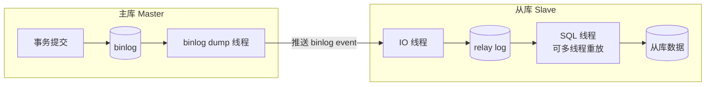
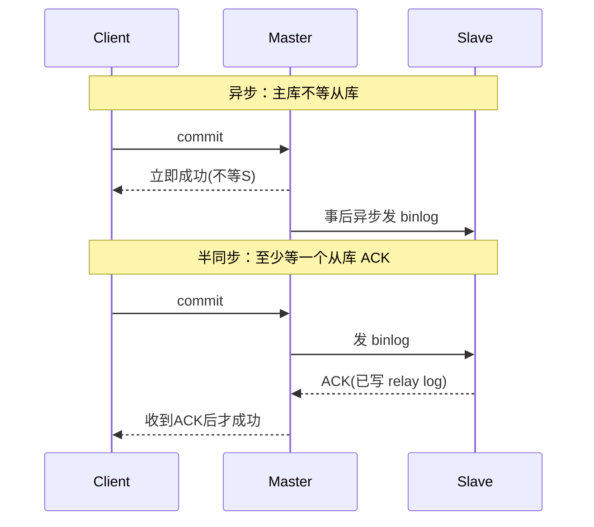

# 19 · 主从复制（Master-Slave Replication）

> 主库把变更写入 binlog，从库通过 **IO 线程拉取写入 relay log、SQL 线程重放**实现数据同步；异步/半同步/组复制在「一致性 vs 性能」间取舍，主从延迟是核心痛点。面试重要度 ⭐⭐⭐ 高频·压轴。

## 📖 核心原理

MySQL 原生复制建立在 **binlog** 之上：主库（master）把所有变更以事件（event）形式写入 binlog，从库（slave/replica）把这些 event 拉过来在本地重放，从而与主库保持数据一致。整个链路涉及**三个线程**：

1. **主库 binlog dump 线程**：从库连上来后，主库为每个从库连接启动一个 dump 线程，负责读取主库 binlog 并**推送**给从库。注意是主库主动 push、从库长连接接收，不是从库轮询。
2. **从库 IO 线程**：接收 dump 线程发来的 binlog event，原样写入本地的 **relay log（中继日志）**。IO 线程只负责「搬运落盘」，不解析执行，所以很快。
3. **从库 SQL 线程**：读取 relay log 里的 event，在从库上**重放执行**，真正把数据变更应用到从库表中。8.0 默认支持多线程重放（MTS，Multi-Threaded Slave），此时是「协调线程 + 多个 worker 线程」。

从库用两个位点记录进度：`Master_Log_File` / `Read_Master_Log_Pos`（IO 线程读到主库 binlog 的位置）和 `Relay_Master_Log_File` / `Exec_Master_Log_Pos`（SQL 线程执行到的位置）。二者的差距就反映了「已拉取但还没重放完」的积压。

**位点复制 vs GTID 复制**：传统方式从库靠「binlog 文件名+偏移量」定位，主从切换时手工算位点极易出错。MySQL 5.6+ 引入 **GTID（Global Transaction ID）**——每个事务有全局唯一 ID（`server_uuid:事务序号`），从库记录「已执行的 GTID 集合」，切换时只需 `CHANGE MASTER TO ... MASTER_AUTO_POSITION=1`，从库自动跳过已执行事务、从缺口续传，是 8.0 高可用的标配。

**三种复制模式（一致性强弱）：**

- **异步复制（默认）**：主库写完 binlog、提交事务就立即返回客户端成功，**不等**从库确认。性能最好，但主库宕机时未同步的 binlog 会丢，**可能丢数据 + 主从不一致**。
- **半同步复制（semi-sync，插件）**：主库提交后要**至少等一个从库确认收到 binlog（写入 relay log）**才返回客户端。保证「已提交事务至少在一个从库有副本」，降低丢数据风险。8.0 的 `rpl_semi_sync_master_wait_point=AFTER_SYNC`（默认）是在 binlog sync 之后、引擎 commit 之前等 ACK，进一步避免主库「幻读式」提交。有超时退化机制（`rpl_semi_sync_master_timeout`），等不到 ACK 会退回异步。
- **组复制（MGR，Group Replication）**：基于 Paxos 变种的多数派协议，事务需**多数节点认证通过**才提交，提供**强一致 + 自动故障转移**，是 InnoDB Cluster 的底座（见 22 篇）。

## 🔄 原理图 / 流程剖析

**复制三线程流程：**

**三种模式返回时机对比：**

| 模式 | 主库是否等从库 | 数据安全 | 性能 | 一致性 |
|------|----------------|----------|------|--------|
| 异步 | 不等 | 可能丢 | 最高 | 最终一致 |
| 半同步 | 等 ≥1 从库 ACK | 强很多 | 中（多一个 RTT） | 准强一致 |
| 组复制 MGR | 多数派认证 | 最强 | 较低 | 强一致 |

## 🔑 面试要点

- 三线程：主库 **dump 线程 push**、从库 **IO 线程写 relay log**、从库 **SQL 线程重放**——这是答题主干，务必背熟。
- 复制基于 **binlog + relay log**，推荐 **row 格式**（statement 主从可能分叉，见 17 篇）。
- **GTID** 让主从切换和续传自动化，是 8.0 高可用标配，能自动跳过已执行事务。
- 异步 / 半同步 / 组复制的取舍：性能 异步>半同步>MGR，一致性反过来。生产核心库常用**半同步**兜底防丢数据。
- **主从延迟**的本质：主库并发写 binlog，从库 SQL 线程重放能力跟不上。主要成因：① 从库单线程重放（旧版）；② 大事务（一个事务改百万行，从库要完整重放）；③ 从库硬件差 / 承担大量读；④ 从库上执行慢 DDL 阻塞。
- 主从延迟解决：**并行复制（MTS）** + 拆大事务 + 半同步 + 提升从库配置 + `WRITESET` 依赖检测提高并行度。
- 用 `SHOW REPLICA STATUS`（8.0 术语，旧版 `SHOW SLAVE STATUS`）看 `Seconds_Behind_Master` 观察延迟，但该值在某些场景（IO 线程断连）会失真，更准可用心跳表/GTID 差值。

## ❓ 高频面试题

**Q：详细讲讲主从复制的完整流程（三个线程各干什么）？**
A：① 从库执行 `CHANGE REPLICATION SOURCE` 连接主库并启动复制；主库为该连接开一个 **binlog dump 线程**，实时读取主库 binlog 并把新的 event 推送给从库。② 从库的 **IO 线程**接收这些 event，原样顺序写入本地 **relay log**，只搬运不执行、速度快，并记录读到主库 binlog 的位点。③ 从库的 **SQL 线程**（8.0 默认多线程）读取 relay log 中的 event 在本地重放，真正应用数据变更，并记录已执行位点。主从数据一致性依赖 binlog（推荐 row 格式）与 GTID 保证事务不重不漏。

**Q：主从延迟是怎么产生的？怎么解决？**
A：根因是主库多线程并发产生变更、而从库重放能力有限，导致 relay log 积压。常见成因：从库单线程重放跟不上主库并发写、大事务（一个事务改动海量行必须在从库完整重放才提交）、从库承担大量读查询抢占资源、从库执行慢查询或 DDL 阻塞 SQL 线程、网络延迟。解决：① 开启**并行复制**（`replica_parallel_workers` 多 worker + `replica_parallel_type=LOGICAL_CLOCK`，8.0 配合 `WRITESET` 依赖检测提高并发度）；② 业务侧拆分大事务、避免一次改百万行；③ 用**半同步**保证关键数据至少同步到一个从库；④ 提升从库硬件、减少从库额外负载；⑤ 对「读己之写」场景强制走主库（见 20 篇读写分离）。

**Q：半同步复制相比异步好在哪？它是「强一致」吗？**
A：异步复制主库提交后立即返回、不等从库，主库宕机时未传出去的 binlog 直接丢失，造成丢数据和主从不一致。半同步要求主库提交时**至少等一个从库确认已收到 binlog（写入 relay log）**才返回客户端，保证已返回成功的事务至少在一个从库有副本，故障切换时不丢这部分数据。但它**不是严格强一致**：① 从库只确认「收到并写 relay log」，不保证已重放，读从库仍可能读到旧值；② 有超时退化（等不到 ACK 会退回异步）；③ 只保证 ≥1 个从库有。真正强一致要用 **MGR / InnoDB Cluster** 的多数派协议。

## ⚠️ 易错点 / 加分项

- **误区**：以为从库轮询拉 binlog。实际是主库 **dump 线程主动 push**，从库 IO 线程通过长连接接收。
- **误区**：以为 relay log 是主库的。relay log 是**从库本地**的中继日志，IO 线程写、SQL 线程读，可自动清理（`relay_log_purge=ON`）。
- **易错**：`Seconds_Behind_Master` 不完全可靠——它基于 SQL 线程执行的 event 时间戳与从库当前时间差，IO 线程断连时会显示 NULL 或 0，大事务重放时也会阶跃。生产常用**心跳表**（主库定时写时间戳，从库对比）更精确。
- **加分点**：能讲 **MTS 并行复制的演进**——5.6 按库并行（DATABASE），5.7 引入 LOGICAL_CLOCK（同一组提交的事务在主库能并行，从库也能并行），8.0 用 **WRITESET**（按行写集合判断事务无冲突即可并行）把并行度进一步拉高，这是缓解延迟的现代关键手段。
- **加分点**：半同步的 `AFTER_SYNC` vs `AFTER_COMMIT` 等待点差异——`AFTER_SYNC`（8.0 默认，无损复制）在引擎 commit 前等 ACK，避免主库先对外可见后又丢失导致的「幻读」；`AFTER_COMMIT` 则在 commit 后等，安全性略弱。
- **加分点**：GTID 复制下不能有「主从各自产生冲突 GTID」，且从库不能开启会产生 binlog 的独立写（除非双主/多源复制专门规划），否则 GTID 集合错乱。
