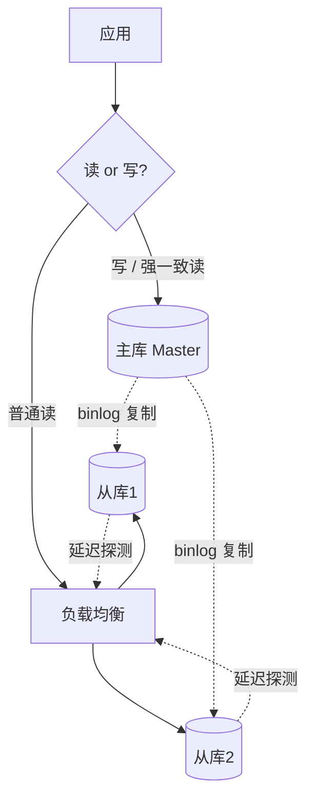
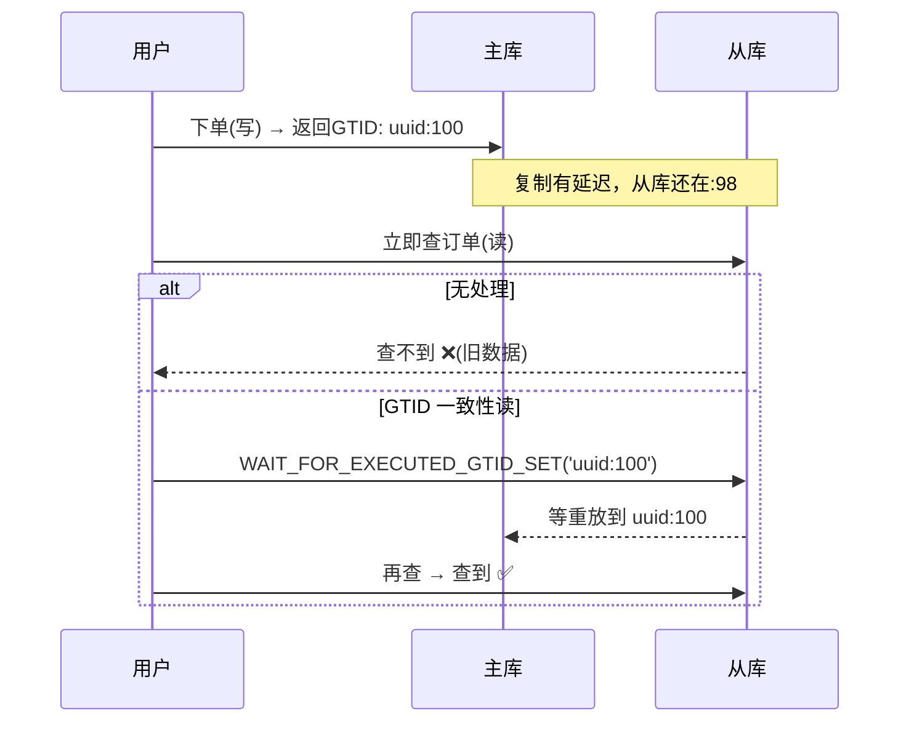

# 20 · 读写分离（Read-Write Splitting）

> 写走主库、读走从库，用从库横向扩展读能力；核心难题是**主从延迟导致读到旧数据**，靠强制走主/半同步/延迟感知解决，方案分中间件与客户端两类。面试重要度 ⭐⭐ 常考。

## 📖 核心原理

读写分离建立在主从复制之上：**所有写操作（INSERT/UPDATE/DELETE/DDL）路由到主库，读操作（SELECT）分发到一个或多个从库**。目的是分担主库压力——大多数系统读远多于写（读写比常 10:1 甚至更高），把读扩散到多个从库即可近乎线性地扩展读吞吐，同时主库专注写、减轻负载。

但读写分离引入一个绕不开的问题：**主从复制是有延迟的（见 19 篇）**，写入主库的数据要经过 binlog 传输 + 从库重放才出现在从库上。于是出现「**读己之写（read-your-writes）不一致**」——用户刚下单（写主库）立刻查订单（读从库），从库还没同步到，查不到，体验就是「明明成功了却看不到」。这是读写分离最经典的坑。

**解决主从延迟读旧数据的三类手段：**

1. **强制走主库（关键读打主库）**：对「写后立即读」「金融/账户余额」等强一致敏感场景，直接把这类 SELECT 路由到主库。实现上：ShardingSphere 提供 `hint` 强制主库；MyBatis 拦截器按注解或方法名判定；业务代码手动切数据源。这是最简单可靠的兜底，代价是主库读压力上升，所以只对必要读用。
2. **半同步复制**：主库提交时等至少一个从库确认收到 binlog，缩小延迟窗口、降低读到旧数据概率（但从库确认的是「收到」非「重放完」，不能 100% 保证，见 19 篇）。
3. **延迟感知路由**：中间件持续探测各从库延迟（`Seconds_Behind_Master` 或 GTID 差值/心跳表），把延迟超阈值的从库**临时摘除**读流量，只把请求发给「已追上」的从库；更精细的做法是 **GTID 一致性读**——写主库拿到本次事务的 GTID，读从库前确认该从库已执行到 ≥ 这个 GTID（`WAIT_FOR_EXECUTED_GTID_SET`）再读，实现「会话级读己之写」。

**方案落地：中间件 vs 客户端（SDK）两条路线。**

- **中间件（代理）方案**：应用连一个代理（ShardingSphere-Proxy、MyCat、MaxScale、ProxySQL），代理伪装成 MySQL、解析 SQL 判断读写并路由。优点：对应用**透明、跨语言**、集中治理；缺点：**多一跳网络延迟**、代理本身要做高可用、是性能瓶颈点。
- **客户端（JDBC/SDK）方案**：在应用进程内做路由（ShardingSphere-JDBC、Spring `AbstractRoutingDataSource` 动态数据源、`@DS` 注解）。优点：**无额外网络跳、性能好**、无中心组件；缺点：**与语言/框架绑定**（Java 生态为主）、每个应用都要引入配置、升级需应用重启。

## 🔄 原理图 / 流程剖析

**读写分离架构与路由：**

**读己之写不一致与 GTID 解决：**

## 🔑 面试要点

- 读写分离 = 写主 + 读从，目的是**扩展读吞吐**、分担主库压力，前提是已有主从复制。
- 核心痛点是**主从延迟导致读到旧数据 / 读己之写不一致**，这是必答的问题点。
- 三种解法：**强制走主库**（关键读兜底，最常用）、**半同步**（缩小窗口）、**延迟感知/GTID 一致性读**（精细路由）。
- 两类方案：**中间件（Proxy）** 透明跨语言但多一跳、**客户端（JDBC）** 高性能但绑语言。Java 生态用 ShardingSphere 居多（两种形态都提供）。
- 从库能承担读、备份、报表分析等，还能天然做**故障时的备主**（配合高可用切换，见 22 篇）。
- 事务内的读默认应走主库（否则事务里的写自己都读不到），中间件通常把**显式事务整体路由到主库**。

## ❓ 高频面试题

**Q：读写分离后用户「写完立刻读不到」怎么办？**
A：这是主从延迟导致的读己之写不一致。分场景处理：① 对强一致敏感的「写后立即读」（如下单后查订单、改资料后查资料），**强制这类读走主库**，实现上用中间件 hint、注解拦截或动态数据源手动切主；② 用**半同步复制**缩小延迟窗口；③ 用 **GTID 一致性读**——写主库后拿到事务 GTID，读从库前用 `WAIT_FOR_EXECUTED_GTID_SET` 等从库追到该 GTID 再读，做到会话级一致；④ 中间件做**延迟感知**，把延迟高的从库摘掉。工程上最常用「关键读走主 + 普通读走从」的组合。

**Q：中间件方案和客户端方案怎么选？各自优缺点？**
A：中间件（ShardingSphere-Proxy/MyCat/ProxySQL）以独立代理进程存在，应用像连普通 MySQL 一样连它，路由对应用透明、**支持多语言、可集中运维治理**，但**多一次网络转发、代理自身要做高可用、易成瓶颈**。客户端（ShardingSphere-JDBC/动态数据源）在应用进程内路由，**没有额外网络跳、性能最好、无中心依赖**，但**只适配特定语言/框架（Java 为主）、每个应用都要接入、规则变更常需重启**。选择：单一 Java 技术栈、追求性能优先选 JDBC；多语言异构、需要统一治理选 Proxy。很多团队两者混用（JDBC 为主，Proxy 兜底跨语言）。

**Q：为什么事务内的读要走主库？**
A：因为一个事务里如果写了主库、读却发到从库，从库还没同步到本事务的写，会导致「事务读不到自己刚写的数据」，破坏事务内一致性；而且从库读还看不到本事务未提交的中间状态。所以中间件/框架通常把**开启了显式事务的连接整体绑定到主库**，事务内所有读写都走主，直到事务结束。

## ⚠️ 易错点 / 加分项

- **误区**：以为读写分离能提升写性能。它只扩展**读**能力，写压力仍全压主库；写瓶颈要靠**分库分表**（见 21 篇）解决。
- **误区**：以为加了半同步就绝对读不到旧数据。半同步从库确认的是「收到 binlog」而非「已重放」，读从库仍可能读到旧值；要严格读己之写得靠 GTID 一致性读或走主库。
- **易错**：忘记把**事务内读**和**自增/时间敏感读**特殊处理，导致偶发性诡异 bug。
- **加分点**：能提「延迟阈值摘流 + 心跳表精确测延迟」比单纯看 `Seconds_Behind_Master` 靠谱，后者在大事务/断连时会失真。
- **加分点**：读写分离与分库分表往往叠加——ShardingSphere 可同时做「分片 + 每个分片主从读写分离」，是大型系统标准形态。
- **加分点**：可提「读扩展有上限」——从库越多，主库 dump 线程和网络复制压力越大，且每个从库都要完整重放全部写，几十个从库后收益递减，超大规模读要引入缓存（Redis）分层。
