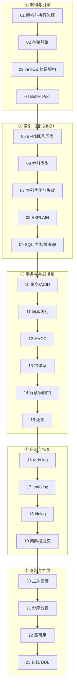

# MySQL 面试知识合集 🐬（资深级别）

> 基于 **MySQL 8.0 / InnoDB** 主线，系统梳理架构、索引、事务、锁、日志、复制与高可用的**底层原理**。目标是资深/面试导向：讲透 how/why 与机制（B+树回表、Buffer Pool LRU、MVCC ReadView、Next-Key Lock、redo/undo/binlog 两阶段提交），不停留在命令罗列。默认隔离级别 **RR（可重复读）**。

姊妹目录：[`../redis`](../redis) · 上层应用见 [`../../java-learning`](../../java-learning) · [`../../spring-learning`](../../spring-learning)。

---

## 一、知识点索引（推荐按编号顺序学习/复习）

| # | 知识点 | 一句话 | 重要度 |
|---|---|---|---|
| 01 | [架构与执行流程](01-architecture.md) | 连接层/Server 层/引擎层三层架构，一条 SQL 的完整旅程 | ⭐⭐⭐ |
| 02 | [存储引擎](02-storage-engines.md) | InnoDB vs MyISAM，为什么 8.0 默认 InnoDB | ⭐⭐ |
| 03 | [InnoDB 体系架构](03-innodb-architecture.md) | 内存结构 + 磁盘结构全景 | ⭐⭐⭐ |
| 04 | [Buffer Pool](04-buffer-pool.md) | 缓存页、改进版 LRU、脏页刷盘、Change Buffer | ⭐⭐⭐ |
| 05 | [索引原理·为什么用 B+树](05-index-basics.md) | B+树 vs B树/红黑/哈希、聚簇索引、回表 | ⭐⭐⭐ |
| 06 | [索引类型](06-index-types.md) | 主键/唯一/联合/覆盖/前缀，自增 vs UUID | ⭐⭐⭐ |
| 07 | [索引优化与失效](07-index-optimization.md) | 最左前缀、ICP、覆盖索引、索引失效全集 | ⭐⭐⭐ |
| 08 | [EXPLAIN 执行计划](08-explain.md) | type/key/rows/Extra 解读与优化 | ⭐⭐⭐ |
| 09 | [SQL 优化与慢查询](09-sql-optimization.md) | 慢查询定位、深分页、JOIN、count 优化 | ⭐⭐ |
| 10 | [事务与 ACID](10-transaction.md) | 原子性/一致性/隔离性/持久性的实现基石 | ⭐⭐⭐ |
| 11 | [隔离级别与并发问题](11-isolation-levels.md) | 脏读/不可重复读/幻读，RC vs RR | ⭐⭐⭐ |
| 12 | [MVCC 多版本并发控制](12-mvcc.md) | ReadView + undo 版本链 + 可见性算法 | ⭐⭐⭐ |
| 13 | [锁体系概览](13-locks.md) | 全局锁/表锁/意向锁/行锁分类 | ⭐⭐ |
| 14 | [行锁·间隙锁·临键锁](14-row-locks.md) | Record/Gap/Next-Key Lock 如何防幻读 | ⭐⭐⭐ |
| 15 | [死锁](15-deadlock.md) | 死锁成因、检测、日志分析与规避 | ⭐⭐ |
| 16 | [redo log](16-redo-log.md) | WAL、Crash-Safe、刷盘策略与 LSN | ⭐⭐⭐ |
| 17 | [undo log](17-undo-log.md) | 回滚 + MVCC 版本链的载体 | ⭐⭐ |
| 18 | [binlog](18-binlog.md) | 归档日志、三种格式、与 redo 的区别 | ⭐⭐⭐ |
| 19 | [两阶段提交与崩溃恢复](19-two-phase-commit.md) | redo+binlog 一致性、prepare/commit | ⭐⭐⭐ |
| 20 | [主从复制与读写分离](20-replication.md) | binlog 复制、主从延迟成因与解决 | ⭐⭐⭐ |
| 21 | [分库分表](21-sharding.md) | 拆分策略、全局 ID、跨库 JOIN/事务 | ⭐⭐ |
| 22 | [高可用](22-high-availability.md) | MHA/MGR、故障切换、双主 | ⭐ |
| 23 | [在线 DDL 与大表变更](23-online-ddl.md) | Online DDL、gh-ost/pt-osc 原理 | ⭐ |

> 01~08 为架构与索引主线（本册），09~23 为事务/锁/日志/复制/运维进阶。

---

## 二、学习路线图

---

## 三、资深面试冲刺清单（必须能手撕）

- **执行流程**：一条 SELECT / 一条 UPDATE 从连接到落盘，各组件（连接器/分析器/优化器/执行器/引擎）职责。
- **索引**：为什么用 B+树而非 B 树/红黑树/哈希；聚簇索引与二级索引、回表、覆盖索引；最左前缀、ICP、索引失效场景全集。
- **EXPLAIN**：type 从 `system` 到 `ALL` 的优劣序，Extra 里 `Using filesort`/`Using temporary`/`Using index` 的含义与优化。
- **事务并发**：RR 与 RC 的区别、MVCC 的 ReadView + undo 版本链、RR 如何用 Next-Key Lock 解决幻读。
- **日志**：redo（WAL/crash-safe）、undo（回滚+MVCC）、binlog（归档/复制）、两阶段提交为何保证一致。
- **复制**：主从原理、主从延迟成因与解决（并行复制、半同步、读己之写）。

> 规范见 [`../_CONVENTIONS.md`](../_CONVENTIONS.md)。
