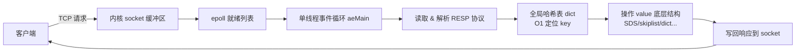

# 01 · Redis 概述与为什么快（Overview & Why Fast）

> Redis 是单线程的内存 KV 数据库，官方基准 QPS 可达 10 万+；快的本质 = **纯内存 + 单线程避免上下文切换与锁 + IO 多路复用 + 高效数据结构 + 全局哈希表**。面试重要度：⭐⭐⭐ 高频（几乎必问"Redis 为什么快"）。

## 📖 核心原理

**Redis（REmote DIctionary Server）** 是一个基于内存的 key-value 存储系统，核心可以理解成"一个巨大的、可网络访问的哈希表 + 丰富的 value 数据结构"。它支持 string/list/hash/set/zset 等多种数据类型，可持久化、可做主从复制与集群，广泛用于缓存、计数器、排行榜、分布式锁、消息队列、限流等场景。

"为什么快"是最高频的开放题，标准答案要拆成 5 个层次，逐条讲清 how/why：

1. **纯内存操作**：所有数据放在内存，读写不走磁盘 IO。内存随机访问是纳秒级（约 100ns），而磁盘寻道是毫秒级，差 10 万倍。这是最根本的原因——但"内存快"只是必要条件，不是 Redis 独有的优势，面试要往下讲。

2. **单线程模型避免上下文切换与锁竞争**：Redis 处理命令的核心是单线程（一个 `main` 线程串行执行命令）。单线程意味着**没有多线程的上下文切换开销、没有锁竞争、没有死锁**，所有命令天然串行、天然原子。既然瓶颈不在 CPU（在内存和网络），多线程带来的收益抵不过锁和切换的成本，单线程反而是更优解（见 04）。

3. **IO 多路复用（epoll）**：单线程如何同时服务成千上万连接？靠 IO 多路复用。一个线程通过 `epoll` 监听所有 socket，哪个就绪就处理哪个，避免为每个连接开线程、也避免阻塞在某个连接上。这是"单线程还能高并发"的关键（见 05）。

4. **高效的底层数据结构**：Redis 为每种类型精心设计了底层编码——SDS（动态字符串）、listpack/ziplist（紧凑连续内存）、quicklist、dict（哈希表）、intset、skiplist（跳表）。小数据用紧凑编码省内存、缓存友好；大数据用指针结构保证操作复杂度（见 03）。

5. **全局哈希表 O(1) 定位**：Redis 的所有 key 存在一个全局哈希表（`dict`）里，key→value 的定位是 O(1)。配合渐进式 rehash，即使表在扩容也不会长时间阻塞。

一句话总结面试话术："**内存决定了下限快，单线程 + IO 多路复用决定了它能在不加锁、不切换的情况下把 CPU 吃满地处理网络请求，高效数据结构 + 全局哈希表决定了每个操作本身也快。**"

## 🔄 原理图 / 流程剖析

一条命令从客户端到返回，经过的路径：

"为什么快"五要素对照：

| 要素 | 解决什么问题 | 反面/替代方案 |
|---|---|---|
| 纯内存 | 磁盘 IO 慢（ms 级） | 走磁盘的 MySQL |
| 单线程 | 上下文切换、锁竞争、死锁 | 多线程需加锁串行化 |
| IO 多路复用 | 单线程如何服务海量连接 | 一连接一线程（C10K 问题） |
| 高效数据结构 | 单个操作本身的复杂度/内存 | 通用容器，浪费内存 |
| 全局哈希表 | key 定位 | 遍历查找 O(n) |

## 🔑 面试要点

- "为什么快"必须答满 5 点，且要点明**瓶颈不在 CPU 而在内存和网络带宽**，这才是单线程合理的前提。
- 单线程指的是**命令执行是单线程**；持久化的 `bgsave`/`bgrewriteaof` 是 fork 子进程、Redis 4.0 惰性删除有后台线程（`lazyfree`）、Redis 6.0 引入多线程 IO——所以"Redis 完全是单线程"是错的。
- IO 多路复用是"单线程也能高并发"的核心；epoll 相比 select/poll 是 O(1) 就绪通知、无 fd 数量限制。
- 高效数据结构体现"空间换时间/时间换空间"的权衡：小集合用紧凑连续内存（省内存 + CPU cache 友好），大集合用跳表/哈希（保证复杂度）。
- 全局哈希表 + 渐进式 rehash：扩容不一次性搬迁，分摊到每次操作，避免长时间阻塞。

## ❓ 高频面试题

**Q：Redis 单线程为什么还这么快？既然快，为什么 6.0 又要引入多线程？**
A：单线程快是因为瓶颈不在 CPU，而在内存访问和网络 IO；单线程省去了锁竞争与上下文切换，命令天然串行原子，配合 IO 多路复用一个线程就能扛住海量连接。6.0 引入多线程 IO 是因为在高并发大 value 场景下，**网络数据的读取和写回（协议 read/write）成了瓶颈**，于是把这部分并行化交给多个 IO 线程，但**命令的实际执行仍然是单线程**，从而既提速又不引入并发安全问题。

**Q：内存快是 Redis 快的全部原因吗？**
A：不是。内存快只是下限。Memcached 也是内存的。Redis 的差异在于单线程 + IO 多路复用的高效网络模型、为每种类型量身定制的底层编码、以及全局哈希表 O(1) 定位。把"内存快"当唯一答案会被认为深度不够。

**Q：Redis 和 Memcached 的核心区别？**
A：数据类型（Redis 有 list/hash/set/zset/stream 等丰富结构，Memcached 只有简单 KV）、持久化（Redis 有 RDB/AOF）、主从/哨兵/Cluster 高可用、单线程 vs 多线程（Memcached 多线程）、以及 Redis 支持 Lua、事务、发布订阅、地理位置等。Memcached 在纯多线程大 value 缓存上可能更省心，但功能远不及 Redis。

## ⚠️ 易错点 / 加分项

- **误区**："Redis 是纯单线程"。正确说法是"核心命令执行单线程，持久化/异步删除/6.0 网络 IO 有多线程/子进程"。
- **加分**：点出"单线程合理的前提是瓶颈在内存/网络而非 CPU"，说明你理解设计权衡而非死记。
- **加分**：能说清 epoll 相对 select 的优势（O(1)、无 1024 限制、事件驱动），把"IO 多路复用"讲到内核层面。
- **加分**：提"CPU cache 友好"——listpack/intset 的连续内存让 CPU 预取命中率高，这也是"高效结构"快的微观原因。
- **踩坑**：单线程意味着**一个慢命令（如 `KEYS *`、大 key 的 `DEL`、复杂 Lua）会阻塞所有请求**，这是单线程模型最大的实战风险，回答"为什么快"时顺带点出这个代价是加分项。
