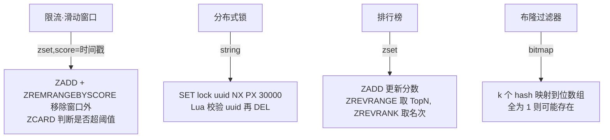

# 02 · 数据类型与应用场景（Data Types & Use Cases）

> Redis 提供 5 种基本类型（string/list/hash/set/zset）+ 4 种扩展类型（bitmap/hyperloglog/geo/stream）；面试重点不是背命令，而是**"什么场景用哪种类型 + 为什么"**——计数、排行榜、分布式锁、限流、去重、布隆、附近的人。面试重要度：⭐⭐⭐ 高频。

## 📖 核心原理

Redis 是"key-value"结构，但 value 有丰富的类型。**类型（type）是逻辑抽象，底层编码（encoding）是物理实现**——同一个 type 在数据量不同时可能用不同编码（详见 03）。这里聚焦"类型语义 + 典型场景"。

**5 种基本类型：**

- **string**：最基础，value 是二进制安全的字节串（最大 512MB）。可存文本、数字、序列化对象、甚至图片。数字场景支持原子 `INCR`/`DECRBY`。
- **list**：双向链表语义（底层 quicklist），支持两端 push/pop，可当栈、队列、阻塞队列（`BLPOP`）。
- **hash**：field-value 映射，适合存对象（一个用户的多个字段），可单独读写某个 field，避免整对象序列化。
- **set**：无序、去重集合，支持交并差（`SINTER`/`SUNION`/`SDIFF`），适合标签、共同好友、去重。
- **zset（sorted set）**：带 score 的有序集合，底层 skiplist + dict，按 score 排序，支持范围查询与排名，是**排行榜的标准答案**。

**4 种扩展类型：**

- **bitmap**：基于 string 的位操作（`SETBIT`/`GETBIT`/`BITCOUNT`），一个 bit 表示一个状态。适合签到、活跃用户统计（一天一个 bitmap，用户 id 为偏移量），极省内存。
- **HyperLogLog**：概率性基数统计，`PFADD`/`PFCOUNT`，固定 12KB 内存即可统计上亿元素的**去重数量**，误差约 0.81%。适合 UV 统计（不需要精确、不需要存明细）。
- **geo**：地理位置（`GEOADD`/`GEOSEARCH`），底层用 zset + GeoHash 编码，适合"附近的人/门店"。
- **stream**：Redis 5.0 引入的持久化消息队列，支持消费组（Consumer Group）、ACK、阻塞读，比 Pub/Sub 可靠（见 16）。

## 🔄 原理图 / 流程剖析

类型 → 场景 → 命令 速查表（面试高频场景加粗）：

| 类型 | 典型场景 | 关键命令 | 为什么用它 |
|---|---|---|---|
| string | **计数**（PV/点赞/库存）、缓存对象、**分布式锁** | `INCR` `DECR` `SET k v NX PX` | 原子自增；`NX` 天然互斥 |
| string+bit | **签到**、活跃统计、**布隆过滤器**位数组 | `SETBIT` `BITCOUNT` `BITOP` | 1 bit/状态，极省内存 |
| list | 消息队列、**最新列表**、栈 | `LPUSH` `RPOP` `BLPOP` | 两端操作 O(1)，可阻塞 |
| hash | 存**对象**、购物车 | `HSET` `HGET` `HINCRBY` | 单字段读写，省序列化 |
| set | **去重**、标签、共同好友、抽奖 | `SADD` `SINTER` `SRANDMEMBER` | 天然去重 + 集合运算 |
| zset | **排行榜**、延迟队列、**限流**（滑动窗口） | `ZADD` `ZRANGE` `ZRANGEBYSCORE` | score 排序 + 排名 |
| HyperLogLog | **UV 统计**（海量去重计数） | `PFADD` `PFCOUNT` | 12KB 统计上亿，误差 0.81% |
| geo | 附近的人/门店 | `GEOADD` `GEOSEARCH` | zset + GeoHash |
| stream | **可靠消息队列** | `XADD` `XREADGROUP` `XACK` | 消费组 + ACK + 持久化 |

几个经典场景的实现思路：

## 🔑 面试要点

- **计数**用 string 的 `INCR`（原子，避免读改写竞态）；高并发库存扣减也常用 `DECR` + Lua 兜底。
- **排行榜**首选 zset：`ZADD` 更新分数、`ZREVRANGE 0 9 WITHSCORES` 取 Top10、`ZREVRANK` 取某人排名。同分可用"分数 + 时间戳"复合 score 保证稳定排序。
- **分布式锁**用 `SET key uuid NX PX 30000`：`NX` 保证互斥、`PX` 防死锁、value 用唯一 uuid 保证只释放自己的锁（见 13）。
- **限流**：计数器法用 `INCR` + `EXPIRE`；滑动窗口用 zset 存时间戳；令牌桶常用 Lua 脚本保证原子。
- **去重/UV**：小规模精确去重用 set，海量近似去重用 HyperLogLog（省内存、不存明细）。
- **签到/布隆**用 bitmap：签到一天一个 key、用户 id 作偏移；布隆过滤器用位数组 + 多个 hash（Redis 4.0+ 有 `RedisBloom` 模块直接支持）。
- **对象缓存**：字段多且要单独更新用 hash；整体读写、要设 TTL 用 string 存 JSON。

## ❓ 高频面试题

**Q：排行榜为什么用 zset 而不是 list 或 MySQL order by？**
A：zset 底层跳表 + 哈希表，`ZADD` 更新分数 O(log n)、按排名取 TopN O(log n + m)、取某成员排名 O(log n)，都很快且实时。list 无法按分数排序；MySQL `order by limit` 在高并发实时更新排行下压力大、深分页慢。zset 天然为"有序 + 排名"设计，是排行榜的标准答案。

**Q：统计一个亿级 UV，用什么？为什么不用 set？**
A：用 HyperLogLog。set 精确但存全部明细，上亿元素内存爆炸（几个 GB）；HyperLogLog 固定 12KB、误差约 0.81%，UV 这种"只要去重总数、能容忍微小误差"的场景完美。若需要精确且能接受内存，才考虑 set 或 bitmap。

**Q：bitmap 做签到怎么设计 key？统计连续签到天数？**
A：key 按 `sign:{userId}:{yyyyMM}` 一个用户一月一个 bitmap，`SETBIT key dayOfMonth 1` 标记签到，`BITCOUNT` 统计当月签到天数，`BITFIELD` 或取出 bit 串判断连续。一个用户一月仅 31 bit，千万用户也才几 MB，极省内存。

**Q：Redis 能做消息队列吗？list、Pub/Sub、Stream 怎么选？**
A：可以但要看可靠性要求。list（`LPUSH`+`BRPOP`）简单但无 ACK、无消费组、消费失败易丢；Pub/Sub 是广播、不持久化、离线丢消息；Stream 才是"正经"消息队列，支持消费组、ACK、pending 重投、持久化。对可靠性要求高应选 Stream，否则用专业 MQ（Kafka/RocketMQ）。

## ⚠️ 易错点 / 加分项

- **误区**：把"类型"和"编码"混为一谈。同一个 zset 小数据用 listpack、大数据才用 skiplist；回答场景题时能带出编码转换是加分项（见 03）。
- **加分**：分布式锁的 value 一定要是唯一标识，删锁要用 Lua 做"判断 + 删除"原子操作，否则可能误删别人的锁。
- **加分**：排行榜同分排序问题——用 `score * 10^n + (maxTs - timestamp)` 构造复合分数，保证同分先到者靠前。
- **踩坑**：`KEYS *`、大 set 的 `SMEMBERS`、大 zset 全量 `ZRANGE` 会阻塞单线程，生产用 `SCAN`/`SSCAN`/分页。
- **踩坑**：list 当队列时若消费端宕机，`RPOP` 出去的消息会丢；可靠场景用 `RPOPLPUSH`（备份队列）或直接上 Stream。
