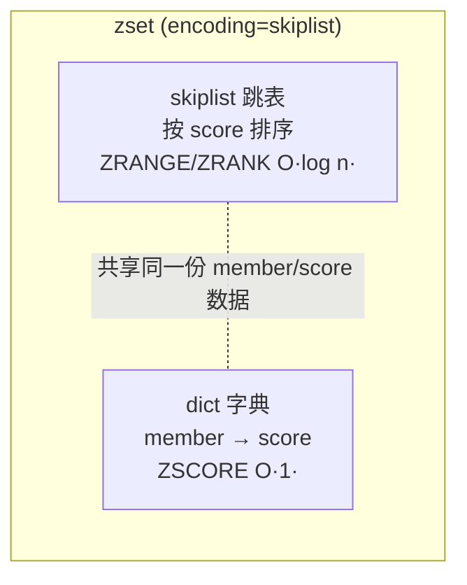
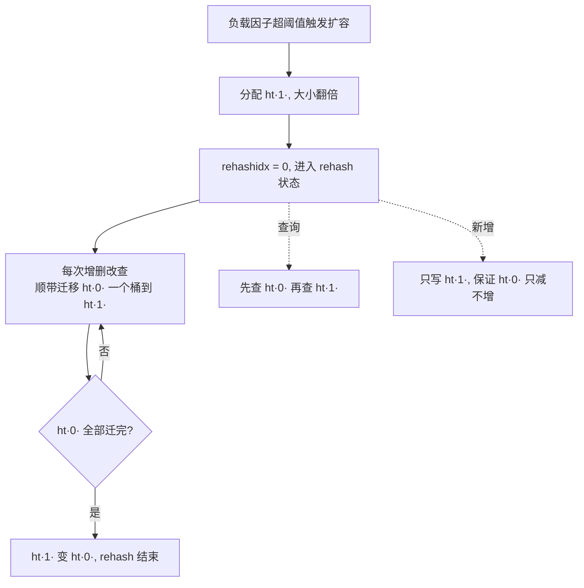

# 03 · 底层数据结构与对象编码（Internal Data Structures & Encoding）

> 重点章节！每个 Redis 类型（type）通过 `redisObject` 的 `encoding` 字段指向不同底层结构：SDS、listpack（7.0 取代 ziplist）、quicklist、dict、intset、skiplist。**核心考点：某类型在什么条件下用哪种编码，以及转换阈值**（如 zset 小用 listpack、大用 skiplist+dict）。面试重要度：⭐⭐⭐ 高频（拉开深度的关键）。

## 📖 核心原理

### redisObject：类型与编码的桥梁

Redis 中每个 value 都封装成一个 `redisObject`，关键字段：

- `type`：逻辑类型（`OBJ_STRING`/`OBJ_LIST`/`OBJ_HASH`/`OBJ_SET`/`OBJ_ZSET`）。
- `encoding`：底层编码（`int`/`embstr`/`raw`/`listpack`/`quicklist`/`hashtable`/`intset`/`skiplist`）。
- `lru`：用于 LRU/LFU 淘汰的时钟/计数（见 10）。
- `refcount`：引用计数（共享对象，如 0–9999 的小整数）。
- `ptr`：指向真正的底层数据结构。

用 `OBJECT ENCODING key` 可查看某 key 当前编码。**同一 type 会随数据规模在编码间转换**，遵循"**小数据用紧凑连续内存（省内存 + CPU cache 友好），大数据用指针结构（保证操作复杂度）**"的设计哲学，且**转换单向不可逆**（元素删回去也不会退回紧凑编码）。

### 六大底层结构

1. **SDS（Simple Dynamic String，简单动态字符串）**：Redis 字符串的底层。相比 C 字符串：
   - 记录 `len`，**O(1) 取长度**，且二进制安全（可存 `\0`）。
   - 记录 `alloc`，**预分配 + 惰性释放**，减少扩容频率（`append` 时扩容翻倍/预留）。
   - **杜绝缓冲区溢出**：修改前检查空间。
   - 5.0+ 按长度用 `sdshdr5/8/16/32/64` 不同头部，省元数据内存。

2. **listpack（紧凑列表，7.0 起取代 ziplist）**：一块**连续内存**存多个元素，无指针、极省内存、cache 友好。ziplist 因每个 entry 存 `prevlen`（前一节点长度）存在**连锁更新（cascade update）**问题——某节点变长导致后续 `prevlen` 字段全部扩容，最坏 O(n²)。**listpack 每个元素只记录自身长度、不记录前驱长度，彻底消除连锁更新**，这是 7.0 用它替换 ziplist 的根本原因。

3. **quicklist（快速列表）**：list 的底层，是"**双向链表 + 每个节点是一个 listpack**"的混合结构。纯双向链表指针开销大、纯 listpack 大数据插入要整体搬移，quicklist 折中：链表串起多个 listpack 块，兼顾内存与操作效率。

4. **dict（哈希表/字典）**：全局 key 空间和 hash 类型的底层。数组 + 链地址法解决冲突。**渐进式 rehash**：扩容时同时保留 `ht[0]` 和 `ht[1]` 两张表，每次增删改查顺带把 `ht[0]` 一个桶的数据迁移到 `ht[1]`，把一次性大搬迁**分摊到多次操作**，避免长时间阻塞（单线程不能停）。rehash 期间查询先查 `ht[0]` 再查 `ht[1]`，写入直接写 `ht[1]`。

5. **intset（整数集合）**：set 全是整数且数量少时使用，**有序整数数组 + 二分查找**，按元素大小用 int16/int32/int64，动态升级（不降级）。

6. **skiplist（跳表）**：zset 的底层（配合 dict）。多层链表，通过随机层高实现"跳跃"，范围查询/排名 O(log n)。zset 用 **skiplist 存排序 + dict 存 member→score 映射**：跳表负责 `ZRANGE`/`ZRANK` 的按序访问，dict 负责 `ZSCORE` 的 O(1) 查分。

## 🔄 原理图 / 流程剖析

### 类型 → 编码 转换对照表（Redis 7.x 默认阈值）

| 类型 | 编码 | 使用条件 | 相关配置 |
|---|---|---|---|
| string | `int` | value 是整数且可用 long 表示 | — |
| string | `embstr` | 字符串 ≤ 44 字节（与 redisObject 一次分配） | — |
| string | `raw` | 字符串 > 44 字节 | — |
| list | `listpack` | 元素少且短 | `list-max-listpack-size`(128) |
| list | `quicklist` | 超过上述阈值 | 同上 |
| hash | `listpack` | field 数 ≤128 且每个值 ≤64 字节 | `hash-max-listpack-entries`(128) / `-value`(64) |
| hash | `hashtable` | 超过任一阈值 | 同上 |
| set | `intset` | 全整数且元素 ≤512 | `set-max-intset-entries`(512) |
| set | `listpack` | 非整数但元素少且短（7.2+） | `set-max-listpack-entries`(128) |
| set | `hashtable` | 超过阈值 | 同上 |
| zset | `listpack` | 元素 ≤128 且每个成员 ≤64 字节 | `zset-max-listpack-entries`(128) / `-value`(64) |
| zset | `skiplist` | 超过任一阈值 | 同上 |

> 记忆口诀：**小数据全用紧凑编码（listpack/intset/embstr），超阈值转指针结构（quicklist/hashtable/skiplist），且转换不可逆。**

### zset 的双结构

### dict 渐进式 rehash

## 🔑 面试要点

- **SDS 四大优势**：O(1) 取长度、二进制安全、预分配+惰性释放减少扩容、杜绝溢出。
- **ziplist→listpack（7.0）**：listpack 每个元素不存前驱长度，消除 ziplist 的**连锁更新**问题；这是版本差异高频考点。
- **quicklist = 双向链表 + listpack 块**，兼顾内存和插入效率；早期是 ziplist 块。
- **渐进式 rehash**：两张表并存，迁移分摊到每次操作，避免单线程长时间阻塞；期间"查两表、写新表"。
- **intset**：有序整数数组 + 二分，支持升级不支持降级。
- **zset = skiplist + dict**：跳表管排序/范围/排名，dict 管 O(1) 查分，空间换时间。
- **跳表 vs B+树**：跳表实现简单、范围查询好、无需旋转平衡，适合内存；B+树为磁盘设计（节点=页、减少 IO），适合磁盘数据库。这是"Redis 为什么用跳表而不用 B+树"的标准答案。
- 所有编码转换**单向不可逆**，且由配置阈值控制。

## ❓ 高频面试题

**Q：zset 底层为什么同时用跳表和字典？只用一个不行吗？**
A：两种操作需求不同。跳表擅长按序访问——`ZRANGE`（范围）、`ZRANK`（排名）、`ZRANGEBYSCORE`，O(log n)；但按 member 查 score 需要遍历，慢。字典擅长 O(1) 按 key 查值——`ZSCORE`；但无序，做不了范围/排名。两者共享同一份数据，各取所长，是典型"空间换时间"。

**Q：Redis 为什么用跳表而不用红黑树或 B+树做 zset？**
A：对比红黑树——跳表实现更简单（无复杂旋转），范围查询天然顺着底层链表走更高效，且并发/插入实现简单。对比 B+树——B+树是为磁盘设计的（一个节点一页、多路降低树高减少磁盘 IO），Redis 是纯内存，没有磁盘 IO 要优化，跳表足够且更轻量。所以内存场景选跳表。

**Q：7.0 为什么用 listpack 取代 ziplist？**
A：ziplist 每个 entry 存 `prevlen`（前一节点长度）以支持从后往前遍历，但当某节点长度跨越 254 字节边界变化时，会导致后一节点的 `prevlen` 字段从 1 字节变 5 字节，进而可能引发**连锁更新**，最坏 O(n²) 且伴随多次内存 realloc。listpack 改为每个元素只存自身长度（元素尾部记录 backlen 供逆向遍历），不依赖前驱长度，从根上消除连锁更新，同时结构更规整。

**Q：渐进式 rehash 期间如果一直有新 key 写入，`ht[0]` 会迁不完吗？**
A：不会。rehash 期间新增的 key **只写入 `ht[1]`**，保证 `ht[0]` 的元素数量只减不增，因此一定会迁完。此外除了每次操作顺带迁移，还有定时任务（serverCron）辅助推进 rehash，避免长期停留在中间态。

## ⚠️ 易错点 / 加分项

- **误区**：以为编码会随数据减少退回紧凑编码。**转换是单向不可逆的**——一个 hash 曾经超过阈值变 hashtable，即使后来删到只剩几个 field 也不会变回 listpack。
- **误区**：`hash-max-ziplist-entries` 等旧配置名。7.0 后是 `hash-max-listpack-entries`（旧名保留为别名，答新名更专业）。
- **加分**：能说出 embstr（≤44 字节）与 raw 的区别——embstr 把 redisObject 和 SDS **一次内存分配**在连续空间、只读优化，raw 是两次分配；embstr 修改会转 raw。
- **加分**：`OBJECT ENCODING key` 现场验证编码，面试可主动提"可以用它排查大 key 编码是否退化"。
- **踩坑（大 key 关联）**：一个 hash/zset 元素过多退化成 hashtable/skiplist 会占大量内存且操作变慢，配置阈值和大 key 治理（见 20）直接相关。
- **加分**：intset 的"升级"——插入一个超出当前编码范围的整数会整体升级 int16→int32→int64，但为了兼容不会降级。
