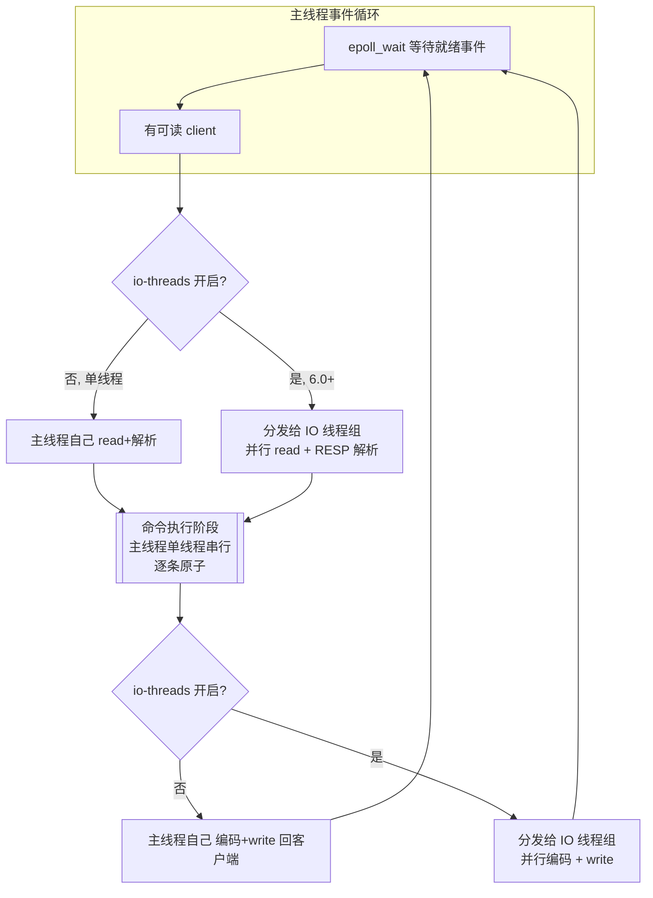

# 04 · 单线程模型（Single-Thread Model）

> Redis 的**命令执行是单线程**串行处理，天然原子、无锁；网络 IO、持久化、异步删除另有线程/子进程分担。面试重要度：⭐⭐⭐ 高频重点。

## 📖 核心原理

**为什么敢用单线程？** 关键在于 Redis 的性能瓶颈**不在 CPU，而在内存和网络 IO**。数据全在内存，一次操作是纳秒~微秒级；真正的耗时是网卡收发和内核态/用户态数据拷贝。既然 CPU 不是瓶颈，多线程带来的**上下文切换（context switch）开销、共享数据的锁竞争（lock contention）、CPU 缓存失效**反而得不偿失。单线程避开了这一切：一个 `while` 事件循环把所有命令串起来跑，简单、可预测、无锁。官方也说过——用单线程「单核就能跑到 10w+ QPS」，多数场景瓶颈先到网络/内存而非计算。

**"单线程"到底指什么？** 严格说，指**命令的执行阶段是单线程**——所有客户端命令进入同一个队列，由主线程一条条**串行**执行，同一时刻只有一条命令在跑。这带来一个巨大红利：**每条命令天然原子**，不会执行到一半被另一条命令插入（这也是 `INCR`、`SETNX`、`LPUSH` 等无需加锁就线程安全的根本原因，也是 Lua 脚本原子性的基础）。但 Redis **进程整体从来不是"只有一个线程"**：

| 工作 | 由谁做 | 说明 |
|---|---|---|
| 命令执行（读写数据结构） | **主线程（单线程）** | 串行、原子，核心逻辑 |
| 网络 IO 多路复用（`epoll`/`kqueue`） | 主线程 | 见 [05-io-multiplexing](05-io-multiplexing.md)，单 reactor |
| 网络读写（解析请求 / 回写响应） | 主线程 或 **IO 线程（6.0+）** | 6.0 后可多线程并行，默认关 |
| RDB 快照 / AOF 重写 | **fork 子进程** | COW 拷贝，不占主线程 |
| 异步删除大 key / 惰性释放 | **后台线程（bio）** | `UNLINK`、`lazyfree-*` |
| AOF 磁盘 `fsync` | 后台线程（bio） | 避免刷盘阻塞主线程 |

所以准确说法是：**Redis 是"网络 IO + 命令处理"的主线程单线程，配合多个后台线程与子进程做重活。**

**Redis 6.0 多线程 IO（Multi-Threaded I/O）**：随着单机流量变大，瓶颈从命令执行转移到了**网络 IO**——主线程一个人既要 `read()` socket 解析协议、又要执行命令、还要 `write()` 回写，大流量下 socket 读写和 RESP 协议解析开始占大头。6.0 引入多线程 IO，把**网络数据的读取解析、结果的编码回写**分摊给一组 IO 线程并行处理，**但命令的实际执行仍然由主线程单线程完成**——因此依然无锁、依然原子。它只是加速了「搬运和翻译数据」这一段，没有触碰「执行」这一段。

- 默认**关闭**，靠 `io-threads N` 开启（N 含主线程，通常设为 CPU 核数的 1/2~3/4，官方建议 4 核设 2~3、8 核设 6 左右，且**不建议超过 8**）。
- 默认只并行**写回（response）**；要连**读取解析（request）**也并行需再设 `io-threads-do-reads yes`（收益一般不如写回明显）。
- 流程：主线程 `accept` 连接、`epoll` 收事件 → 把可读/可写的 client **分配（round-robin）给各 IO 线程**并行做 `read`+解析 / 编码+`write` → **命令执行环节收拢回主线程串行跑**。是一种「IO 分散、执行汇聚」的模型。

## 🔄 原理图 / 流程剖析

要点：无论是否开多线程 IO，中间那个 **`命令执行阶段` 永远是主线程单线程**——这是原子性和无锁的根，多线程只发生在它的两侧（读入、写出）。

## 🔑 面试要点

- **为什么单线程**：瓶颈在**内存和网络 IO 不在 CPU**，纯内存操作极快；单线程省掉多线程的**上下文切换 + 锁竞争 + CPU 缓存抖动**，实现简单、行为可预测。呼应 [01-overview](01-overview.md) 的「为什么快」。
- **单线程 = 命令执行单线程**：所有命令进同一队列串行跑，**每条命令天然原子**（`INCR`/`SETNX`/`LPUSH` 无锁线程安全、Lua 脚本原子都源于此）。
- **进程不是只有一个线程**：网络多路复用、RDB/AOF（fork 子进程）、大 key 异步删除、AOF fsync（后台 bio 线程）都在主线程之外。
- **Redis 6.0 多线程 IO**：只并行**网络读写与协议解析/编码**，**命令执行仍单线程**；`io-threads` 开启，默认关；解决大流量下网络 IO 成瓶颈——不是为了并行执行命令。
- **单线程最大风险**：**一条慢命令阻塞所有请求**。因为串行，一个 O(n) 大命令跑几百毫秒，期间**全库其它请求全部排队**，表现为整体延迟飙升甚至「假死」。
- **典型阻塞元凶**：`KEYS *`（O(n) 全库扫描）、`FLUSHALL/FLUSHDB` 同步删、大 key 的 `HGETALL/SMEMBERS/LRANGE 0 -1`、`DEL` 一个百万元素的大 key、`SORT`、复杂 Lua。
- **如何避免阻塞**：慎用 O(n)；用 `SCAN`/`HSCAN` 游标式代替 `KEYS`；**拆大 key**；删除大 key 用 `UNLINK`（异步）代替 `DEL`，开 `lazyfree-lazy-*` 系列走后台线程释放。

## ❓ 高频面试题

**Q：Redis 是单线程的，为什么还这么快？**
A：三层原因。① **纯内存操作**：数据结构都在内存，读写是纳秒~微秒级，CPU 根本不是瓶颈，瓶颈在内存带宽和网络 IO。② **单线程避开了多线程的代价**：没有上下文切换、没有锁竞争、没有 CPU 缓存来回失效，一个事件循环串到底，简单高效且延迟可预测。③ **高效的 IO 多路复用**（[05-io-multiplexing](05-io-multiplexing.md)）：用 `epoll`/`kqueue` 一个线程管上万连接，只处理就绪的 fd，配合 Redis 自研的高效数据结构（`ziplist`/`listpack`/`skiplist`/渐进式 rehash），单线程就能跑到 10w+ QPS。一句话：**在 CPU 不是瓶颈的场景下，单线程反而是最优解**。

**Q：既然单线程，Redis 6.0 的多线程 IO 到底多线程了什么？会破坏原子性吗？**
A：多线程的**只是网络 IO 这一段**——从 socket 读数据、解析 RESP 协议、以及把结果编码后写回 socket，这些「搬运和翻译」的活由多个 IO 线程并行做。**命令的真正执行仍然收拢到主线程单线程串行完成**，所以**不会破坏原子性、也不需要加锁**——数据结构永远只有主线程在碰。它解决的是「大流量下网络读写占满主线程」的问题，不是为了并行执行命令。默认关闭，`io-threads` 开启，一般设为核数的一半左右且不超过 8。

**Q：单线程模型下，线上最怕什么？怎么排查和规避？**
A：最怕**一条慢命令把整个实例堵死**——因为命令串行，任何一条 O(n) 的大命令执行期间，其它所有客户端请求都在排队，表现为 P99 延迟暴涨甚至超时雪崩。常见元凶：`KEYS *`、大 key 的全量读（`HGETALL`/`SMEMBERS`/`LRANGE 0 -1`）、同步 `DEL` 大 key、`FLUSHALL`。排查用 `SLOWLOG GET` 看慢命令、`redis-cli --bigkeys`/`--hotkeys` 找大 key 热 key、`INFO commandstats` 看命令耗时分布。规避：`SCAN` 代替 `KEYS`、拆大 key、`UNLINK` 代替 `DEL` 并开 `lazyfree-lazy-*`、把复杂计算放业务侧或用 Lua 但控制复杂度。

## ⚠️ 易错点 / 加分项

- **误区**：以为「单线程」= 整个 Redis 进程只有一个线程。错。是**命令执行单线程**；网络多路复用在主线程，而 RDB/AOF 用 fork 子进程、大 key 删除/fsync 用后台 bio 线程，都是并行的。
- **误区**：以为 6.0 多线程 IO 让命令并行执行、能提升单命令并发安全性。错。**命令执行始终单线程**，多线程只碰网络读写；正因如此才无需锁、才保原子。
- **踩坑**：线上执行 `KEYS *` 或删一个百万元素的大 key——单线程串行下会**阻塞全部请求**，直接引发超时雪崩。改用 `SCAN`、`UNLINK`。
- **加分点**：Redis 单命令原子性（无锁）**根源就是单线程串行**，这也是 `INCR` 做计数器、`SETNX` 做锁、Lua 脚本原子执行的底层保证——面试把「单线程」和「原子性」串起来讲是高分点。
- **加分点**：多线程 IO 默认写回并行，读解析要额外开 `io-threads-do-reads yes`；且线程数不是越多越好，超过 8 收益递减甚至因调度/伪共享变差，官方明确不建议 > 8。
- **面试怎么答**：先纠正「单线程指命令执行」→ 讲为什么（瓶颈在内存/网络非 CPU，省去切换与锁）→ 点出天然原子这一红利 → 引出唯一风险（慢命令阻塞）与规避 → 补 6.0 多线程 IO 只优化网络 IO 不动执行，层层递进即资深水准。
