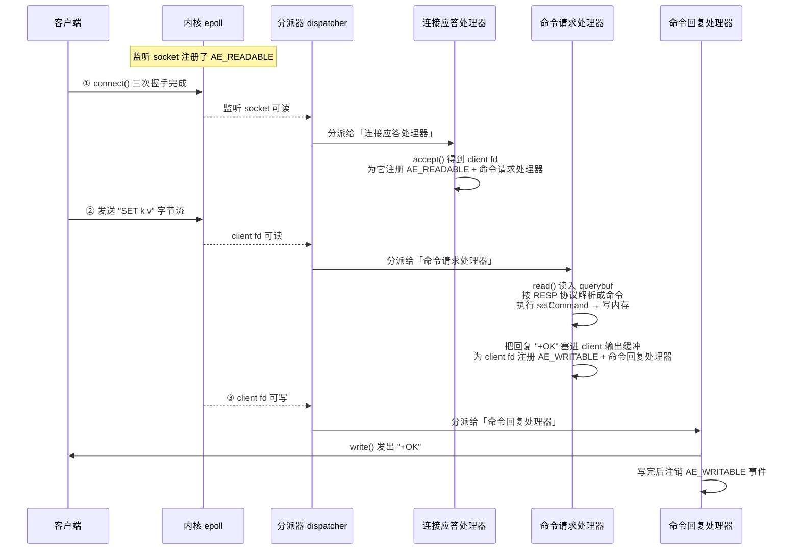

# 05 · IO 多路复用与事件循环（IO Multiplexing & Event Loop）

> 一个线程用 `epoll`/`kqueue`/`select` 同时盯住成千上万个 socket，谁就绪处理谁，避免「一连接一线程」和阻塞空等——这是 Redis 单线程还能扛百万 QPS 的网络地基。面试重要度：⭐⭐⭐ 高频重点。

## 📖 核心原理

**问题从哪来**：一个 TCP 服务要同时服务大量客户端连接，最朴素的模型有两种，都不行。① **一连接一线程/进程**（BIO）：每来一个连接开一个线程去 `read()`，线程数随连接数线性膨胀，上万连接就是上万线程，光上下文切换和栈内存就把机器压垮。② **单线程轮流阻塞读**：一个线程挨个 `read()`，但 `read()` 在没数据时会**阻塞**，卡在一个空闲连接上，其它有数据的连接全部饿死。核心矛盾是：**用一个线程管多个 fd，却不能阻塞在任何单个 fd 上**。

**IO 多路复用（IO Multiplexing）就是答案**：把「监听哪些 fd」这件事交给一个内核系统调用（`select`/`poll`/`epoll`/`kqueue`），线程调用它时把一批 fd 交给内核「代为盯梢」，线程自己阻塞在这**一个**系统调用上；只要这批 fd 里**任意一个**就绪（可读/可写），系统调用就返回并告诉你**哪些**就绪，线程再去逐个处理就绪的 fd。「多路」指多个网络连接，「复用」指复用同一个线程/同一次阻塞。这样**一个线程**就能高效管理海量连接：CPU 只花在真正有数据的连接上，空闲连接不占任何 CPU，也不需要额外线程。

**为什么高效**：假设 1 万个连接里同一时刻只有 100 个有数据，多路复用让线程一次 `epoll_wait` 就拿到这 100 个就绪 fd，只处理这 100 个；其余 9900 个空闲连接**零开销**挂着。对比一连接一线程要养 1 万个线程、对比轮流阻塞读会卡死，多路复用用「事件驱动」把「等待」这件重活下沉给了内核，线程永远在做有效工作。这也是 Redis 敢用**单线程**处理命令的前提——网络 IO 不再是瓶颈，见 [01-overview](01-overview.md) 和 [04-single-thread-model](04-single-thread-model.md)。

**Redis 的文件事件处理器（File Event Handler）+ Reactor 模型**：Redis 基于多路复用自研了一套事件驱动库 `ae`（<code>a</code>simple <code>e</code>vent library，源码 `ae.c`），核心是一个 `aeEventLoop` 结构，跑的是经典 **Reactor 模式**（反应堆：注册事件 → 内核检测 → 分派回调）。四个组成部分：

| 组件 | 角色 | 说明 |
|---|---|---|
| **多个 Socket** | 事件源 | 监听 socket + 每个客户端连接 socket，都是 fd |
| **IO 多路复用程序** | 事件监听 | 对不同 OS 封装成统一接口（见下），负责监听所有 fd |
| **文件事件分派器（dispatcher）** | 分派 | 从多路复用程序拿到就绪 fd，按事件类型调用对应处理器 |
| **事件处理器（handler）** | 回调 | 连接应答 / 命令请求 / 命令回复三类，真正干活 |

**IO 多路复用程序对不同 OS 的封装**：Redis 不绑死某个系统调用，而是在编译期按平台选最优实现，全部适配成 `ae.c` 里统一的 `aeApiPoll` 等接口。优先级从高到低（`ae.c` 顶部的条件编译）：

```c
#ifdef HAVE_EVPORT        // Solaris: ae_evport.c
#include "ae_evport.c"
#else
  #ifdef HAVE_EPOLL       // Linux: ae_epoll.c（生产主力）
  #include "ae_epoll.c"
  #else
    #ifdef HAVE_KQUEUE    // macOS/BSD: ae_kqueue.c
    #include "ae_kqueue.c"
    #else
    #include "ae_select.c"// 兜底：POSIX select，人人都有
    #endif
  #endif
#endif
```

即 **Linux 用 `epoll`、macOS/BSD 用 `kqueue`、Solaris 用 `evport`、其它兜底 `select`**。上层 `aeMain()` 主循环完全不感知底层是哪个——这是一层漂亮的策略模式/适配器。

**主循环 `aeMain`**：Redis 启动后 `aeMain()` 就是那个「永不退出」的死循环，每一轮 `aeProcessEvents()` 做两件事：先处理**文件事件**（socket 可读可写，即网络请求），再处理**时间事件**（`serverCron` 定时任务：过期扫描、渐进式 rehash、统计等）。为避免时间事件迟迟得不到执行，`aeApiPoll` 的阻塞超时会被设成「距离最近一个时间事件到期的时间」——没网络请求时线程就阻塞在 `epoll_wait` 上睡到下一个定时任务，**既不空转烧 CPU，也不误了定时任务**。

## 🔄 原理图 / 流程剖析

**Reactor 事件循环整体结构：**

```
        ┌──────────────────────────────────────────────────┐
        │                  aeEventLoop                       │
        │                                                    │
   fd0  │   ┌────────────────────┐    ┌──────────────────┐  │
  ──────┼──▶│  IO 多路复用程序     │    │   文件事件分派器   │  │
   fd1  │   │  (aeApiPoll 封装)   │──▶ │  (dispatcher)    │  │
  ──────┼──▶│  epoll / kqueue /  │就绪 └───────┬──────────┘  │
   fdN  │   │  evport / select   │  fd 队列    │分派          │
  ──────┼──▶└────────────────────┘             ▼             │
        │                          ┌───────────────────────┐│
   由   │                          │ ① 连接应答处理器 accept ││
 aeMain │                          │ ② 命令请求处理器 read  ││
 死循环 │                          │ ③ 命令回复处理器 write ││
 驱动   │                          └───────────────────────┘│
        └──────────────────────────────────────────────────┘
```

**一次完整请求的事件流转（`SET k v` 为例）：**



**三类文件事件处理器职责（`networking.c`）：**

| 处理器 | 源码函数 | 触发事件 | 干什么 |
|---|---|---|---|
| **连接应答处理器** | `connSocketAcceptHandler` / `acceptTcpHandler` | 监听 socket `AE_READABLE` | 对新连接 `accept()` 拿到 client fd，创建 `client` 对象，给它注册命令请求处理器 |
| **命令请求处理器** | `readQueryFromClient` | client fd `AE_READABLE` | `read()` 读字节 → 按 **RESP 协议**解析 → `processCommand()` 查表执行 → 结果写入输出缓冲，并按需注册回复处理器 |
| **命令回复处理器** | `sendReplyToClient` | client fd `AE_WRITABLE` | 把输出缓冲区的响应 `write()` 回客户端；一次没写完保留事件下轮续写，写完则**注销** `AE_WRITABLE`（避免空触发） |

> 关键细节：**回复事件是「按需注册、写完注销」**。平时 client fd 只监听可读；只有当有数据要回且一次没发完时才挂上可写事件，发完立刻摘掉——因为可写状态几乎总是就绪，长期监听会导致 `epoll_wait` 空转。

## 🔑 面试要点

- **多路复用解决的核心矛盾**：一个线程管多个 fd，却不能阻塞在任何单个 fd 上；靠 `epoll`/`kqueue` 把「等待就绪」下沉内核，线程只处理就绪 fd。**一个线程管上万连接**、空闲连接零 CPU 开销。
- **Redis 事件模型 = Reactor**：`aeEventLoop` + `aeMain` 死循环，四大件——多个 socket、IO 多路复用程序、文件事件分派器、事件处理器。
- **底层封装按平台自动选**：Linux→`epoll`（`ae_epoll.c`）、macOS/BSD→`kqueue`、Solaris→`evport`、兜底→`select`，上层统一接口 `aeApiPoll`，答出这一层「适配器」是加分点。
- **三类处理器**：连接应答（`accept`）、命令请求（`read`+RESP 解析+执行）、命令回复（`write`）；能顺出一条完整请求的事件流转。
- **主循环两类事件**：先文件事件（网络），后时间事件（`serverCron`）；`epoll_wait` 超时设为最近时间事件到期时间，兼顾定时任务又不空转。
- **epoll 相对 select/poll 的优势**：就绪通知 O(1)、无 fd 数量硬上限、内核用红黑树+就绪链表维护、`mmap` 共享减少拷贝（详见下表）。
- **单线程的底气**：网络 IO 由多路复用扛住后，命令执行走单线程避免锁竞争；Redis 6 只把**网络读写/协议解析**多线程化、命令执行仍单线程（一句带过，详见 [04-single-thread-model](04-single-thread-model.md)）。

## ❓ 高频面试题

**Q：`epoll` 相比 `select`/`poll` 到底强在哪？为什么 Redis 在 Linux 上默认用它？**
A：三点本质差异：
| 维度 | `select` / `poll` | `epoll` |
|---|---|---|
| **每次调用开销** | 每次都要把**全量 fd 集合**从用户态拷进内核态，返回后还要**遍历所有 fd** 才知道谁就绪，O(n) | fd 用 `epoll_ctl` **一次性注册**进内核红黑树，`epoll_wait` 只返回**就绪 fd 列表**，O(1) 拿结果 |
| **fd 数量上限** | `select` 受 `FD_SETSIZE`（默认 1024）硬限制；`poll` 无硬限但仍 O(n) 遍历 | 无硬上限，仅受进程/系统 fd 数限制，天生为海量连接设计 |
| **就绪通知机制** | 轮询：内核逐个查 fd 状态 | 回调：fd 就绪时内核回调把它加入就绪链表，`epoll_wait` 直接取链表 |
| **数据拷贝** | 每轮重复拷贝 fd 集合 | 注册一次常驻内核，`mmap` 式共享就绪信息，减少来回拷贝 |

所以连接数越大 `epoll` 优势越碾压：`select` 是「你问内核 1 万个 fd 谁好了」，`epoll` 是「内核主动告诉你这 100 个好了」。Redis 单实例常有大量长连接，Linux 上自然选 `epoll`（`ae_epoll.c`）。

**Q：Redis 是单线程，那它怎么同时处理成千上万个客户端连接的？**
A：靠 **IO 多路复用**，不是靠多线程。单线程跑 `aeMain` 死循环，每轮用 `epoll_wait`（`aeApiPoll`）一次性拿到所有**就绪**的 socket，逐个交给对应处理器（应答/请求/回复）。空闲连接不占 CPU，线程永远在处理真正有数据的连接。「单线程」指的是**命令执行**是单线程（免锁、无竞争），而底层网络监听是多路复用的事件驱动。这两者不矛盾：多路复用负责「高效地知道该处理谁」，单线程负责「安全地处理」。

**Q：既然一次请求要经过读事件和写事件，为什么客户端 socket 平时只注册可读、写完还要注销可写？**
A：因为 socket 的**可写状态几乎永远是就绪的**（内核发送缓冲区通常有空间）。如果长期监听 `AE_WRITABLE`，`epoll_wait` 会被反复无意义唤醒（空触发），白烧 CPU。所以 Redis 的策略是：平时只监听 `AE_READABLE` 等命令进来；等有回复要发、且一次 `write()` 没写完（输出缓冲还有残留）时，才临时注册 `AE_WRITABLE` 续写；一旦缓冲清空立即注销。这是事件驱动编程里「写事件要按需注册」的经典实践。

**Q：主循环里网络事件和定时任务（如过期扫描）会互相饿死吗？**
A：不会，靠 `aeApiPoll` 的**超时参数**协调。每轮循环 Redis 先算出「距离最近一个时间事件（`serverCron`）到期还有多久」，把这个值作为 `epoll_wait` 的阻塞超时。这样：有网络请求就立刻返回处理；没请求就最多睡到下一个定时任务到期，醒来执行 `serverCron`（过期采样删除、渐进式 rehash、统计等）。既不会因为死等网络而误了定时任务，也不会没事干时空转烧 CPU。注意：单线程模型下，若某条命令执行很慢（大 key），会同时阻塞后续网络事件和定时任务——这正是要防大 key/慢命令的原因。

## ⚠️ 易错点 / 加分项

- **误区**：把「IO 多路复用」等同于「多线程」。恰恰相反，多路复用是让**单线程**高效管多连接的技术，和线程数无关。
- **误区**：以为 `epoll` 一定比 `select` 快。**连接少且大多活跃**时 `select` 未必输，`epoll` 维护红黑树也有固定开销；`epoll` 的优势在**海量连接、活跃占比低**的场景（正是 Redis/Nginx 的典型负载）。
- **加分项**：`epoll` 有 **LT（水平触发）** 和 **ET（边缘触发）** 两种模式。Redis 用的是 **LT**（默认、更不易漏事件、编程简单）；Nginx 多用 ET（就绪只通知一次，需一次读干净，效率略高但易漏读）。能主动点出这点很加分。
- **加分项**：Reactor 有单 Reactor 单线程、单 Reactor 多线程、主从 Reactor 多线程等演进。Redis 传统是**单 Reactor 单线程**；Redis 6.0 的多线程 IO 把 `read`+解析、`write` 交给一组 IO 线程并行，但**命令执行仍在主线程**串行，本质更接近「主从 Reactor」的思路（详见 [04-single-thread-model](04-single-thread-model.md)）。
- **加分项**：源码定位能力——事件库 `ae.c`，平台实现 `ae_epoll.c`/`ae_kqueue.c`/`ae_select.c`，处理器在 `networking.c`（`acceptTcpHandler`/`readQueryFromClient`/`sendReplyToClient`），主循环入口 `server.c` 的 `aeMain(server.el)`。
- **面试怎么答**：先讲多路复用要解决的矛盾（一线程管多 fd 不能阻塞）→ Redis 的 Reactor 四大件与 `aeMain` 主循环 → 三类处理器串一次完整请求 → `epoll` 相比 `select`/`poll` 的 O(1)/无上限优势 → 收尾点出它是单线程模型能成立的地基、Redis 6 多线程 IO 只优化网络层。层层递进即资深水准。
