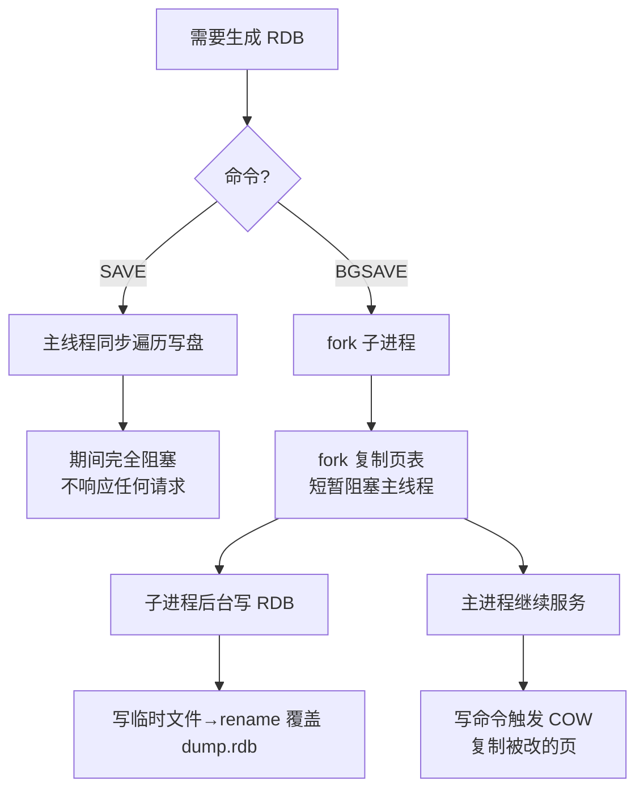

# 06 · 持久化·RDB 快照（RDB Snapshot）

> RDB 把某一时刻的**全量内存数据**序列化成一个紧凑的二进制文件 `dump.rdb`，恢复时直接加载、速度极快；核心机制是 `fork` 子进程 + Copy-On-Write（COW）边持久化边服务。面试重要度：⭐⭐⭐ 高频重点。

## 📖 核心原理

**RDB 是什么**：RDB（Redis DataBase）是**某一时刻内存数据的二进制快照（point-in-time snapshot）**。Redis 把当时所有 key-value 按内部编码序列化，压缩后落成一个单一文件（默认 `dump.rdb`）。它记录的是「数据的最终状态」而非「操作过程」——这一点和 AOF（[07-persistence-aof](07-persistence-aof.md)）记命令日志有本质区别。因为是二进制紧凑格式，RDB 文件比同等数据的 AOF 小很多，**恢复时直接把文件反序列化装回内存即可，无需重放命令，加载速度快**，天然适合做冷备份和主从全量同步的载体。

**save vs bgsave**：Redis 生成 RDB 有两条路径：

| 命令 | 执行方式 | 对主进程影响 | 生产使用 |
|---|---|---|---|
| `SAVE` | 主线程**同步**生成快照 | **完全阻塞**，期间不响应任何命令 | ❌ 禁用（大内存会卡死数秒~数十秒） |
| `BGSAVE` | `fork` 出**子进程**后台生成 | 只在 fork 瞬间短暂阻塞，之后主进程继续服务 | ✅ 生产标准做法 |

`SAVE` 在主线程里同步遍历整个数据集写盘，期间 Redis 单线程被独占、彻底不可用，生产环境严禁使用。`BGSAVE` 才是正解：主进程 `fork()` 出一个子进程，由**子进程**负责把内存数据写成 RDB 文件，主进程 fork 完立刻返回、继续处理客户端请求。同一时间只允许一个 `BGSAVE` 在跑（避免多个子进程同时写盘 + 多份 COW 内存爆掉）。

**★ fork + Copy-On-Write（COW）原理（重点）**：这是 RDB「既要一致快照、又要不停服」的关键。

`fork()` 是 Linux 系统调用，它创建一个子进程，**子进程与父进程共享同一份物理内存页**——注意此刻并没有真正复制几十 GB 数据，只是复制了**页表（page table）**，父子进程的虚拟地址都指向同一批物理页，这些页被内核标记为**只读**。

- 子进程拿到的是 fork 那一瞬间内存的**逻辑快照**，它只管遍历这份数据、序列化写盘，全程只读，不受后续写入干扰 → 保证快照的**一致性**。
- 主进程继续对外服务。当主进程要**修改**某个 key（写命令）时，触碰到那批只读页会触发**缺页中断（page fault）**，内核此时才把**被修改的那一页**复制一份出来给主进程改（Copy-On-Write，写时复制）。子进程仍然引用原来那份旧页 → 主进程的新写入不会污染子进程正在写的快照。

于是父子进程**共享未修改的页、只对被写的页各自持有副本**，实现「一边持久化、一边正常服务」。理想情况下若持久化期间没有写入，父子进程可以完全共享内存，几乎零额外内存开销。

**但 fork 本身会短暂阻塞主线程**：fork 时内核要为子进程**复制父进程的页表**，进程占用内存越大、页表越大，复制越久，这段时间主线程是被卡住的——这是 Redis **延迟毛刺（latency spike）的经典来源**。可用 `INFO stats` 的 `latest_fork_usec` 观察最近一次 fork 耗时（微秒），几十 GB 实例 fork 可能耗时几十到上百毫秒。此外，写入越频繁，COW 复制的页越多，持久化期间**额外内存**占用越高（最坏接近翻倍），所以 `maxmemory` 不能设满物理内存（见 [10-eviction](10-eviction.md) 加分项）。

**触发时机**：RDB 快照在以下场景被触发：

1. **`save m n` 配置自动触发**：`m` 秒内发生了 `n` 次写修改就自动 `BGSAVE`。默认三条（`redis.conf`）：`save 900 1` / `save 300 10` / `save 60 10000`（900 秒内 1 次改、300 秒内 10 次、60 秒内 10000 次，满足任一条即触发）。配 `save ""` 可关闭 RDB。
2. **手动执行** `SAVE`（阻塞）或 `BGSAVE`（后台）。
3. **`SHUTDOWN`（正常关闭）**：若配置了 save 规则，Redis 退出前会做一次 `SAVE` 保证数据落盘。
4. **主从全量同步（full resync）**：主节点执行 `BGSAVE` 生成 RDB 发给从节点做全量初始化（见 [17-replication](17-replication.md)）。
5. **`FLUSHALL`** 携带 save 规则时、以及执行 `DEBUG RELOAD` 等也会触发。

**优缺点**：

| | RDB |
|---|---|
| ✅ 优点 | 文件**紧凑**、体积小；**恢复快**（直接加载不重放）；对性能影响集中在 fork，日常几乎无损耗；非常适合**定期冷备份 / 灾难恢复 / 主从全量同步** |
| ❌ 缺点 | **两次快照之间宕机会丢数据**（丢失最后一次快照后的所有写入，可能是几分钟）；fork 会带来延迟毛刺；**大内存实例 fork 慢、COW 额外占内存**；不同 Redis 版本 RDB 格式可能不兼容 |

数据安全性要求高时应结合 AOF（[07-persistence-aof](07-persistence-aof.md)），或直接用 **RDB+AOF 混合持久化**（[08-persistence-hybrid](08-persistence-hybrid.md)）——用 RDB 做全量基线、AOF 记增量，兼顾恢复速度与数据安全。

## 🔄 原理图 / 流程剖析

**BGSAVE 的 fork + COW 全过程**：

```
                    ┌──────────────────────────────────────┐
  触发 BGSAVE  ───► │  主进程调用 fork()                     │
                    │  · 复制页表（不复制数据）→ 此刻短暂阻塞 │
                    └──────────────────────────────────────┘
                                     │
                 fork 返回，父子分道扬镳
                    │                                   │
         ┌──────────▼──────────┐            ┌───────────▼───────────┐
         │  主进程（继续服务）  │            │  子进程（写快照）      │
         │  处理读写命令         │            │  遍历内存快照          │
         └──────────┬──────────┘            │  序列化 → temp-xxx.rdb │
                    │                         │  fsync 落盘            │
        收到写命令 SET k v                    └───────────┬───────────┘
                    │                                     │
                    ▼                              写完 rename 覆盖
        ┌────────────────────────┐                    dump.rdb
        │ 触碰只读共享页 → page   │                        │
        │ fault → 内核 COW 复制   │                     子进程退出
        │ 「被改的那一页」        │                        │
        │ 主进程改副本，子进程    │            主进程收到 SIGCHLD，
        │ 仍读旧页（快照不受污染）│            更新 rdb_last_save_time
        └────────────────────────┘

  内存页视角：
     fork 前：      [P1][P2][P3][P4]   ← 父进程独有
     fork 后：      父─┐              ← 页表复制，全部标记只读、共享
                       ├─[P1][P2][P3][P4]
                   子─┘
     父改 P2：      父→[P1][P2'][P3][P4]   ← 仅 P2 被 COW 复制成 P2'
                   子→[P1][P2 ][P3][P4]   ← 子进程仍看旧 P2（快照一致）
```

**save vs bgsave 对比**：



## 🔑 面试要点

- **RDB = 某一时刻内存的二进制全量快照**，记「状态」不记「过程」；文件紧凑、恢复快（直接加载不重放），是主从全量同步和冷备的载体。
- **`SAVE` 主线程同步阻塞（生产禁用）**；**`BGSAVE` fork 子进程后台生成**，主进程 fork 完继续服务，是生产标准。
- **fork + COW 是核心**：fork 只复制页表、父子共享只读物理页；主进程写数据时触发 page fault，内核只复制被改的那一页给主进程，子进程始终用旧页写快照 → 一致快照 + 不停服。
- **fork 本身短暂阻塞主线程**（复制页表，内存越大越慢），是延迟毛刺来源；用 `latest_fork_usec` 观测，`maxmemory` 别设满、给 COW 留冗余。
- **触发时机**：`save m n` 自动、手动 `BGSAVE`、`SHUTDOWN`、主从全量同步。
- **最大缺点：两次快照间宕机会丢数据**（丢最后一次快照后的全部写入）；这正是引入 AOF（[07-persistence-aof](07-persistence-aof.md)）和混合持久化（[08-persistence-hybrid](08-persistence-hybrid.md)）的动因。

## ❓ 高频面试题

**Q：BGSAVE 是怎么做到「一边持久化一边不停服务」的？COW 具体怎么工作？**
A：靠 `fork` + Copy-On-Write。`fork` 出子进程时并不真复制几十 GB 数据，只复制**页表**，父子进程的虚拟地址映射到**同一批物理页**，内核把这些页标记为只读。子进程拿到的就是 fork 那一刻的内存逻辑快照，它只读地遍历、序列化写盘，不受后续写入干扰，保证快照一致性。主进程继续服务，当它执行写命令要改某个 key 时，触碰只读页会触发**缺页中断**，内核这时才**把被改的那一页复制一份**给主进程去改（写时复制），子进程仍引用旧页。这样父子只在「被写的页」上产生副本，未改的页全共享，既拿到一致快照又不阻塞服务。

**Q：BGSAVE 已经是后台子进程了，为什么还会造成主进程延迟毛刺？**
A：因为 `fork()` 这个系统调用本身在主进程里是同步的。内核创建子进程时要为它**复制父进程的页表**，实例占用内存越大、页表项越多，复制越耗时，这段时间主线程被卡住无法处理请求，就是延迟毛刺。可以用 `INFO stats` 的 `latest_fork_usec` 看最近一次 fork 耗时。此外持久化期间主进程写得越多，COW 复制的物理页越多，**额外内存开销越大**（最坏接近翻倍），内存吃紧还可能触发换页甚至 OOM。缓解手段：控制单实例内存别太大、关闭透明大页 THP（会放大 COW 复制粒度、加剧延迟）、`maxmemory` 留足冗余。

**Q：RDB 和 AOF 最本质的区别是什么？各自丢数据的粒度？**
A：本质区别是**记什么**——RDB 记某一时刻的**数据快照（最终状态）**，AOF 记**写命令日志（操作过程）**。丢数据粒度：RDB 取决于快照频率，两次 `BGSAVE` 之间宕机会丢掉这段时间**所有**写入（可能几分钟），粒度粗；AOF 取决于 `appendfsync`，`everysec` 最多丢 1 秒，粒度细。恢复速度反过来：RDB 直接加载二进制快，AOF 要重放命令慢。所以生产常用**混合持久化**（[08-persistence-hybrid](08-persistence-hybrid.md)）：RDB 做全量基线保证恢复快，AOF 记增量保证少丢数据。

**Q：`save 900 1` 是什么意思？RDB 都有哪些触发时机？**
A：`save 900 1` 表示「900 秒内至少发生 1 次写修改就自动触发 `BGSAVE`」。默认还有 `save 300 10`、`save 60 10000`，满足任意一条即触发，写越频繁触发越勤。其他触发时机：手动 `SAVE`/`BGSAVE`、正常 `SHUTDOWN`（退出前存盘）、主从全量同步（主节点 BGSAVE 生成 RDB 发给从节点）、`DEBUG RELOAD` 等。`save ""` 可完全关闭 RDB 自动快照。

## ⚠️ 易错点 / 加分项

- **误区**：以为 `BGSAVE` 完全不阻塞主进程。实际 **fork 复制页表那一下是阻塞的**，大内存实例可达几十上百毫秒，是延迟毛刺根源，要用 `latest_fork_usec` 监控。
- **踩坑：透明大页 THP**。开启 THP 后内存页从 4KB 变 2MB，COW 复制粒度放大 512 倍，持久化期间主进程写延迟和额外内存都暴涨。生产务必 `echo never > /sys/kernel/mm/transparent_hugepage/enabled` 关闭。
- **踩坑：内存不足导致 fork 失败**。默认 `vm.overcommit_memory=0` 时，若空闲内存不够容纳「理论上可能翻倍」的量，`fork` 会直接失败、`BGSAVE` 报错。生产建议设 `vm.overcommit_memory=1` 允许 overcommit。
- **加分点**：RDB 写盘是**先写临时文件再 `rename` 原子替换** `dump.rdb`，避免写一半崩溃留下损坏文件；加载时坏文件可用 `redis-check-rdb` 校验。
- **加分点**：RDB 是二进制格式，**跨大版本可能不兼容**（新版能读旧版，反之未必），跨版本迁移别直接拷 RDB 文件。
- **加分点**：`maxmemory` 不要设成物理内存 100%，要给 fork 时的 COW 额外内存和复制缓冲区留 20%~30% 冗余，否则持久化期间易 OOM（呼应 [10-eviction](10-eviction.md)）。
- **面试怎么答**：先讲 RDB 是「时刻快照」本质 → save/bgsave 区别 → 重点讲透 fork+COW 如何做到一致快照不停服 → 点出 fork 阻塞与 COW 额外内存这两个代价 → 触发时机 → 最大缺点是丢数据、引出 AOF 与混合持久化，层层递进即资深水准。
