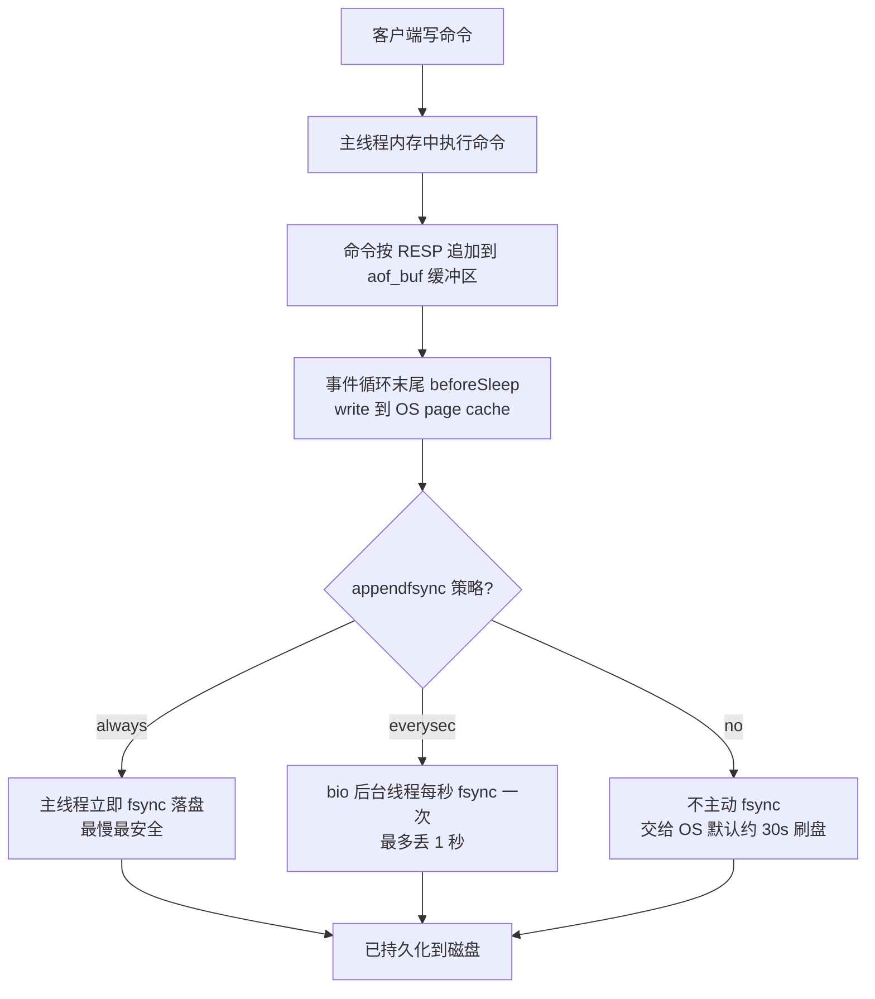
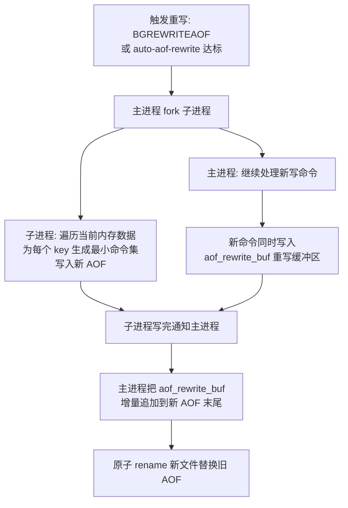

# 07 · 持久化·AOF 日志（Append Only File）

> AOF 以**追加写命令日志**的方式记录每一条写命令（RESP 文本），重启时按顺序重放恢复数据；相比 RDB 快照，AOF 的数据安全性更高、丢数据更少。面试重要度：⭐⭐⭐ 高频重点。

## 📖 核心原理

**AOF 是什么**：RDB（见 [06-persistence-rdb](06-persistence-rdb.md)）保存的是某一时刻的**内存快照**，两次快照之间宕机会丢一批数据。AOF（Append Only File）走的是完全不同的思路——**记录写操作的日志**：Redis 每执行一条**修改数据的命令**（如 `SET`、`LPUSH`、`EXPIRE`），就把这条命令按 **RESP 协议文本**格式追加写到 AOF 文件末尾。重启时 Redis 创建一个**伪客户端（fake client）**，把 AOF 文件里的命令**逐条重放**一遍，就还原出了宕机前的数据集。所以 AOF 存的是「怎么把数据变成现在这样的过程」，RDB 存的是「数据现在长什么样的结果」。日志类命令只记**写命令**，读命令（`GET`）不记；且记录的是**执行后的最终命令**（如 `INCR` 在某些情况下、`SPOP`/`EXPIRE` 会被改写成确定性命令 `SET`/`PEXPIREAT`，保证重放结果一致）。

**为什么是「先执行、后记日志」**：这是 AOF 和 MySQL redo log（WAL，先写日志后改数据）最大的区别。Redis 是**命令先在内存里执行成功，再把命令追加进 AOF**。好处是不用对命令做语法/执行检查就能保证入库的都是合法命令、且不阻塞当前命令；代价是——**如果执行完、还没来得及 `fsync` 就宕机，这条命令的日志就丢了**（这也是 `everysec` 最多丢 1 秒的根因）。

**写入流程（三个阶段）**：一条写命令进入 AOF 不是一步到位落盘，而是经过缓冲区 → OS → 磁盘三级：

1. **写 AOF 缓冲区（`aof_buf`）**：命令执行后，Redis 先把 RESP 格式的命令追加到内存里的 `aof_buf` 缓冲区，而不是直接写文件。这样能把多条命令攒起来批量写，减少系统调用。
2. **`write` 到 OS page cache**：在**事件循环的每次末尾**（`beforeSleep`），Redis 调用 `write()` 把 `aof_buf` 的内容写进内核的 **page cache**（页缓存）。注意 `write()` 返回只代表数据交给了 OS，**并没有真正落盘**，此时宕机（掉电/内核崩溃）数据仍会丢。
3. **`fsync` 落盘**：由 `appendfsync` 策略决定**何时**调用 `fsync()`/`fdatasync()` 把 page cache 真正刷到磁盘。fsync 是真正保证持久化、也是最慢的一步。

**★ `appendfsync` 三策略**：这是 AOF 面试必问点，本质是在**数据安全**和**性能**之间取舍——控制上面第 3 步 `fsync` 的频率：

| 策略 | fsync 时机 | 最多丢多少 | 性能 | 说明 |
|---|---|---|---|---|
| `always` | **每条**写命令都 fsync | 几乎不丢（最多当前一条） | 最慢 | 每次写都等磁盘，QPS 大幅下降，机械盘尤其明显 |
| `everysec`（默认） | **每秒**由后台线程 fsync 一次 | 最多丢 **1 秒** | 折中 | 由 `bio` 后台线程执行 fsync，不阻塞主线程；**推荐** |
| `no` | **从不主动** fsync，交给 OS | 由 OS 决定（可能几十秒） | 最快 | 依赖内核默认 30s 刷盘节奏，宕机丢数据最多、最不可控 |

> `everysec` 是默认与生产首选：主线程只负责 `write` 到 page cache，真正的 `fsync` 丢给后台 `bio` 线程每秒做一次。特别要注意——如果后台线程上一次 fsync 还没做完（磁盘 IO 打满），主线程本次 `write` 会**被阻塞等待**，这就是 AOF 拖慢 Redis 的典型现象（可用 `no-appendfsync-on-rewrite` 缓解，见易错点）。

**★ AOF 重写（`bgrewriteaof`）**：AOF 是**只追加**的，同一个 key 反复修改会在文件里留下一大堆历史命令（对一个计数器 `INCR` 一百万次就有一百万条记录），文件会越来越大，导致**占磁盘、重启重放极慢**。AOF 重写就是给日志「瘦身」：

- **不是读旧 AOF 去压缩**，而是**读当前内存的最终状态**，为每个 key 生成**能重建它的最小命令集**。比如一个含 5 个字段的 hash，无论历史被改过多少次，重写后只留一条 `HSET key f1 v1 f2 v2 ...`（大 key 会拆成多条，避免单条命令过长）。
- **通过 `fork` 子进程完成**：主进程 `fork()` 出子进程，子进程基于 fork 那一刻的**内存快照**（COW，写时复制）生成新 AOF，**不阻塞主进程**处理命令。
- **★ 重写期间的新命令怎么办**：fork 之后主进程继续接收写命令，这些新命令一边正常写老的 AOF 缓冲区，一边**额外写进 `aof_rewrite_buf`（AOF 重写缓冲区）**。子进程写完新 AOF 后，主进程把 `aof_rewrite_buf` 里累积的增量命令**追加合并**到新 AOF 末尾，再用新文件原子替换旧文件。这样保证「重写期间产生的数据一条都不丢」。
- **触发方式**：手动 `BGREWRITEAOF`；或自动——由 `auto-aof-rewrite-percentage`（默认 100，即当前 AOF 比上次重写后大了一倍）和 `auto-aof-rewrite-min-size`（默认 64mb，避免文件太小时频繁重写）共同触发。

**Redis 7.0 Multi Part AOF（分片 AOF）**：7.0 把单个 AOF 文件拆成一组——一个 **base 文件**（重写时的基准快照，可为 RDB 或 AOF 格式）+ 一个或多个 **incr 文件**（增量命令）+ 一个 **manifest 清单文件**（记录这些文件的顺序与角色），统一放在 `appenddirname`（默认 `appendonlydir`）目录下。这解决了旧版重写时要把 `aof_rewrite_buf` 全部回写、fork 内存和磁盘双倍开销的问题——重写只需生成新 base，增量直接续写 incr，更省资源。一句话：**7.0 用「base+incr+manifest」的多文件结构替代了单文件 AOF**。

## 🔄 原理图 / 流程剖析

**AOF 写入三级流程**：

**AOF 重写流程（bgrewriteaof）**：

## 🔑 面试要点

- **AOF 记的是写命令日志（RESP 文本）**，重启靠伪客户端逐条重放恢复；RDB 记的是内存快照。AOF 丢数据更少、可读，但文件更大、恢复更慢。
- **「先执行命令、再写日志」**：Redis 与 MySQL WAL（先日志后改数据）相反，好处是不阻塞当前命令、入库皆合法命令，代价是执行完未 fsync 时宕机会丢这条日志。
- **写入三级**：`aof_buf`（内存缓冲）→ `write` 到 OS page cache → `fsync` 落盘。`write` 成功≠落盘成功。
- **`appendfsync` 三策略 = 安全/性能的取舍**：`always`（每条 fsync，最安全最慢）、`everysec`（每秒，默认，最多丢 1 秒）、`no`（交给 OS，最快最不安全）。生产用 `everysec`。
- **`everysec` 的 fsync 由 bio 后台线程做**，但若上次 fsync 未完成，主线程 `write` 会被阻塞——这是 AOF 拖慢 Redis 的根因。
- **AOF 重写不读旧文件、读内存最终态生成最小命令集**，通过 fork 子进程 + COW 完成；重写期间新命令写 `aof_rewrite_buf`，完成后追加合并，保证不丢数据。
- **重写触发**：`auto-aof-rewrite-percentage`（默认 100）+ `auto-aof-rewrite-min-size`（默认 64mb），或手动 `BGREWRITEAOF`。
- **Redis 7.0 Multi Part AOF**：base + incr + manifest 多文件结构，降低重写的内存与磁盘开销。

## ❓ 高频面试题

**Q：AOF 的 `appendfsync` 三个策略分别是什么？生产该选哪个、为什么？**
A：`always` 每执行一条写命令就 fsync 一次，最多只丢正在写的这一条，最安全，但每次写都要等磁盘 fsync，QPS 掉得很厉害；`no` 从不主动 fsync，完全交给 OS 的刷盘节奏（Linux 默认约 30 秒），最快但宕机可能丢几十秒数据、不可控；`everysec`（默认）折中——主线程只把命令 `write` 到 page cache，真正的 `fsync` 交给 `bio` 后台线程每秒做一次，正常最多丢 1 秒数据，性能接近 `no`。生产**几乎都选 `everysec`**：在「最多丢 1 秒」这个可接受的代价下拿到接近最优的性能。要点补充：`everysec` 下如果磁盘 IO 打满、后台上一秒的 fsync 没做完，主线程本次 write 会被阻塞，此时可能丢的其实不止 1 秒。

**Q：AOF 会越写越大，重写（rewrite）是怎么做的？重写期间新写进来的命令会丢吗？**
A：AOF 只追加，同一 key 的历史修改都堆在文件里，所以要重写瘦身。重写**不是去压缩旧文件**，而是 `fork` 一个子进程，子进程基于 fork 那一刻的内存快照，**遍历当前每个 key 的最终状态，生成能重建它的最小命令集**写入新 AOF（比如一个 key 被 `INCR` 一百万次，重写后只剩一条 `SET`）。重写期间主进程照常处理新命令，这些新命令**除了写正常 AOF，还额外写进一个 `aof_rewrite_buf` 重写缓冲区**；子进程写完后，主进程把 `aof_rewrite_buf` 里的增量命令**追加合并**到新 AOF 末尾，再原子替换旧文件——所以**重写期间的新数据一条都不会丢**。触发靠 `auto-aof-rewrite-percentage` 和 `auto-aof-rewrite-min-size`，也可手动 `BGREWRITEAOF`。

**Q：AOF 和 RDB 各有什么优缺点？实际怎么选？**
A：RDB 是二进制快照，文件小、恢复快（直接加载）、fork 对主线程影响小，适合备份和灾难恢复；缺点是两次快照间宕机会丢一批数据、实时性差。AOF 是命令日志，`everysec` 下最多丢 1 秒、数据安全性高、文件可读；缺点是文件比 RDB 大得多、重启重放命令**恢复比 RDB 慢**、fsync 频繁会影响写性能。实际生产**不是二选一**：一般同时开 RDB + AOF，用 Redis 4.0+ 的**混合持久化**（见 [08-persistence-hybrid](08-persistence-hybrid.md)）——AOF 重写时用 RDB 格式写 base（恢复快），再用 AOF 增量记录之后的命令（丢得少），兼得两者优点。

**Q：为什么 AOF 是「先执行命令再记日志」，这样有什么风险？**
A：Redis 是命令在内存执行成功后，才把命令追加进 AOF 缓冲区。好处：不需要先对命令做语法/可执行性校验，能保证写进 AOF 的都是**已成功执行的合法命令**，且记日志不阻塞当前命令的返回。风险：**命令已经改了内存、但对应的 AOF 还没 `fsync` 落盘时宕机，这条日志就丢了**——这正是 `everysec` 最多丢 1 秒、`no` 可能丢更多的本质原因。这和 MySQL redo log 的 WAL（先写日志再改数据、崩溃能靠日志恢复）刚好相反，是常被追问的对比点。

## ⚠️ 易错点 / 加分项

- **误区**：以为 `write()` 成功就等于数据安全了。`write()` 只是把数据交给 OS 的 page cache，**没 `fsync` 之前掉电/内核崩溃照样丢**；真正决定安全性的是 `appendfsync` 控制的 fsync 频率。
- **误区**：以为 AOF 记录的是原始命令。像 `SPOP`（随机弹出）、`EXPIRE`（相对时间）、`SETEX` 这类**非确定性/相对性**命令会被改写成**确定性命令**（如 `SREM 指定成员`、`PEXPIREAT 绝对时间戳`）再写入，否则重放会得到不同结果。
- **踩坑**：重写（fork 子进程）与 `everysec` fsync 抢磁盘 IO，会导致主线程 fsync 阻塞、延迟飙升。可开 `no-appendfsync-on-rewrite yes`，让重写期间主线程**不做 fsync**（暂时退化为 `no`，牺牲一点安全换性能）。
- **踩坑**：`fork` 时 AOF 重写会 COW 复制脏页，`maxmemory` 设太满（接近物理内存）时 fork 可能因内存不足失败或触发 swap，一般给内存留 30% 冗余（与 [10-eviction](10-eviction.md) 里 fork 冗余同理）。
- **加分点**：AOF 文件若因宕机写了一半（尾部命令不完整），Redis 默认 `aof-load-truncated yes` 会**忽略末尾残缺命令**继续加载，而不是启动失败；损坏可用 `redis-check-aof --fix` 修复。
- **加分点**：Redis 7.0 之前 AOF 重写要把 `aof_rewrite_buf` 全量回写、fork 与磁盘双倍开销大；7.0 的 **Multi Part AOF**（base + incr + manifest）改成增量续写 incr，显著降低重写成本，是版本差异加分点。
- **面试怎么答**：先讲 AOF 本质（写命令日志、重放恢复）→ 写入三级流程（aof_buf→page cache→fsync）→ `appendfsync` 三策略的安全/性能取舍 → 重写为何存在、fork+重写缓冲区如何不丢数据 → 对比 RDB 并引出混合持久化，层层递进即资深水准。
