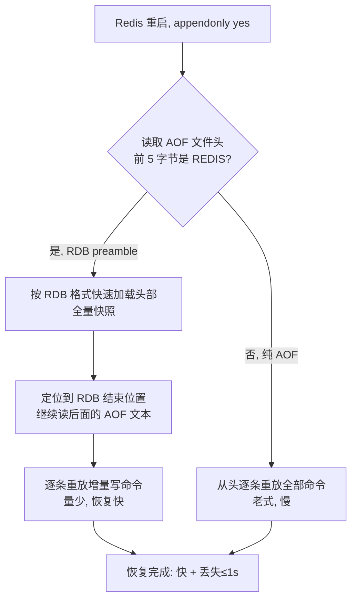

# 08 · 持久化·混合持久化（Hybrid Persistence）

> AOF 重写时把内存快照以 RDB 二进制写在文件头、之后的增量命令以 AOF 文本追加在尾，即「RDB 头 + AOF 增量尾」，兼得 RDB 恢复快与 AOF 丢数据少。面试重要度：⭐⭐⭐ 高频重点。

## 📖 核心原理

**为什么要混合**：RDB（见 [06-persistence-rdb.md](06-persistence-rdb.md)）是内存快照的二进制压缩格式，**加载极快**（直接把二进制反序列化建对象，无需逐条执行命令），但快照间隔期（如 `save 900 1`）宕机会丢一大段数据。AOF（见 [07-persistence-aof.md](07-persistence-aof.md)）记录每条写命令的文本协议（RESP），配合 `appendfsync everysec` **最多只丢 1 秒**数据，但纯文本 AOF **文件体积大**、**加载慢**（重启时要把几百万条命令逐条重新执行一遍）。混合持久化就是让 AOF **既有 RDB 的加载速度，又有 AOF 的低丢失**。

**混合持久化的本质（4.0+，`aof-use-rdb-preamble yes`，7.0 默认开启）**：它**不是**第三种独立的持久化方式，而是**改造了 AOF 重写（rewrite）的产物格式**。开启后，每次 AOF 重写时，Redis **不再**把当前内存翻译成一堆 `SET`/`RPUSH` 文本命令写进新 AOF，而是**直接把当前内存以 RDB 二进制格式 dump 到新 AOF 文件的头部**；重写完成后、到下次重写之间，新产生的写命令仍以传统 AOF 文本（RESP）追加在这段 RDB 之后。于是一个 AOF 文件的物理布局就是：**前半段 = RDB 格式的全量快照，后半段 = 增量写命令的 AOF 文本**。

**为什么这样能兼得两者之长**：文件头那段 RDB 承载了「重写那一刻的全量数据」，加载它走的是 RDB 的快速反序列化路径；文件尾那段 AOF 增量只覆盖「重写之后到宕机之间」的少量命令，重放它们既快（量少）又能把丢失窗口压到 `appendfsync` 的粒度（`everysec` 下 ≤1 秒）。相比纯文本 AOF，混合格式的**文件更小**（RDB 压缩过）、**加载更快**（大头走 RDB 路径而非逐条 replay）。

**Redis 7.0 的 Multi-Part AOF 配合**：7.0 起 AOF 不再是单文件，而是拆成一个 `manifest`（清单）+ 一个 base 文件（基准）+ 若干 incr 文件（增量），存放在 `appenddirname`（默认 `appendonlydir`）目录下。开启混合持久化时，**base 文件就是 RDB 格式**（后缀 `.rdb`），incr 文件是 AOF 文本（后缀 `.aof`），由 `manifest` 记录它们的组成关系。所以 7.0 里「RDB 头 + AOF 尾」在物理上体现为「一个 RDB base 文件 + 一个 AOF incr 文件」，比 4.x 单文件内拼接的形式更清晰、重写也更安全（不必把旧数据重写进新文件）。

## 🔄 原理图 / 流程剖析

**「RDB 头 + AOF 尾」文件结构示意**（4.x 单文件视角）：

```
┌─────────────────────────── appendonly.aof ───────────────────────────┐
│                                                                       │
│  ┌─────────────────────────┐   ← 文件头：AOF 重写那一刻的全量内存      │
│  │  REDIS0011 ...           │     以 RDB 二进制格式写入（压缩、紧凑）   │
│  │  <RDB binary payload>    │     加载走 RDB 快速反序列化路径          │
│  │  ...  EOF  <8B checksum> │                                         │
│  └─────────────────────────┘                                         │
│  ┌─────────────────────────┐   ← 文件尾：重写完成后新增的写命令        │
│  │  *3\r\n$3\r\nSET\r\n...  │     以 AOF 文本(RESP)协议逐条追加         │
│  │  *2\r\n$4\r\nINCR\r\n... │     加载时在 RDB 之上重放，量少、丢失≤1s │
│  │  ...                     │                                         │
│  └─────────────────────────┘                                         │
└───────────────────────────────────────────────────────────────────────┘
   ↑ 靠文件头 magic 是 "REDIS" 判定：是 RDB preamble → 先加载 RDB 再放 AOF
```

> 7.0 Multi-Part AOF 下，上面两段分别落在**独立文件**里：`appendonlydir/appendonly.aof.1.base.rdb`（RDB 头）+ `appendonly.aof.1.incr.aof`（AOF 尾），由 `appendonly.aof.manifest` 串联。

**加载 / 恢复流程**：



**AOF 重写触发混合写入的时机**：由 `auto-aof-rewrite-percentage`（默认 100，即比上次重写涨了一倍）和 `auto-aof-rewrite-min-size`（默认 64mb）自动触发，或 `BGREWRITEAOF` 手动触发。重写在 fork 出的子进程里完成（copy-on-write），把内存 dump 成 RDB preamble，父进程期间的新写命令进 AOF 重写缓冲区，重写结束后追加为 AOF 文本尾部。

## 🔑 面试要点

- **混合持久化不是第三种持久化**，而是**改造 AOF 重写产物的格式**：重写时头部写 RDB 二进制全量、尾部继续追加 AOF 文本增量，本质是「RDB 头 + AOF 增量尾」。
- **开关是 `aof-use-rdb-preamble yes`**（4.0 引入，**7.0 默认开**）；前提当然是 `appendonly yes` 开着 AOF。
- **加载靠文件头 magic 判定**：AOF 文件头 5 字节是 `REDIS` 就先按 RDB 快速加载，再重放后面的 AOF 增量；否则按老式纯 AOF 逐条 replay。
- **兼得两者之长**：恢复速度接近 RDB（大头走二进制反序列化），丢失窗口接近 AOF（增量段 `appendfsync everysec` ≤1 秒），文件也比纯文本 AOF 小。
- **Redis 7.0 Multi-Part AOF**：AOF 拆成 `manifest` + base(RDB) + incr(AOF) 三类文件放 `appendonlydir/`，「RDB 头」= base 文件、「AOF 尾」= incr 文件，重写更安全。
- **生产标配**：RDB 和 AOF（混合）**都开**——AOF 混合负责低丢失快恢复，RDB 快照作冷备/迁移份；**纯缓存**可只开 RDB（丢点数据无所谓，追求最简最快）。
- **面试怎么答**：先点出 RDB「快但丢多」、AOF「丢少但大且慢」的矛盾 → 混合是改造 AOF 重写，头 RDB 尾 AOF → 加载靠 magic 先 RDB 后增量 → 落到 7.0 Multi-Part 与「都开」的选型。

## ❓ 高频面试题

**Q：混合持久化到底混合了什么？是同时生成 RDB 和 AOF 两个文件吗？**
A：不是两个文件各自独立，而是**在一个 AOF 体系内**混用两种编码。开启 `aof-use-rdb-preamble` 后，AOF **重写**时把当前内存以 **RDB 二进制格式**写进 AOF（4.x 是文件头部，7.0 是独立的 base.rdb 文件），重写之后新增的写命令仍以 **AOF 文本**追加（4.x 接在后面，7.0 进 incr.aof 文件）。所以它是「用 RDB 格式存全量基准 + 用 AOF 文本存增量」的组合，服务的是 AOF 这一条持久化链路，不是把 RDB 和 AOF 两套机制拼一起。

**Q：开了混合持久化后，重启是怎么加载的？为什么比纯 AOF 快？**
A：重启加载 AOF 时，Redis 先看文件头（或 base 文件）的前几个字节，magic 是 `REDIS` 就判定为 RDB preamble，**走 RDB 的快速反序列化路径**把全量数据一次性建好，再定位到 RDB 结束处、把后面的 AOF 文本增量命令逐条重放。纯文本 AOF 则要从头到尾把几百万条命令**一条条重新执行**，CPU 和耗时都大得多。混合模式下需要 replay 的只有「上次重写之后」那一小段增量，量小，所以整体恢复快得多，同时丢失窗口还保持在 `everysec` 的 1 秒级别。

**Q：既然混合持久化这么好，还需要单独开 RDB 吗？**
A：需要，二者定位不同。混合 AOF 保证的是**在线低丢失 + 快恢复**；而 RDB 快照文件是一个**紧凑的时间点全量备份**，更适合**冷备份、异地容灾、主从全量同步、跨实例迁移**（`redis-cli --rdb` 导出、直接拷 dump.rdb 拉起新实例）。生产建议一般是 RDB + AOF（混合）**都开**：AOF 管日常故障恢复，RDB 定期落一份做备份份。纯缓存、允许丢数据、追求极简的场景，可以只开 RDB。

## ⚠️ 易错点 / 加分项

- **误区**：以为混合持久化会额外多生成一个文件、或者能同时替代 RDB。它只改造 AOF 重写的产物，恢复优先级仍是「有 AOF 就加载 AOF」，`dump.rdb` 只有在 `appendonly no` 时才用于恢复。
- **踩坑**：4.x 升级到高版本、或版本回退时，老版本可能**不认得带 RDB preamble 的 AOF**（旧 Redis 期望纯文本 AOF），跨大版本迁移前要确认兼容性，必要时先 `BGREWRITEAOF` 用目标格式重写。
- **踩坑**：`aof-use-rdb-preamble` 只在**重写时**生效——改了配置后，得等一次 AOF 重写（自动触发或 `BGREWRITEAOF`）才会真正变成混合格式，不是改完立即生效。
- **加分点**：RDB preamble 段是二进制、**人不可读**，纯文本 AOF 可以用文本工具肉眼审计/手工修复，混合后头部这段没法直接读——排障时可用 `redis-check-aof` 校验、`redis-check-rdb` 校验其 RDB 段。
- **加分点**：7.0 Multi-Part AOF 解决了旧版单文件重写的一个隐患——旧版重写要把内存全量写进一个**临时新文件**再改名替换，重写期间的双份数据放大了磁盘和内存压力；拆成 base + incr 后，重写只需生成新 base，incr 增量文件独立滚动，更安全高效。
- **面试怎么答**：能点出「混合=改造 AOF 重写、RDB 头 + AOF 尾」「加载靠 magic 先 RDB 后增量」「7.0 默认开 + Multi-Part 落地」「RDB 与 AOF 都开各司其职」四层，就是资深水准。
