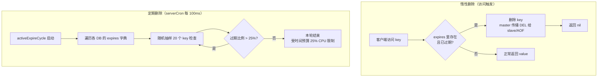
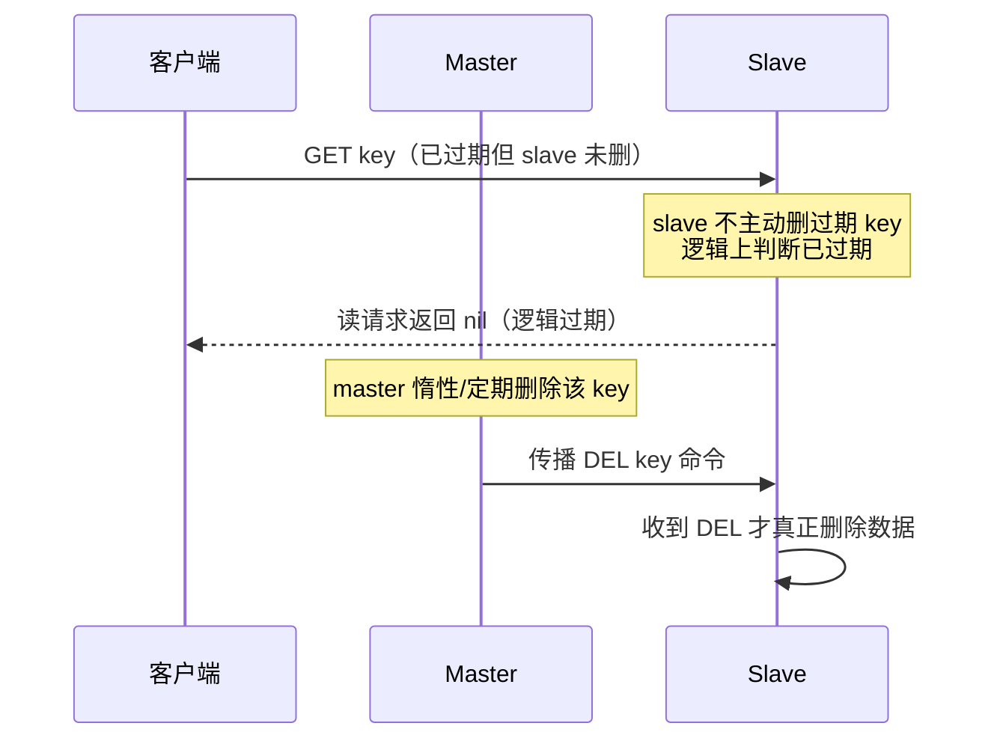

# 09 · 过期删除策略（Key Expiration）

> Redis 用「惰性删除 + 定期删除」两条腿走路来清理过期 key，主从架构下过期由 master 统一控制。面试重要度：⭐⭐⭐ 高频。

## 📖 核心原理

**过期 key 存在哪？** Redis 每个 DB 是一个 `redisDb` 结构，里面有两个核心字典：`dict`（主键空间，存 key→value）和 `expires`（过期字典，存 key→过期时间戳，单位毫秒的 UNIX 时间）。当你执行 `EXPIRE key 60` 或 `SET key val EX 60` 时，Redis 会在 `expires` 字典里为该 key 记一个绝对过期时间点（注意是绝对时间戳，不是倒计时，所以主从/持久化时不受传输耗时影响）。`expires` 里的 key 只是指向 `dict` 里 key 对象的指针，不额外拷贝，省内存。

**为什么需要主动清理？** 一个 key 过期了不代表它立刻从内存消失。如果只靠「访问时判断」，那些过期后再也没人访问的冷 key 会永久占用内存。所以 Redis 采用两种删除策略配合：

- **惰性删除（lazy / passive expiration）**：不主动检查，只有在**访问某个 key 时**才判断它是否过期（`expireIfNeeded()`）。过期就删掉并返回 nil，否则正常返回。优点是绝不浪费 CPU 去检查用不到的 key；缺点是过期冷 key 会「赖着不走」导致内存泄漏。
- **定期删除（active / periodic expiration）**：Redis 后台定时任务 `serverCron` 默认每秒运行 `server.hz` 次（默认 hz=10，即每 100ms 一次），调用 `activeExpireCycle()`，**随机抽样**检查 `expires` 字典里的 key 并删除已过期者。这是对惰性删除的兜底，保证冷 key 也能被回收。

**定期删除的抽样算法（7.x）**：每次循环遍历各 DB，从 `expires` 中随机取一批（`ACTIVE_EXPIRE_CYCLE_KEYS_PER_LOOP`，默认 20 个）检查；如果这批里**过期比例超过 25%**，说明过期 key 密集，立即再抽一批继续删，直到过期比例降到 25% 以下或达到时间上限。整个 cycle 有时间预算限制（默认不超过 CPU 时间的 25%，由 `ACTIVE_EXPIRE_CYCLE_SLOW_TIME_PERC` 控制），避免删除操作长时间阻塞主线程。这是一种「自适应」策略：过期越多删得越狠。

**为什么不用「定时删除」？** 定时删除是指给每个 key 设一个定时器（timer），到点就精确触发删除。它内存最友好（过期即删），但对 CPU 极不友好：海量 key 意味着海量定时器，Redis 单线程会被大量定时器回调抢占，影响正常命令响应。Redis 选择用「惰性 + 定期」在**内存**和**CPU**之间做权衡——牺牲一点内存精度，换取吞吐。

## 🔄 原理图 / 流程剖析

**主从架构下的过期控制（关键）**：

## 🔑 面试要点

- **两种策略配合**：惰性删除（省 CPU、可能漏冷 key）+ 定期删除（兜底回收、控制内存），二者互补。
- **不用定时删除的原因**：海量定时器对单线程 CPU 冲击大，Redis 用内存换 CPU。
- **过期字典 `expires`**：独立于主字典，只存 key 指针 + 绝对过期时间戳（毫秒）。
- **定期删除是随机抽样 + 自适应**：过期比例 >25% 就继续删，有 25% CPU 时间预算上限，防止阻塞主线程。
- **主从下过期由 master 控制**：slave 自己**不主动删**过期 key，只在收到 master 传播的 `DEL`（实际是 `UNLINK`）时才删；slave 读到逻辑过期的 key 会当作不存在返回 nil（读请求场景），保证数据一致性。
- **持久化对过期的处理**：RDB 保存时会过滤已过期 key；AOF 重写同理；主从/AOF 里过期删除以显式 `DEL` 命令传播，保证确定性。

## ❓ 高频面试题

**Q：为什么 slave 不主动删除过期 key，而要等 master 发 DEL？**
A：为了保证主从数据一致性和读写确定性。如果 slave 自己删，就可能出现 master 还没删、slave 已删的时间差，导致同一时刻主从返回结果不一致；更严重的是若 slave 后来被提升为 master，数据可能已被误删。所以设计上**只有 master 有权删过期 key**，master 删除后向 slave 传播 `DEL`。在 slave 上读到已到期但未收到 DEL 的 key 时，Redis 会在读逻辑里判断「逻辑过期」并对读命令返回 nil（3.2+ 修复了旧版本 slave 会返回过期数据的 bug），但**物理删除**仍等 master 指令。

**Q：大量 key 在同一秒过期会发生什么？如何缓解？**
A：定期删除任务会在这一秒集中删除大量 key，`activeExpireCycle` 因为过期比例持续 >25% 会反复抽样删除，占用主线程 CPU，导致其他命令延迟抖动（甚至客户端超时）。这本质就是**缓存雪崩**的诱因之一。缓解办法：给过期时间加随机抖动（如基础 TTL + `rand()`），把过期点打散；并可用 `UNLINK`（惰性删除、后台线程释放内存）替代 `DEL` 减少大对象删除的阻塞。

**Q：`EXPIRE` 存的是倒计时还是绝对时间？对主从有何影响？**
A：`expires` 字典存的是**绝对 UNIX 时间戳（毫秒）**。好处是不受命令传输、RDB 加载、主从同步耗时的影响——无论 key 在哪个节点、什么时候被读到，判断「当前时间 > 过期时间戳」都一致。这也是为什么 master 传播的是 `DEL` 而不是把剩余 TTL 传给 slave 自己算。

## ⚠️ 易错点 / 加分项

- **误区**：以为 key 一过期就立刻从内存删除。实际是「过期 ≠ 删除」，可能仍占内存，直到被访问（惰性）或被定期任务抽到。
- **加分点**：定期删除的 25% CPU 时间预算和 25% 过期比例阈值是两个不同的 25%，别混淆——前者是时间上限，后者是「是否继续删」的密度阈值。
- **加分点**：`DEL` 是同步释放内存（大对象会阻塞），`UNLINK`（4.0+）把内存释放丢给后台线程 `lazyfree`，Redis 4.0 起还有 `lazyfree-lazy-expire` 配置让过期删除走异步释放。
- **踩坑**：只设了过期时间但没做内存淘汰策略（`maxmemory-policy`）时，如果写入速度远超过期回收速度，内存仍可能被写满——过期和淘汰是两套机制（见 [10-eviction.md](10-eviction.md)）。
- **加分点**：`PERSIST` 命令会把 key 从 `expires` 字典移除变成永久；`SET` 命令（不带 `KEEPTTL`）会清除原有 TTL——很多「缓存莫名不过期」的 bug 源于此。
