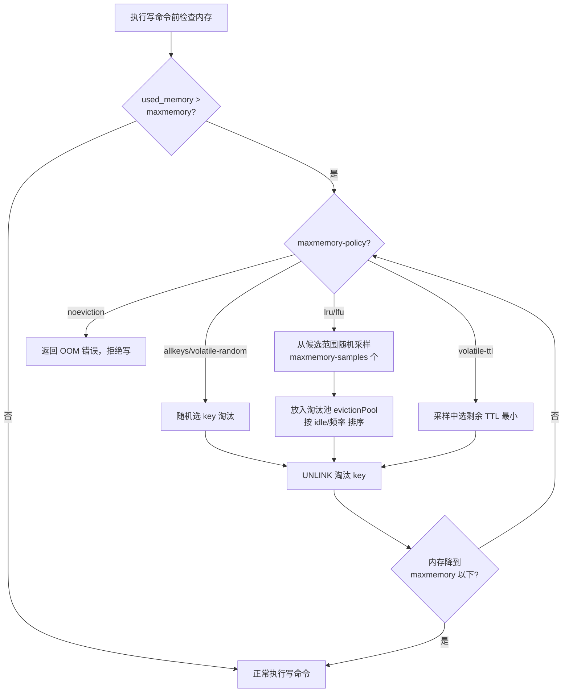
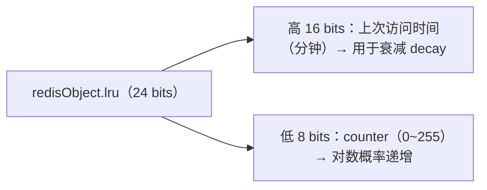

# 10 · 内存淘汰策略（Eviction / maxmemory-policy）

> 内存达到 `maxmemory` 上限时，Redis 按 `maxmemory-policy` 选一批 key 淘汰腾空间；核心是近似 LRU 与 LFU。面试重要度：⭐⭐⭐ 高频重点。

## 📖 核心原理

**触发时机**：Redis 在**每次执行写命令前**会检查 `used_memory` 是否超过 `maxmemory`（0 表示不限制，64 位默认无限）。超过就调用 `performEvictions()`，按配置的 `maxmemory-policy` 反复淘汰 key，直到内存降到 `maxmemory` 以下才继续执行写命令。所以淘汰是**同步、内联**在命令执行路径上的（会给写命令带来延迟），不是后台异步任务。

**过期删除 vs 内存淘汰的区别**：过期删除（见 [09](09-expiration.md)）是清理「已过期」的 key；内存淘汰是内存不够时**主动删还没过期的 key**来腾地方。二者独立：即使没设过期时间的 key，在 `allkeys-*` 策略下也会被淘汰。

**8 种策略**（`maxmemory-policy`）：

| 策略 | 淘汰范围 | 淘汰依据 | 适用场景 |
|---|---|---|---|
| `noeviction` | 不淘汰 | 内存满后写命令直接报错 `OOM`，读/删仍可用 | 不能丢数据、当持久存储用（默认值） |
| `allkeys-lru` | 所有 key | 最久未使用（LRU） | 通用缓存，热点集中 |
| `volatile-lru` | 仅带 TTL 的 key | 最久未使用（LRU） | 缓存与持久数据混存，只淘汰缓存 |
| `allkeys-lfu` | 所有 key | 最少使用频率（LFU） | 有明显冷热区分、访问频率差异大（4.0+） |
| `volatile-lfu` | 仅带 TTL 的 key | 最少使用频率（LFU） | 混存 + 频率敏感（4.0+） |
| `allkeys-random` | 所有 key | 随机 | 各 key 访问概率均匀 |
| `volatile-random` | 仅带 TTL 的 key | 随机 | 混存 + 无明显热点 |
| `volatile-ttl` | 仅带 TTL 的 key | 剩余 TTL 最小（快到期的先删） | 想让快过期的优先被清 |

> 记忆法：前缀 `allkeys-`（全体）/`volatile-`（仅有 TTL 的）× 依据 `lru`/`lfu`/`random`/`ttl`。`volatile-*` 策略下若没有任何带 TTL 的 key 可淘汰，行为退化为 `noeviction`（写报错）。

**近似 LRU（Approximated LRU）**：真正的 LRU 需要一个双向链表维护全部 key 的访问顺序，每次访问都要移动节点，内存和 CPU 开销大。Redis 用**近似 LRU**：每个对象头 `redisObject` 有个 24 位 `lru` 字段记录最后访问时间（秒级时钟）。淘汰时不扫全库，而是**随机采样** `maxmemory-samples` 个 key（默认 5），从中挑 `lru` 最旧的淘汰。采样值越大越接近真实 LRU，但 CPU 开销越大。Redis 3.0 还引入了**淘汰候选池（eviction pool）**：把每次采样中最该淘汰的候选放进一个大小 16 的池子，跨多轮维护，让近似 LRU 更逼近精确 LRU。

**LFU（Least Frequently Used，4.0+）**：LRU 的问题是「一次性大量访问」会把真正的热点挤掉（比如一次全表扫描把冷数据都变成「最近访问」）。LFU 按**访问频率**淘汰。同样复用 `redisObject` 的 24 位 `lru` 字段，拆成两部分：高 16 位存**上次访问时间**（分钟级，用于衰减），低 8 位存 **LFU 计数器**（`counter`，0~255）。

- **计数器不是简单 +1**，而是**对数概率递增**（`morris counter` 思想）：counter 越大，再 +1 的概率越低，由 `lfu-log-factor`（默认 10）控制，使 8 位就能表示到访问频率百万级别。
- **计数器会衰减**：如果一个 key 长时间不访问，其 counter 会随时间下降，由 `lfu-decay-time`（默认 1 分钟）控制——每过 `lfu-decay-time` 分钟没访问，counter 减 1。这样避免「历史上很热但现在已冷」的 key 永远不被淘汰。
- 新 key 初始 counter 是 **5**（`LFU_INIT_VAL`），给新 key 一个缓冲，避免刚写入就因频率为 0 被立刻淘汰。

## 🔄 原理图 / 流程剖析

**LFU 计数器 24 位布局**：

## 🔑 面试要点

- **淘汰是同步内联在写命令前**，会拖慢写延迟；`noeviction`（默认）内存满会让写命令直接 `OOM` 报错。
- **8 种策略 = 范围（allkeys/volatile）× 依据（lru/lfu/random/ttl）**，其中 `allkeys-lru` 和 `allkeys-lfu` 最常用。
- **近似 LRU**：不维护全局链表，靠对象头 24 位时间戳 + 随机采样（`maxmemory-samples` 默认 5）+ 淘汰候选池逼近真实 LRU。
- **LFU 解决 LRU 的「缓存污染」**：全表扫描类一次性访问不会误伤热点，因为看的是频率而非最近时间。
- **LFU 计数器对数递增 + 时间衰减**，由 `lfu-log-factor` 和 `lfu-decay-time` 调节，8 位计数器可表达极大频率。
- **volatile-\* 无可淘汰 key 时退化为 noeviction**（写报错）——所以纯缓存场景更推荐 `allkeys-*`。
- **如何选**：纯缓存且想「谁都能被淘汰」→ `allkeys-lru`/`allkeys-lfu`；热点稳定、频率差异大 → LFU；缓存与需持久化数据混存 → `volatile-*`；不容许丢数据 → `noeviction`。

## ❓ 高频面试题

**Q：LRU 和 LFU 有什么区别？为什么有了 LRU 还要 LFU？**
A：LRU 按「最近最久未使用」淘汰，只看**时间**；LFU 按「访问频率最低」淘汰，看**次数**。LRU 的致命问题是**缓存污染 / 一次性访问**：比如一次大批量扫描（全表刷一遍）把很多冷 key 变成「刚访问过」，反而把真正长期的热点 key 挤出去了。LFU 记录访问频率，偶尔一次的批量访问频率涨得慢（对数递增），不会误伤真热点；同时用时间衰减保证曾经热、现在冷的 key 频率会掉下来，最终被淘汰。缺点是 LFU 对突发新热点的响应比 LRU 慢一点。

**Q：Redis 的 LRU 是精确 LRU 吗？怎么实现的、有什么代价？**
A：不是精确 LRU，是**近似 LRU**。精确 LRU 要维护一条包含所有 key 的双向链表，每次访问 O(1) 移到头部，但链表指针会额外吃内存、且每次访问都要改链表。Redis 为省内存改用近似：每个对象只存 24 位最后访问时间戳，淘汰时**随机采样** `maxmemory-samples` 个 key 选最旧的，再配合大小 16 的淘汰候选池跨轮维护候选。代价是可能偶尔淘汰掉「不是最旧」的 key，但用极小内存换来了接近精确的效果。调大 `maxmemory-samples`（如 10）能更精确但更耗 CPU。

**Q：设置了过期时间，为什么还会 OOM？过期和淘汰是一回事吗？**
A：不是一回事。过期删除只清理**已经到期**的 key；如果写入速度快于过期速度，或很多 key 根本没到期，内存照样会涨到 `maxmemory`。此时若策略是 `noeviction`，写命令直接 `OOM` 报错;若是 `volatile-*` 但恰好没有带 TTL 的 key 可淘汰，也会退化成拒绝写。所以生产上要么用 `allkeys-lru`/`allkeys-lfu` 保证总能淘汰，要么严格给所有 key 设 TTL。

## ⚠️ 易错点 / 加分项

- **误区**：以为淘汰是后台异步做的。实际是**同步内联**在写命令执行前，淘汰大 key（如百万元素 hash）会显著阻塞——可开 `lazyfree-lazy-eviction yes` 让内存释放走后台线程。
- **踩坑**：`volatile-*` 策略下所有 key 都没设 TTL → 等于 `noeviction`，线上突然大面积写失败。纯缓存请用 `allkeys-*`。
- **加分点**：`maxmemory` 要留足冗余给 fork（RDB/AOF 重写时 COW 会额外占内存）和复制缓冲区，别设成物理内存的 100%，一般 70%~80%。
- **加分点**：`OBJECT FREQ key`（LFU 模式下）可查 key 的访问频率计数，`OBJECT IDLETIME key`（LRU 模式下）可查空闲时间，用于诊断热点。
- **加分点**：Redis 4.0 引入 LFU 后，很多大厂缓存默认从 `allkeys-lru` 切到 `allkeys-lfu`，命中率更稳；但要注意 LFU 计数受 `lfu-decay-time` 影响，需按业务访问周期调参。
- **面试怎么答**：先说触发时机（写前检查）→ 8 种策略分类维度 → 近似 LRU 采样机制 → LFU 对数计数+衰减解决缓存污染 → 结合业务给选型建议，层层递进就是资深水准。
