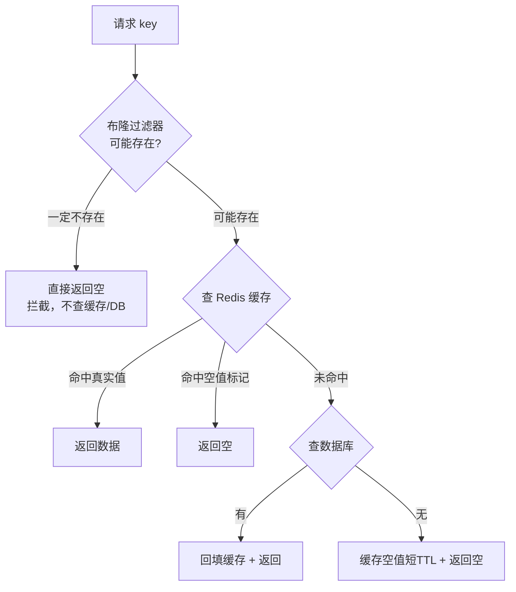
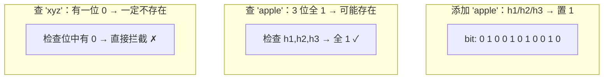

# 11 · 缓存穿透（Cache Penetration）

> 查询**根本不存在**的数据，请求每次都绕过缓存直击数据库；解法是缓存空值 + 布隆过滤器。面试重要度：⭐⭐⭐ 高频重点。

## 📖 核心原理

**什么是穿透**：正常缓存流程是「先查缓存，命中直接返回；未命中查 DB，回填缓存」。缓存穿透指请求的数据**在缓存和数据库里都不存在**（比如查 `id=-1` 或一个不存在的用户）。由于 DB 也查不到，就没法回填缓存，导致**每一次这种请求都会穿过缓存打到 DB**。如果被恶意刷（用大量不存在的 id 攻击），DB 会被打垮。

与击穿、雪崩的区别：**穿透 = 数据不存在**（缓存和 DB 都没有）；击穿 = 单个热点 key 过期瞬间；雪崩 = 大量 key 同时失效或 Redis 宕机。三者根因不同，别混。

**解法一：缓存空值（Cache Null）**。查 DB 发现不存在时，也往缓存里写一个特殊的「空值」标记（如空字符串或 `"NULL"`），并设一个**较短的过期时间**（如 30~60 秒）。后续相同请求命中这个空值直接返回，不再打 DB。
- 优点：实现简单，能挡住重复查同一个不存在 key。
- 缺点：① 如果攻击者每次用**不同**的不存在 key，缓存里会堆积大量空值，浪费内存；② 空值 TTL 内如果该 key 真的被写入了 DB，会有短暂的数据不一致（需在写入时主动删除空值缓存）。

**解法二：布隆过滤器（Bloom Filter）**。在缓存前面加一道「这个 key 可能存在吗」的快速过滤，把肯定不存在的请求直接拦掉，根本不查缓存和 DB。

**布隆过滤器原理**：它是一个**很长的二进制位数组 + k 个独立哈希函数**。
- **添加元素**：把元素用 k 个哈希函数算出 k 个位置，把这 k 个 bit 置 1。
- **查询元素**：同样算 k 个位置，如果这 k 个 bit **有任意一个是 0**，则元素**一定不存在**；如果 k 个 bit **全是 1**，则元素**可能存在**（也可能是别的元素把这些位碰巧都置 1 了，这就是误判/假阳性）。

**核心特性**：
- **误判只会「假阳性」，不会「假阴性」**：说「不存在」一定不存在（可放心拦截）；说「存在」可能是误报（放过去查一下 DB，最坏就是漏掉一次拦截，不会漏数据）。
- **不能删除元素**：因为多个元素可能共享同一个 bit，把某元素的 bit 置 0 会误伤其他元素，导致假阴性。想支持删除要用**计数布隆过滤器（Counting Bloom Filter）**（每位用计数器代替单 bit）或定期重建。
- **误判率与参数关系**：位数组越长（m 越大）、哈希函数个数 k 越合适、元素越少（n 越小），误判率越低。给定 n 和目标误判率 p，最优位数 `m = -n·ln(p)/(ln2)²`，最优哈希个数 `k = (m/n)·ln2`。RedisBloom 模块可直接 `BF.RESERVE key error_rate capacity` 指定误判率和容量自动算参数。

用法：系统启动时把**所有合法 key（如全部商品 id）预热进布隆过滤器**；请求先问布隆过滤器，返回「不存在」就直接拒绝，返回「可能存在」才走缓存→DB。

## 🔄 原理图 / 流程剖析

**布隆过滤器位数组示意（k=3 个哈希）**：

## 🔑 面试要点

- **穿透定义**：查询缓存和 DB 都不存在的数据，每次都击穿到 DB，常见于恶意攻击或参数非法。
- **缓存空值**：简单有效，挡重复查同一 key；要设短 TTL，且 DB 真写入时要删空值缓存保证一致。
- **布隆过滤器**：位数组 + k 个哈希，判断元素「一定不存在 / 可能存在」，用极小空间拦截海量非法请求。
- **只有假阳性没有假阴性**：说「没有」绝对可信 → 能安全拦截；说「有」可能误报 → 放行查一下即可，不会丢数据。
- **不能删除**：删除会误伤共享 bit 的其他元素造成假阴性；需删除用 Counting Bloom Filter 或定期整体重建。
- **参数权衡**：误判率由位数组长度 m、哈希个数 k、元素数 n 决定；生产用 RedisBloom 或 Guava BloomFilter 直接给误判率。
- **两方案配合**：布隆过滤器挡住「海量不同的非法 key」，缓存空值挡住「重复的合法但无数据的 key」，实战常一起用。

## ❓ 高频面试题

**Q：缓存空值和布隆过滤器各解决什么问题？为什么常一起用？**
A：缓存空值解决的是「**反复查询同一个不存在的 key**」——第一次查 DB 没有就缓存个空标记，后续直接命中不打 DB；但它挡不住「每次都用**不同**的不存在 key」的攻击（会堆满空值缓存）。布隆过滤器解决的正是这个——它在最前面用极小内存记录「所有合法 key 的集合」，任何不在集合里的 key 直接拦掉，不占用缓存空间。两者互补：布隆过滤器挡海量新非法 key，缓存空值兜底那些「合法但暂时无数据」的 key。

**Q：布隆过滤器为什么会误判？误判会造成什么后果？能接受吗？**
A：因为多个不同元素经哈希后可能映射到相同的 bit 位。查询某个从未加入的元素时，它的 k 个 bit 恰好都被别的元素置 1 了，就会误判为「可能存在」（假阳性）。后果是：这个本该被拦截的非法请求被放行，去查了一次缓存/DB——最坏就是**少拦截了一个**，DB 扛一次查询，完全可接受。关键是它**绝不会假阴性**（不会把真实存在的数据误判为不存在），所以不会漏掉合法数据。调低误判率（加大位数组）可减少放行量,但会增加内存。

**Q：布隆过滤器为什么不能删除元素？如果要支持删除怎么办？**
A：因为一个 bit 可能被多个元素共同置 1。若删除元素 A 时把它的 k 个 bit 置 0，而其中某位也是元素 B 置的，B 查询时就会因为这位变 0 而被误判为「不存在」——产生**假阴性**，这是布隆过滤器绝对不允许的。解决方案：① **Counting Bloom Filter**，每个位置用一个小计数器代替单 bit，添加 +1、删除 -1，只有计数归 0 才算不存在，代价是内存翻几倍；② **定期全量重建**布隆过滤器（如每天用最新数据重灌一份）。

## ⚠️ 易错点 / 加分项

- **误区**：把穿透和击穿搞混。穿透强调「数据本就不存在」，击穿强调「热点 key 恰好过期」。答题先把定义区分清楚是加分第一步。
- **踩坑**：缓存空值不设 TTL 或 TTL 太长 → 一旦该数据后来真的写入 DB，缓存里的空值会长期覆盖真实数据造成不一致。正解：空值设短 TTL，且写库时主动 `DEL` 对应空值缓存。
- **加分点**：布隆过滤器有「**能加不能减**」的特性，业务数据频繁增删时要么用 Counting 版，要么周期性重建，否则删掉的数据仍被判「可能存在」导致回源。
- **加分点**：布隆过滤器可用 Redis 的 bitmap 自己实现，或直接用官方 **RedisBloom 模块**（`BF.ADD` / `BF.EXISTS` / `BF.RESERVE`），后者支持自动扩容（Scalable Bloom Filter）。单机内可用 Guava 的 `BloomFilter`（业务侧，见 [`../../spring-learning`](../../spring-learning)）。
- **加分点**：还有**布谷鸟过滤器（Cuckoo Filter）**，支持删除且空间效率更高，是布隆过滤器的进阶替代，能答出来是亮点。
- **踩坑**：布隆过滤器初始化要**预热全量数据**，且新增数据要同步写入过滤器，否则新数据会被误拦（这次是「假阴性」的假象，实为过滤器数据不全）。
