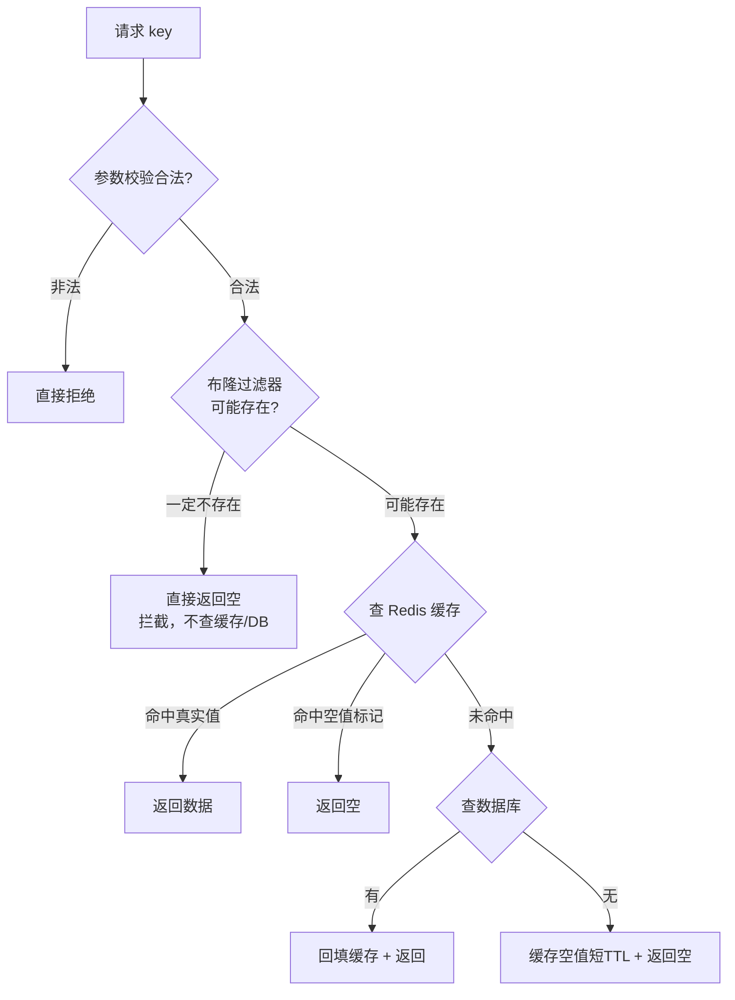
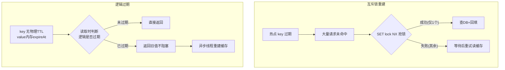
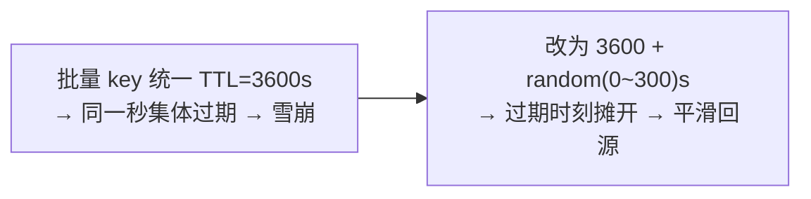
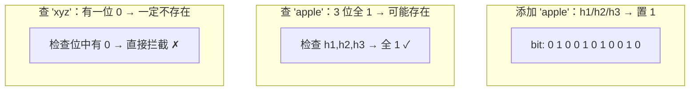

# 11 · 缓存穿透/击穿/雪崩（Cache Penetration / Breakdown / Avalanche）

> 三类高并发缓存失效问题：穿透=数据不存在、击穿=单热点 key 过期、雪崩=大量 key 同时失效或 Redis 宕机；核心是别混淆根因与对应解法。面试重要度：⭐⭐⭐ 高频重点。

## 📖 核心原理

正常缓存流程是「先查缓存，命中直接返回；未命中查 DB，回填缓存」。这三个问题都是**这条链路在某种情况下失效、请求大量压到 DB**，但根因和解法完全不同，面试最忌把三者混为一谈。先记住一句话对比：**穿透 = 数据压根不存在（缓存和 DB 都没有）；击穿 = 单个热点 key 恰好过期；雪崩 = 大量 key 同时失效或 Redis 整体宕机。**

---

### 一、缓存穿透（Cache Penetration）

**定义**：请求的数据**在缓存和数据库里都不存在**（比如查 `id=-1` 或一个不存在的用户）。由于 DB 也查不到，就没法回填缓存，导致**每一次这种请求都会穿过缓存直击 DB**。

**成因**：① 恶意攻击——用大量不存在的 id 疯狂刷接口；② 业务参数非法或数据被删除后仍被大量请求。共性是「查不到 → 无法回填 → 缓存形同虚设」。

**解法一：缓存空值（Cache Null）**。查 DB 发现不存在时，也往缓存里写一个特殊的「空值」标记（如空字符串或 `"NULL"`），并设一个**较短的过期时间**（如 30~60 秒）。后续相同请求命中这个空值直接返回，不再打 DB。
- 优点：实现简单，能挡住重复查同一个不存在 key。
- 缺点：① 如果攻击者每次用**不同**的不存在 key，缓存里会堆积大量空值，浪费内存；② 空值 TTL 内如果该 key 真的被写入了 DB，会有短暂的数据不一致（需在写入时主动 `DEL` 空值缓存）。

```
# 缓存空值，短 TTL，避免长期覆盖真实数据
SET user:404 "NULL" EX 60
```

**解法二：布隆过滤器（Bloom Filter）**。在缓存前面加一道「这个 key 可能存在吗」的快速过滤，把肯定不存在的请求直接拦掉，根本不查缓存和 DB。

**布隆过滤器原理**：它是一个**很长的二进制位数组 + k 个独立哈希函数**。
- **添加元素**：把元素用 k 个哈希函数算出 k 个位置，把这 k 个 bit 置 1。
- **查询元素**：同样算 k 个位置，如果这 k 个 bit **有任意一个是 0**，则元素**一定不存在**；如果 k 个 bit **全是 1**，则元素**可能存在**（也可能是别的元素把这些位碰巧都置 1 了，这就是误判/假阳性）。

**核心特性**：
- **只会「假阳性」，不会「假阴性」**：说「不存在」一定不存在（可放心拦截）；说「存在」可能是误报（放过去查一下 DB，最坏就是漏掉一次拦截，不会漏数据）。
- **不能删除元素**：多个元素可能共享同一个 bit，把某元素的 bit 置 0 会误伤其他元素造成假阴性。想支持删除要用**计数布隆过滤器（Counting Bloom Filter）**（每位用计数器代替单 bit）或定期整体重建。
- **误判率与参数关系**：位数组越长（m 越大）、哈希函数个数 k 越合适、元素越少（n 越小），误判率越低。给定 n 和目标误判率 p，最优位数 `m = -n·ln(p)/(ln2)²`，最优哈希个数 `k = (m/n)·ln2`。

用法：系统启动时把**所有合法 key（如全部商品 id）预热进布隆过滤器**；请求先问布隆过滤器，返回「不存在」就直接拒绝，返回「可能存在」才走缓存→DB。生产可直接用官方 **RedisBloom 模块**：

```
BF.RESERVE goods:bf 0.001 1000000   # 误判率 0.1%、容量 100 万，自动算 m/k
BF.ADD    goods:bf 10086            # 预热/新增时写入合法 id
BF.EXISTS goods:bf -1               # 查询：返回 0=一定不存在，直接拦截
```

**解法三：参数校验**。最前置的一道防线——对明显非法的入参（如 `id<0`、格式不符、超长字符串）在进入缓存查询前直接拒绝，成本最低，能挡掉一大批无脑攻击。

---

### 二、缓存击穿（Cache Breakdown / Hotspot Invalid）

**定义**：**某个热点 key 在过期的瞬间**，恰好有大量并发请求同时到来。这些请求同时发现缓存未命中，于是**同时打到 DB** 去查同一份数据并回填，DB 瞬间被这一个 key 的并发压垮。注意：数据是**存在**的，问题出在「过期瞬间的并发」，这与穿透的「数据不存在」本质不同。

**成因**：热点 key（如爆款商品、首页配置）设置了 TTL，到期瞬间缓存空窗，而其 QPS 极高，成千上万请求在同一刻集体回源。

**解法一：互斥锁（Mutex / 只放一个线程重建）**。缓存未命中时，先用 `SET key value NX EX` 抢一把分布式锁，**只有抢到锁的那一个线程去查 DB 并回填缓存，其余线程短暂等待后重试读缓存**（此时通常已被填好）。把 N 个并发回源收敛成 1 次。

```java
// 伪代码：互斥锁重建缓存
String val = redis.get(key);
if (val == null) {
    // SET lock 1 NX EX 10：抢锁，只有一个线程成功
    if (redis.set("lock:" + key, "1", "NX", "EX", 10)) {
        try {
            val = db.query(key);              // 只有拿到锁的线程查 DB
            redis.set(key, val, "EX", 300);   // 回填
        } finally {
            redis.del("lock:" + key);         // 释放锁
        }
    } else {
        Thread.sleep(50);                     // 其余线程等一下再读缓存
        return getWithMutex(key);             // 重试
    }
}
```
- 要点：锁必须设过期时间防死锁；业务侧分布式锁细节（Redisson 看门狗续期）见 [13-distributed-lock](13-distributed-lock.md) 与 [`../../spring-learning`](../../spring-learning)。缺点是等待线程会有一点延迟。

**解法二：逻辑过期（Logical Expiration）**。热点 key **不设物理 TTL**（永不真正过期），而是把过期时间**写进 value 里**（如 `{"data":..., "expireAt": 168xxxx}`）。读取时判断逻辑过期时间：
- 未逻辑过期 → 直接返回；
- 已逻辑过期 → **返回旧值（不阻塞用户）**，同时**开一个异步线程去查 DB 重建缓存**（重建时也用互斥锁保证只重建一次）。

这样任何时刻缓存里都有数据，永远不会出现「过期空窗」，牺牲一点**数据实时性**（短暂返回旧值）换取**绝不阻塞、绝不击穿**。适合对一致性要求不高、但对可用性/延迟极敏感的超热点场景。

> 对比：互斥锁保证强一致（拿到的是最新值）但会让部分线程阻塞等待；逻辑过期保证高可用不阻塞但可能读到短暂旧值。二者按「一致性 vs 可用性」取舍。

---

### 三、缓存雪崩（Cache Avalanche）

**定义**：**大量 key 在同一时间集中失效**，或 **Redis 实例整体宕机**，导致海量请求在同一刻全部越过缓存压到 DB，DB 被瞬间打垮甚至级联雪崩。与击穿的区别：击穿是**单个**热点 key，雪崩是**大批** key 同时出事（或整个缓存层挂掉）。

**成因**：① 大量 key 用了**相同的 TTL**（比如凌晨批量导入时统一设 `EX 3600`，一小时后集体过期）；② Redis 宕机 / 网络分区，整个缓存层不可用。

**解法一：随机 TTL（错峰过期）**。给过期时间加一个随机扰动，让 key 分散在不同时刻过期，避免同一秒集体失效。

```
# 基础 3600s + 随机 0~300s，把过期时间摊开
SET config:1001 v EX 3712
# 代码里：ttl = 3600 + random(0, 300)
```

**解法二：多级缓存**。本地缓存（Caffeine / Guava）+ Redis 分布式缓存组成多级，Redis 某些 key 失效时本地缓存还能兜一层，降低回源概率（本地缓存见 [`../../spring-learning`](../../spring-learning)）。

**解法三：服务熔断 / 降级 / 限流**。缓存层失效导致 DB 压力骤增时，用 Sentinel / Hystrix 等对下游做**限流**（放行一部分、拒绝多余请求）和**降级**（返回兜底默认值），保护 DB 不被打死，是最后一道保命防线。

**解法四：Redis 高可用**。针对「Redis 宕机型雪崩」，根本解法是让缓存层本身不宕——**主从复制 + 哨兵（Sentinel）自动故障转移**，或 Cluster 集群分片，保证单点故障时自动切换、服务不中断。详见 [18-sentinel](18-sentinel.md)。

---

### 三者对比（面试务必区分，别混淆）

| 问题 | 根因 | 数据是否存在 | 影响范围 | 核心解法 |
|---|---|---|---|---|
| **穿透 Penetration** | 查的数据**根本不存在**，无法回填缓存，每次直击 DB | 否（缓存+DB 都无） | 特定非法 key（常为攻击） | ① 缓存空值(短 TTL) ② 布隆过滤器 ③ 参数校验 |
| **击穿 Breakdown** | **单个热点 key 过期瞬间**大量并发同时回源 | 是 | 单个热点 key | ① 互斥锁(只放一个重建) ② 逻辑过期(异步重建) |
| **雪崩 Avalanche** | **大量 key 同时失效** 或 **Redis 宕机** | 是 | 大批 key / 整个缓存层 | ① 随机 TTL ② 多级缓存 ③ 熔断降级限流 ④ 主从+哨兵高可用 |

> 一句话记忆：**穿透看「数据在不在」，击穿看「一个热 key」，雪崩看「一大批 key / 整个 Redis」**。

## 🔄 原理图 / 流程剖析

**穿透 + 空值 + 布隆过滤器完整链路**：



**击穿：互斥锁 vs 逻辑过期**：



**雪崩：随机 TTL 错峰**：



**布隆过滤器位数组示意（k=3 个哈希）**：



## 🔑 面试要点

- **一句话区分三者**：穿透=数据不存在（缓存+DB 都无，每次直击 DB）；击穿=单个热点 key 过期瞬间大量并发回源；雪崩=大量 key 同时失效或 Redis 宕机。**先把定义分清是答题第一步。**
- **穿透·缓存空值**：查不到也缓存空标记 + **短 TTL**；DB 真写入时要主动 `DEL` 空值保证一致；挡不住「每次不同的非法 key」。
- **穿透·布隆过滤器**：位数组 + k 个哈希，判断「一定不存在 / 可能存在」；**只有假阳性无假阴性**——说没有绝对可信（能安全拦截），说有可能误报（放行查一下不丢数据）；**不能删除**，需删用 Counting Bloom 或定期重建。
- **两方案配合**：布隆过滤器挡「海量不同的非法 key」，缓存空值兜「重复的合法但暂无数据的 key」，实战常一起用；最前面再加参数校验。
- **击穿·互斥锁**：`SET NX EX` 只放一个线程查 DB 回填，其余等待重试——强一致但有等待延迟；锁必须设 TTL 防死锁。
- **击穿·逻辑过期**：不设物理 TTL，value 内存过期时间，过期后返回旧值 + 异步重建——高可用不阻塞但可能读到短暂旧值。二者按「一致性 vs 可用性」取舍。
- **雪崩·四板斧**：随机 TTL 错峰（防集中失效）+ 多级缓存 + 熔断降级限流（护 DB）+ 主从哨兵高可用（防 Redis 宕机）。
- **穿透/击穿/雪崩本质**：穿透和击穿要区分「数据不存在 vs 热点过期」，雪崩要区分「大量 key 失效 vs 整个 Redis 挂」，宕机型雪崩靠高可用而非 TTL 解决。

## ❓ 高频面试题

**Q：缓存穿透、击穿、雪崩有什么区别？分别怎么解决？**
A：三者根因不同。**穿透**是查的数据缓存和 DB 里都不存在（如恶意 `id=-1`），无法回填缓存，每次都打 DB——解法是缓存空值（短 TTL）、布隆过滤器提前拦截、参数校验。**击穿**是单个热点 key 恰好过期的瞬间，大量并发同时回源查同一份数据压垮 DB——解法是互斥锁（只放一个线程重建）或逻辑过期（不设物理 TTL、异步重建）。**雪崩**是大量 key 在同一时间集中失效、或 Redis 整体宕机，海量请求同时压到 DB——解法是随机 TTL 错峰、多级缓存、熔断降级限流、以及主从+哨兵高可用。记忆点：穿透看数据在不在，击穿看一个热 key，雪崩看一大批 key 或整个 Redis。

**Q：布隆过滤器为什么会误判？误判会造成什么后果？能接受吗？**
A：因为多个不同元素经哈希后可能映射到相同的 bit 位。查询某个从未加入的元素时，它的 k 个 bit 恰好都被别的元素置 1 了，就会误判为「可能存在」（假阳性）。后果是：这个本该被拦截的非法请求被放行，去查了一次缓存/DB——最坏就是**少拦截了一个**，DB 扛一次查询，完全可接受。关键是它**绝不会假阴性**（不会把真实存在的数据误判为不存在），所以不会漏掉合法数据。调低误判率（加大位数组）可减少放行量，但会增加内存。

**Q：布隆过滤器为什么不能删除元素？如果要支持删除怎么办？**
A：因为一个 bit 可能被多个元素共同置 1。若删除元素 A 时把它的 k 个 bit 置 0，而其中某位也是元素 B 置的，B 查询时就会因为这位变 0 被误判为「不存在」——产生**假阴性**，这是布隆过滤器绝对不允许的。解决方案：① **Counting Bloom Filter**，每个位置用一个小计数器代替单 bit，添加 +1、删除 -1，只有计数归 0 才算不存在，代价是内存翻几倍；② **定期全量重建**布隆过滤器（如每天用最新数据重灌一份）。进阶可用支持删除且空间更省的**布谷鸟过滤器（Cuckoo Filter）**。

**Q：缓存击穿的互斥锁和逻辑过期方案怎么选？各有什么代价？**
A：**互斥锁**在缓存未命中时用 `SET NX` 抢锁，只放一个线程查 DB 回填，其余线程等待后重试读缓存——保证拿到的是**最新数据（强一致）**，代价是等待线程有一点阻塞延迟，且要给锁设 TTL 防死锁。**逻辑过期**不给热点 key 设物理 TTL，把过期时间写进 value，读到「逻辑已过期」时先返回旧值不阻塞用户，同时异步线程重建——保证**永不阻塞、永不空窗（高可用）**，代价是重建期间会读到**短暂旧值（弱一致）**。所以对一致性敏感选互斥锁，对延迟/可用性敏感（超热点、能容忍短暂旧数据）选逻辑过期。

**Q：如何防止缓存雪崩？如果是 Redis 宕机导致的雪崩，随机 TTL 有用吗？**
A：雪崩分两类。**大量 key 同时失效型**：给 TTL 加随机值错峰（如 `base + random(0,300)s`），避免同一秒集体过期，再配多级缓存降低回源。**Redis 宕机型**：随机 TTL 此时**完全没用**，因为整个缓存层都没了，根本解法是让 Redis 本身高可用——**主从复制 + 哨兵自动故障转移**或 Cluster 集群，单点挂了自动切换（见 [18-sentinel](18-sentinel.md)）。两类都要配**熔断、降级、限流**作为最后一道防线，缓存失效时限制打到 DB 的流量、返回兜底值，避免 DB 被打垮引发级联雪崩。

## ⚠️ 易错点 / 加分项

- **误区**：把穿透、击穿、雪崩三者搞混。穿透强调「数据本就不存在」，击穿强调「单个热点 key 恰好过期」，雪崩强调「大批 key 同时失效 / Redis 宕机」。答题先精准区分定义是加分第一步。
- **踩坑**：缓存空值不设 TTL 或 TTL 太长 → 一旦该数据后来真的写入 DB，缓存里的空值会长期覆盖真实数据造成不一致。正解：空值设短 TTL，且写库时主动 `DEL` 对应空值缓存。
- **加分点**：布隆过滤器「**能加不能减**」，业务数据频繁增删时要么用 Counting 版、要么周期性重建，否则删掉的数据仍被判「可能存在」导致回源；初始化必须**预热全量合法数据**，新增数据要同步写入过滤器，否则新数据被误拦。
- **加分点**：布隆过滤器可用 Redis 的 bitmap 自己实现，或直接用官方 **RedisBloom 模块**（`BF.ADD` / `BF.EXISTS` / `BF.RESERVE`，支持 Scalable Bloom 自动扩容）；单机内可用 Guava 的 `BloomFilter`（业务侧，见 [`../../spring-learning`](../../spring-learning)）。**布谷鸟过滤器**支持删除、空间效率更高，是进阶替代，能答出来是亮点。
- **踩坑**：击穿互斥锁若锁不设过期时间，持锁线程崩溃会导致**死锁**，其他线程永久等待；生产用 Redisson 分布式锁（看门狗自动续期）更稳妥，见 [13-distributed-lock](13-distributed-lock.md)。
- **加分点**：逻辑过期的「异步重建」也要加互斥锁，否则多个线程发现逻辑过期会同时启动重建，又退化成小型击穿。
- **加分点**：雪崩的「Redis 宕机型」和「大量 key 失效型」要分开答——前者靠**高可用架构**（主从+哨兵/Cluster）解决，后者靠**随机 TTL + 错峰**解决，混为一谈（比如说「Redis 挂了用随机 TTL 解决」）会露怯。
- **面试怎么答**：先用一句话对比三者根因 → 逐个给定义+成因+解法+代码/参数 → 点出方案取舍（空值 vs 布隆、互斥锁 vs 逻辑过期、随机 TTL vs 高可用）→ 最后强调「熔断降级限流」是通用兜底，层层递进即资深水准。
