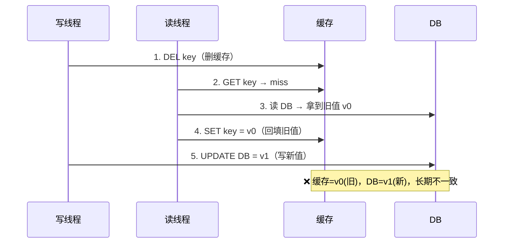
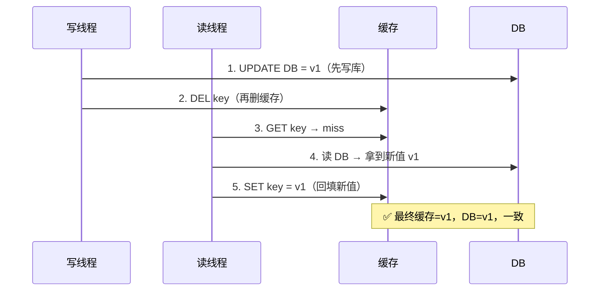
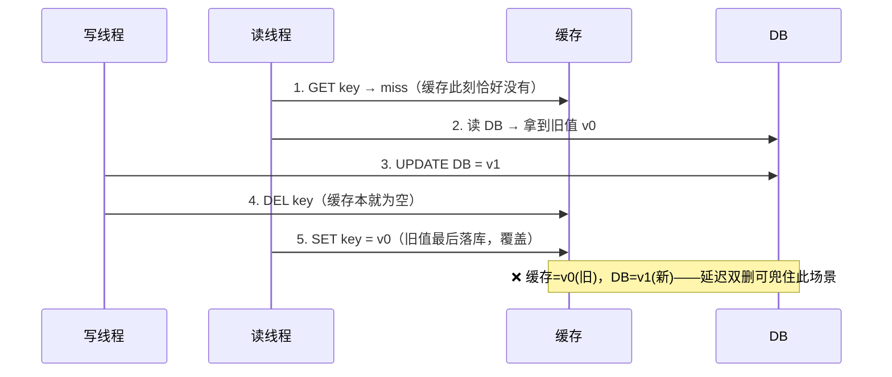

# 12 · 缓存与数据库一致性（Cache Consistency）

> 缓存与 DB 是两套独立系统，更新有先后、有并发，做不到强一致；工程上用 Cache Aside + 先更库再删缓存 + 延迟双删 + 兜底删除 + TTL 追求**最终一致**。面试重要度：⭐⭐⭐ 高频重点。

## 📖 核心原理

**问题本质：一份数据两个副本。** 缓存（Redis）和数据库（MySQL）是两个**独立的存储系统**，同一份数据存了两份。只要「写 DB」和「写/删缓存」不是一个原子操作，中间就存在时间窗口；再叠加多线程并发读写、缓存或 DB 单点写失败、主从复制延迟，就必然出现某个瞬间「缓存里是旧值、DB 里是新值」的不一致。分布式系统里**没有免费的强一致**：要强一致就得串行化（加锁、走 2PC），代价是吞吐和可用性。所以生产上的目标不是「任意时刻都一致」，而是**最终一致（Eventual Consistency）**——不一致窗口尽量小、且一定会收敛。

**Cache Aside（旁路缓存）是事实标准。** 应用代码自己管理缓存，DB 是权威数据源（Source of Truth），缓存只是加速副本：

- **读**：先读缓存 → 命中直接返回；未命中 → 读 DB → **回填缓存**（通常带 TTL）→ 返回。
- **写**：**更新 DB，然后删除缓存**（`DEL key`），而不是去更新缓存。

**为什么写操作是「删除缓存」而不是「更新缓存」？** 这是本知识点第一个高频考点，三个原因：

1. **惰性加载（Lazy Loading）省算力**：删除后缓存变空，只有下次真被读到时才回填。如果一个 key 写得很频繁、读得很少，每次写都去算一遍新缓存值纯属浪费——很多缓存值是多表 JOIN、聚合、序列化的结果，重建成本高。删除是 O(1)，把「重建」推迟到真正有人读时。
2. **避免并发写互相覆盖（写写并发）**：若两个线程都「更新缓存」，线程 A 算出 v1、线程 B 算出 v2，但因 CPU 调度，A 的 DB 先提交却后写缓存，缓存里留下的是过期的 v1，DB 却是 v2——脏数据长期存在。而「删除」是幂等的，两个线程都删，结果都是「空」，下次读一定从 DB 拿到最新值，不会留下错误的中间态。
3. **避免无效计算**：更新缓存要求应用侧能拼出完整缓存值，删除则把这个责任交给读路径统一处理，逻辑更简单、耦合更低。

**为什么不能「删缓存」+「更缓存」都用、或先操作缓存？** 关键在于缓存和 DB 谁先谁后、以及删/更的并发安全性，见下节。

## 🔄 原理图 / 流程剖析

**方案一：先删缓存，再更 DB（不推荐）—— 并发读会把旧值回填。**

一个写线程刚删完缓存、还没写完 DB，恰好来了个读线程：读缓存未命中 → 读到 DB **旧值** → 回填缓存。随后写线程才把 DB 改成新值。结果：DB=新，缓存=旧，且这个旧值会一直命中到 TTL 过期。

**方案二：先更 DB，再删缓存（推荐，Cache Aside 标准做法）。**

先把 DB 改成新值，再删缓存。这样即使有并发读，读到的旧缓存马上会被写线程删掉，下次读就回填新值。它把不一致窗口从「一个 TTL 周期」压缩到「两步操作之间的极短瞬间」。

**但「先更 DB 再删缓存」也非完美，有两个残留窗口：**

1. **理论并发窗口（概率极低）**：读线程恰好在「缓存刚失效、还没回填」时读到 DB 旧值，然后写线程完成了「更 DB + 删缓存」，读线程**最后**才把旧值回填进缓存。触发条件苛刻——读操作要慢于一次 DB 写+删缓存，实际很难发生，但存在。
2. **删缓存失败（真正要兜底的）**：DB 更成功了，但 `DEL` 因网络抖动、Redis 抖动失败，缓存里旧值就一直在，直到 TTL 过期。这是工程上必须用兜底机制解决的（见下）。

## 🔑 面试要点

- **一致性目标是「最终一致」不是「强一致」**：缓存+DB 两系统、非原子，只能压缩不一致窗口 + 保证收敛，别声称能做到强一致。
- **Cache Aside 读写流程要能背**：读=查缓存→miss→查库→回填；写=**更库 + 删缓存**。DB 才是权威数据源，缓存是可重建的副本。
- **写操作删缓存而非更缓存**：惰性加载省重建算力、删除幂等避免写写并发覆盖脏数据、降低耦合。
- **顺序选「先更 DB 再删缓存」**：先删再更会被并发读回填旧值并持续到 TTL；先更再删把窗口压到极短。
- **先更再删仍有两个洞**：极低概率的读回填旧值窗口 + 删缓存失败——分别用**延迟双删**和**MQ/binlog 兜底重试**解决。
- **TTL 是最后一道保险**：所有兜底都失效时，key 过期后自然回源 DB 收敛，是「不一致的时间上限」。
- **强一致方案代价大**：加分布式锁把读写串行化能强一致，但等于把缓存降级成串行访问，牺牲性能，一般不用。

## ❓ 高频面试题

**Q：更新数据时，为什么是「删除缓存」而不是「更新缓存」？先删缓存还是先更数据库？**
A：删而不更有三点：① 惰性加载——很多缓存值是聚合/JOIN/序列化结果，重建贵，删掉推迟到真被读时再算，写多读少时省大量算力；② 删除幂等，能避免两个写线程「各自更缓存」因调度乱序留下旧值覆盖新值的脏数据；③ 逻辑更简单、耦合更低。顺序选**先更 DB 再删缓存**：先删再更的话，删完缓存到 DB 写完之间若有并发读，会把 DB 旧值回填缓存，且一直命中到 TTL，不一致窗口是一整个过期周期；先更再删则即使读到旧缓存也会立刻被删，窗口被压到两步之间的极短瞬间。

**Q：先更数据库再删缓存，就一定一致了吗？还有什么问题、怎么兜底？**
A：不是绝对一致，有两个残留窗口。① **理论并发窗口**：读线程在缓存恰好失效时读到 DB 旧值，之后写线程完成「更库+删缓存」，读线程最后才把旧值回填——触发条件是「读比一次写+删还慢」，概率极低但存在，用**延迟双删**兜（更库后隔几百毫秒到 1 秒再删一次，删掉这个晚到的回填）。② **删缓存失败**：DB 更成功但 `DEL` 因网络/Redis 抖动失败，旧值滞留到 TTL——用**异步兜底**：把删除操作投递到消息队列重试，或订阅 MySQL **binlog（Canal）**，由消费者异步删缓存，业务代码只管更 DB，删缓存这件事解耦出去、失败可重试，最可靠。再叠加 **TTL** 作最终保险，保证一定收敛。

**Q：能不能做到缓存和数据库的强一致？为什么一般不做？**
A：能，但代价大。要强一致就得让「更 DB + 更缓存」这组操作对读写都**串行化**：比如对该 key 加分布式锁，写时锁住、期间不许读缓存或读也要排队走 DB，或者用 2PC/TCC 把两个系统纳入一个事务。这两种做法都把缓存本来「高并发读」的优势打没了——加锁串行化后吞吐大跌、锁本身还有可用性和死锁风险。缓存的意义就是用「短暂的、可收敛的不一致」换「高吞吐低延迟」，所以业界绝大多数场景选最终一致（Cache Aside + 兜底 + TTL），只有极少数强一致要求的场景才会考虑串行化，且往往干脆不加缓存、直接读库。

## ⚠️ 易错点 / 加分项

- **误区**：以为「先更 DB 再删缓存」就 100% 一致。要说清它只是把窗口压到极小，删失败和理论并发窗口仍需延迟双删 + MQ/binlog 兜底，别把话说满。
- **延迟双删的延迟怎么定**：第二次删的延迟要**略大于「一次读操作 + 回填」的耗时**，一般几百毫秒到 1 秒，太短兜不住晚到的回填，太长则第二次删期间旧值仍可能被读到。第二次删最好异步（放线程池/延时队列），别阻塞写请求。
- **加分点：binlog 订阅（Canal）解耦最优雅**。业务代码只更 DB，删缓存交给订阅 binlog 的独立服务做——好处是①业务无侵入；②binlog 是 DB 已提交的事实，不会漏；③失败可重试、可保证「至少删一次」。缺点是引入组件、有秒级延迟，适合对删缓存可靠性要求高的核心数据。
- **加分点：主从复制延迟会放大不一致**。若「更主库 + 删缓存」后，读线程回源打到**还没同步的从库**，回填的仍是旧值。所以延迟双删的延迟还要覆盖主从同步延迟，或对一致性敏感的读强制走主库。
- **加分点：TTL 是「不一致时间上限」**。哪怕所有主动删除都失败，key 到期后回源自然收敛，务必给缓存设合理过期时间——这也和 [10-eviction.md](10-eviction.md) 的过期/淘汰形成兜底闭环，别让缓存永不过期。
- **踩坑**：删缓存和更 DB 分处两个事务/两次网络调用，本身不原子；若更 DB 成功、进程在删缓存前崩溃，就漏删——所以必须有 MQ/binlog 这类**可重试、可追溯**的兜底，不能只靠一次同步 `DEL`。
- **面试怎么答**：先点破「两系统非原子→只能最终一致」→ Cache Aside 读写流程 + 为何删不更 → 对比两种顺序的并发时序 → 先更再删的两个残留窗口 → 延迟双删 + MQ/binlog 兜底 + TTL 收敛 → 强一致方案代价，层层递进就是资深水准。
