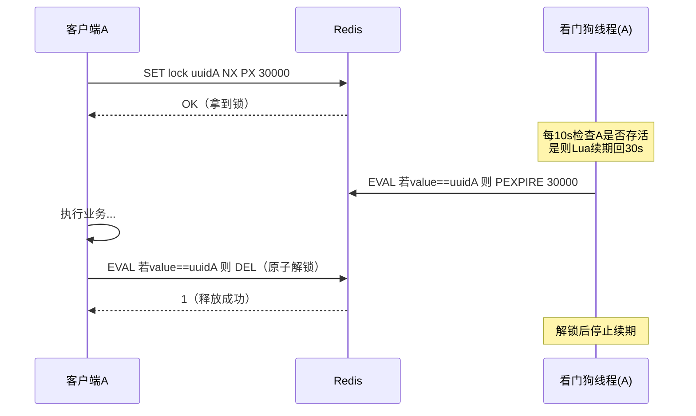

# 13 · 分布式锁（Distributed Lock）

> 用 Redis 的原子写命令在多进程/多机之间实现互斥：`SET key value NX PX ms` 加锁 + Lua 比对唯一标识解锁 + 看门狗续期防提前过期。面试重要度：⭐⭐⭐ 高频重点。

## 📖 核心原理

**要解决什么**：多个进程（多台机器、多个 JVM）竞争同一个共享资源（如扣库存、防重复下单、定时任务只跑一份），单机的 `synchronized`/`ReentrantLock` 只在一个 JVM 内有效，跨进程失效。需要一个所有进程都能访问的**外部仲裁者**，Redis 单线程串行执行命令、天然适合做这个「谁先设成功谁拿锁」的裁判。

**一把正确的 Redis 分布式锁要同时满足三点**：① **互斥**——任意时刻只有一个客户端持有；② **不死锁**——持锁客户端崩溃也能自动释放（靠过期时间兜底）；③ **只能自己解自己的锁**——不能误删别人的锁。下面层层递进，每一层都在补上一个漏洞。

**第一层 · 原子加锁 `SET key value NX PX ms`**：

```
SET lock:order:123 <uuid> NX PX 30000
```

- `NX`（Not eXists）：只有 key 不存在时才 SET 成功，返回 `OK`；已存在返回 `nil`。这保证了**互斥**——只有第一个客户端能设成功。
- `PX 30000`：设置 30s 过期时间（毫秒）。这保证了**不死锁**——持锁进程宕机没来得及解锁，锁也会自动过期释放。

**为什么必须用一条 `SET ... NX PX`，而不是老式的 `SETNX` + `EXPIRE` 两条**：两条命令非原子。若 `SETNX` 成功后、`EXPIRE` 执行前进程崩溃（或客户端与 Redis 网络中断），锁就变成了**永不过期的死锁**，其他人永远拿不到。Redis 2.6.12 起 `SET` 命令支持 `NX`/`EX`/`PX` 参数，把「判断不存在 + 设值 + 设过期」合成一条原子命令，这是现代实现的基石。（早期还有人用 `getset` + 时间戳的 trick 绕过原子性问题，如今已被 `SET NX PX` 淘汰。）

**第二层 · 锁误删问题（value 存唯一标识 + 比对再删）**：如果解锁只是简单 `DEL lock:order:123`，会误删别人的锁。场景：客户端 A 加锁，业务执行超过 30s，锁**自动过期**释放；此时客户端 B 拿到锁；A 业务终于跑完执行 `DEL`，删掉的其实是 **B 的锁**——互斥被打破，B 和后续的 C 可能同时持锁。

解法：加锁时把 value 设为**当前客户端的唯一标识**（UUID、或 `UUID:threadId`），解锁前先 `GET` 比对 value 是不是自己写的，是才 `DEL`。这样 A 醒来发现锁上的 value 已经是 B 的，就不会删。

**第三层 · 比对 + 删除必须用 Lua 保证原子**：上面「先 GET 比对、再 DEL」是**两次独立请求**，中间有窗口。假设 A 执行 `GET` 拿到自己的 value、比对通过，但**就在 DEL 之前锁恰好过期**、B 拿到了锁并写入自己的 value，A 接着执行 `DEL` 仍然删掉了 B 的锁。问题的根源和第一层一样：check-then-act 非原子。解法是把「比对 value + 删除」封装进一条 **Lua 脚本**，Redis 单线程执行脚本期间不会插入其他命令，从而原子。

**第四层 · 锁过期但业务没跑完（看门狗 watchdog 自动续期）**：过期时间是把双刃剑——设长了，持锁进程崩溃后别人要等很久；设短了，业务没执行完锁就过期，互斥被破坏。理想做法是**加锁时不设死板的短超时，而是后台起一个「看门狗」线程周期性给锁续命**：只要持锁进程还活着、业务还在跑，就不断 `PEXPIRE` 把过期时间重置回去；一旦进程崩溃，看门狗线程也没了，锁便按最后一次续期的超时自然过期。Redisson 的看门狗默认锁租期 **30s**、每 **10s**（租期的 1/3）续一次，续期同样用 Lua「先确认是自己的锁再 `PEXPIRE`」保证原子。

**第五层 · 主从/单点丢锁**：见下方原理图与面试要点，这是 Redlock 争议的起点。

## 🔄 原理图 / 流程剖析

**加锁 / 释放全流程**：



**释放锁的 Lua 脚本**（比对 value 再删，原子）：

```lua
-- KEYS[1]=锁的key   ARGV[1]=当前客户端唯一标识(uuid)
if redis.call('GET', KEYS[1]) == ARGV[1] then
    return redis.call('DEL', KEYS[1])
else
    return 0
end
```

调用：`EVAL "<上面脚本>" 1 lock:order:123 <uuidA>`。返回 1 表示删了自己的锁，0 表示锁已不是自己的（已过期被别人拿走），不动手。

**看门狗续期的 Lua 脚本**（确认是自己的锁再重置过期时间）：

```lua
-- KEYS[1]=锁的key  ARGV[1]=租期ms  ARGV[2]=唯一标识
if redis.call('GET', KEYS[1]) == ARGV[2] then
    return redis.call('PEXPIRE', KEYS[1], ARGV[1])
else
    return 0
end
```

**可重入锁的存储结构**（Redisson 用 Hash 而非 String）：field 为 `uuid:threadId`、value 为重入计数，同线程再次加锁计数 +1，解锁 -1，减到 0 才真正 `DEL`：


## 🔑 面试要点

- **加锁一条命令搞定**：`SET key uniqueValue NX PX ms`，`NX` 保证互斥、`PX` 保证不死锁。**绝不能用 `SETNX` + `EXPIRE` 两条**（非原子，中间崩溃会永久死锁）。
- **value 必须是唯一标识**（UUID / `UUID:threadId`），解锁前**比对 value 再删**，防止「锁过期后误删别人的锁」。
- **比对 + 删除、比对 + 续期都要用 Lua**，因为「先判断再操作」是 check-then-act，两条独立命令之间有并发窗口；Lua 在 Redis 单线程里原子执行堵住这个窗口。
- **看门狗解决「业务比锁租期长」**：后台线程周期续期（Redisson 默认租期 30s、每 10s 续），持锁者活着就续、崩溃就停续让锁自然过期。**注意**：只有加锁时**不显式传 leaseTime**（用默认 -1）Redisson 才启用看门狗；一旦你自己指定了过期时间，看门狗不生效，过期就真过期。
- **可重入**：Redisson 用 Hash 存 `线程标识 → 重入次数`，同线程可重复加锁、计数增减，避免自己把自己锁死。
- **主从架构有丢锁风险**：Redis 主从复制是**异步**的，客户端在 master 加锁成功、master 还没把这条写同步给 replica 就宕机，哨兵把 replica 提升为新 master——新 master 上没有这把锁，另一个客户端能再次加锁成功，**两个客户端同时持锁**。
- **Redlock（红锁）** 是 antirez 为解决单点/主从丢锁提出的多节点算法（见高频题），但存在学术争议——**能点出争议是加分点**。

## ❓ 高频面试题

**Q：为什么不能用 `SETNX` 加锁、再用 `EXPIRE` 设过期？解锁为什么必须用 Lua？**
A：两个都是**原子性**问题。`SETNX`+`EXPIRE` 是两条命令，若 `SETNX` 成功后进程崩溃或网络断开、`EXPIRE` 没执行，这把锁就永不过期，变成死锁——所以要用一条 `SET key val NX PX ms` 把加锁和设过期合成原子操作。解锁同理：正确解锁要「先 `GET` 比对 value 是不是自己、是才 `DEL`」，但比对和删除若是两次独立请求，中间锁可能恰好过期并被别人拿走，你的 `DEL` 就删了别人的锁；把「比对 + 删除」写进 Lua 脚本，借 Redis 单线程串行执行保证这段逻辑不被打断，才真正安全。本质上加锁、解锁、续期三处都在防同一个敌人：check-then-act 的并发窗口。

**Q：锁的过期时间设多久合适？业务执行时间不确定怎么办？**
A：设短了业务没跑完锁就过期、互斥被破坏；设长了持锁进程崩溃后别人要苦等。所以不该赌一个固定值，而用**看门狗自动续期**：加锁给一个初始租期（如 30s），后台线程每隔租期的 1/3（约 10s）检查持锁进程是否还活着，活着就用 Lua 把过期时间重置回 30s，业务多久都不会中途失锁；进程一旦崩溃，看门狗线程随之消失，不再续期，锁在最后一次租期到点后自然释放，不会死锁。这正是 Redisson 默认（不传 leaseTime 时）的行为。代价是续期有额外网络开销、且要防看门狗线程本身因 GC/阻塞而漏续。

**Q：Redlock 是什么？Martin Kleppmann 为什么批评它？antirez 怎么回应？**
A：**Redlock** 是 antirez 针对单点/主从丢锁提出的算法：部署 **N 个相互独立的 master**（通常 5 个，无主从关系），客户端**依次**向所有节点用相同 value 加锁，只有在**超过半数（N/2+1）节点加锁成功、且总耗时小于锁租期**时才算获得锁；获得后的有效时间要减去加锁耗时；失败或超时则向所有节点发起解锁。多数派让个别节点宕机不至于丢锁。
**Martin Kleppmann 的批评**分两层：① 对于「效率型」用途（避免重复工作）根本不需要这么重，一把普通锁足矣；② 对于「正确性型」用途，Redlock **依赖危险的时间假设**——算法建立在各节点时钟走速一致、进程无长停顿的前提上，而现实中 **时钟漂移/NTP 跳变** 会让某节点的锁提前过期、**GC 停顿或 IO 阻塞** 会让客户端「以为还持锁」时锁其实早已过期，两个客户端就可能同时进临界区；他主张真正要正确性就得靠带 **fencing token**（单调递增序号，存储层校验、拒绝旧 token 的写）的方案，而 Redlock 不提供 fencing token。
**antirez 的回应**：GC/停顿问题对**任何**基于超时的分布式锁都存在，不是 Redlock 独有；只要在「拿到锁之后、真正操作共享资源之前」再校验一次锁的有效性（或结合 fencing）即可缓解；对时钟他认为只要不发生大的不连续跳变、依赖有界的时钟误差是工程上可接受的假设。
**面试怎么答**：先讲清算法（多数派 + 租期减耗时），再点出「Redlock 试图解决主从异步复制的丢锁，但代价是引入对时间的强假设」，最后说明「要强正确性优先考虑带 fencing token 的方案（或直接上 ZooKeeper/etcd 这类基于共识的锁）；Redis 锁更适合效率型场景」——能把争议双方观点摆出来，就是资深水准。

**Q：Redis 主从 + 哨兵下，分布式锁会不会失效？**
A：会。Redis 主从复制**默认异步**：客户端在 master 上 `SET NX` 成功即返回，但这条写可能还没同步到 replica。若此刻 master 宕机、哨兵将一个尚未收到该锁的 replica 选为新 master，那把锁在新 master 上就「凭空消失」了，另一个客户端能重新加锁成功，导致**两个客户端同时持锁**、互斥被破坏。这正是 Redlock 想解决的问题（用多个独立 master 取代单主从）。工程上若不上 Redlock，可用 `WAIT numreplicas timeout` 命令要求写同步到指定数量副本再返回以降低概率，但 `WAIT` 也不能提供强一致保证（超时仍返回、且新主可能仍缺数据）；要强一致就该用 ZooKeeper/etcd。

## ⚠️ 易错点 / 加分项

- **误区：解锁直接 `DEL`**。必须「比对唯一 value 再删」，否则在锁过期后会误删他人的锁。加锁的 value 一定要全局唯一（UUID + 线程号），不能用固定值。
- **踩坑：Redisson 传了 leaseTime 还指望看门狗续期**。只有**不显式指定过期时间**（`lock()` 无参 / leaseTime = -1）才启用看门狗；一旦传了 `lock(10, TimeUnit.SECONDS)`，到点就真过期，不再自动续。
- **踩坑：看门狗线程被 STW GC 或长阻塞拖住漏续期**，锁提前过期而业务方毫不知情——这正是 Kleppmann 批评的 GC 停顿场景。要求强正确性时，应在写共享资源处叠加 **fencing token** 校验或改用共识型锁。
- **加分点：锁粒度**。锁 key 要尽量细（如 `lock:order:{orderId}` 而非全局 `lock:order`），减少无谓竞争、提升并发。
- **加分点：加锁要设获取超时 + 可中断**，避免拿不到锁的线程无限阻塞（Redisson `tryLock(waitTime, leaseTime, unit)`）；对公平性有要求可用 Redisson **公平锁**（内部维护一个等待队列 + 超时清理，按请求顺序发锁），代价是吞吐低于非公平锁。
- **加分点：选型结论**。效率型（防重复执行、幂等兜底）用 Redis 锁足够；强正确性（金融扣款不容许双写）优先 ZooKeeper/etcd 这类基于共识、天然带序号/临时节点的方案，或在 Redis 锁上叠 fencing token。
- **业务侧用法**（Redisson `RLock` 注入、`@Transactional` 与锁的先后顺序、连接池配置）见 [`../../java-learning`](../../java-learning)，此处不展开。
- **面试怎么答**：`SET NX PX` 原子加锁 → value 唯一标识防误删 → 比对+删除用 Lua 堵原子窗口 → 看门狗续期解决业务超时 → 主从异步复制的丢锁风险 → Redlock 及其时钟/GC 争议，层层递进补漏洞，就是资深答法。
