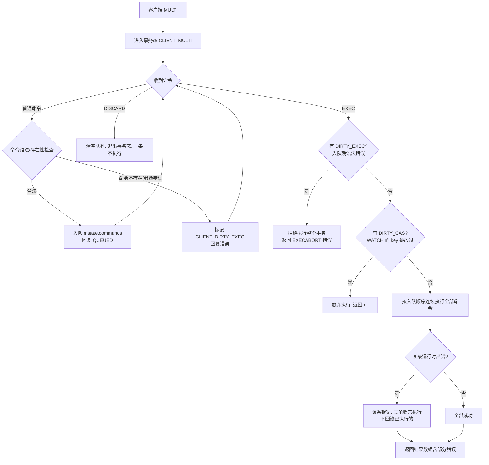

# 14 · 事务（Transaction）

> Redis 用 `MULTI`/`EXEC` 把一组命令打包，一次性顺序、不被打断地执行；配合 `WATCH` 做乐观锁 CAS。但它**没有回滚、没有隔离级别**，和关系型数据库的事务完全不是一个概念。面试重要度：⭐⭐ 常考。

## 📖 核心原理

**四个核心命令**：`MULTI`（开启事务）、`EXEC`（执行）、`DISCARD`（放弃）、`WATCH`/`UNWATCH`（乐观锁监视）。

**入队而非立即执行**：客户端发送 `MULTI` 后，服务端把该客户端标记为「事务态」（在 `client->flags` 打上 `CLIENT_MULTI`）。此后该客户端发来的普通命令**不会立刻执行**，而是被逐条放进一个命令队列 `client->mstate.commands`，服务端每条只回复一个 `QUEUED`。直到收到 `EXEC`，服务端才把队列里的命令**按入队顺序一次性、连续地**跑完，中间不会插入其它客户端的命令（Redis 单线程串行执行，`EXEC` 期间不会让出），最后把每条命令的结果以数组形式一起返回。`DISCARD` 则清空队列、退出事务态，一条都不执行。

```
MULTI            → +OK          （进入事务态，开始入队）
SET k1 v1        → +QUEUED      （不执行，只入队）
INCR counter     → +QUEUED
EXEC             → 1) +OK       （此刻才顺序执行整个队列，一次性返回数组）
                   2) (integer) 1
```

**为什么说「不被打断」而不是「原子」**：Redis 单线程，`EXEC` 一旦开始就把队列跑完才处理下一个客户端请求，所以事务内的命令**中间绝不会穿插别人的命令**——这是它唯一硬保证的语义。但「连续执行」≠「关系型的原子性」：中途某条命令运行失败，**已经执行的不会回滚**（见下文重点）。

**WATCH 乐观锁（CAS）**：`EXEC` 本身不检查数据是否被改过；要做「读—改—写」的并发安全，需在 `MULTI` **之前**用 `WATCH key...` 监视若干 key。服务端为每个被 watch 的 key 记录监视者；一旦**任何一个被监视的 key 在 `EXEC` 之前被其它客户端修改**（哪怕改成相同的值），该客户端会被标记 `CLIENT_DIRTY_CAS`。此时 `EXEC` **不执行任何命令，直接返回 `nil`**，告诉调用方「数据变了，重试」。这就是典型的**乐观锁 / Compare-And-Set**：不加锁，先干活，提交时检测冲突，冲突则整批放弃。`EXEC`（无论成功失败）或 `DISCARD` 都会自动 `UNWATCH` 所有 key。

**WATCH + MULTI + EXEC 实战（余额扣减 100，库存/余额充足才扣）**：

```
WATCH balance                    # 监视余额
val = GET balance                # 客户端读到 balance = 500（读操作在事务外，正常返回）
                                 # 应用层判断：500 >= 100，可扣
MULTI
DECRBY balance 100               # +QUEUED，入队不执行
EXEC
# 情形A：EXEC 期间 balance 未被别人改 → 返回 1) (integer) 400，扣款成功
# 情形B：其它客户端在 WATCH 后、EXEC 前改了 balance → EXEC 返回 (nil)
#        应用层检测到 nil，回到 WATCH 那步整体重试（自旋 CAS）
```

> 关键点：判断逻辑（`500 >= 100`）在**客户端**做，Redis 事务本身不支持「条件执行」；WATCH 只负责保证「我读到的值到提交时没变」。要把条件判断也放进服务端原子执行，用 Lua 脚本更合适（见下文对比）。

## 🔄 原理图 / 流程剖析



**两类错误的处理天差地别**（面试核心）：

| 错误类型 | 何时发现 | 触发标志 | 结果 |
|---|---|---|---|
| **入队时错误**（命令名拼错、参数个数不对等语法/编译期错误） | `MULTI`…入队阶段 | `CLIENT_DIRTY_EXEC` | `EXEC` 直接返回 `EXECABORT`，**整个事务一条都不执行** |
| **运行时错误**（命令合法但语义错，如对 `String` 执行 `INCR`、对 key 用错类型的命令） | 只有真正执行时才暴露 | 无 | 只有**出错那一条失败**，队列中**其余命令照常执行、已执行的不回滚** |

## 🔑 面试要点

- **MULTI 只入队不执行**，每条回 `QUEUED`；`EXEC` 才顺序一次性执行并返回结果数组；`DISCARD` 放弃整个队列。
- **单线程保证「命令连续不被打断」**：`EXEC` 期间不会穿插其它客户端的命令——这是 Redis 事务唯一的强语义。
- **WATCH = 乐观锁 CAS**：`WATCH` 的 key 在 `EXEC` 前被任何客户端改动，`EXEC` 就返回 `nil` 放弃执行，应用层据此重试。读和条件判断在事务外/客户端做。
- **★ 不支持回滚**：入队期语法错误 → 整批不执行（`EXECABORT`）；运行时错误 → 只错那条，**其余照常、不回滚**。这是和关系型事务最大的区别。
- **antirez 的设计哲学**：运行时错误几乎都是「命令用错类型」这类**编程 bug，应在开发测试期就暴露**；生产上极少发生，为此引入回滚会让实现复杂、拖慢性能，得不偿失——所以刻意不做回滚，保持**简单高效**。
- **无隔离级别概念**：单线程串行执行天然「串行化」，不存在脏读/不可重复读/幻读那套问题，也就没有隔离级别可调。
- **和 Lua 脚本 [21-lua-scripting](21-lua-scripting.md) 的关系**：需要「服务端条件判断 + 原子执行」时 Lua 更强、更常用；MULTI/EXEC 现在多用于「WATCH 乐观锁」这类特定场景。
- **和 Pipeline [15-pipeline](15-pipeline.md) 的区别**：Pipeline 只是把多条命令**一次网络往返批量发送**以省 RTT，**没有任何原子性**，命令间可被其它客户端穿插；事务才保证连续不被打断。

## ❓ 高频面试题

**Q：Redis 事务支持回滚吗？为什么？**
A：**不支持回滚**（原子性回滚）。要分两种错误说：① **入队时**就能发现的错误（命令名不存在、参数个数不对等语法错误），Redis 会给整个事务打上 `DIRTY_EXEC` 标记，`EXEC` 时直接返回 `EXECABORT`，**整批不执行**——这算是一种「提交前的整体拒绝」，但不是回滚；② **运行时错误**（命令语法没问题、只是执行时才失败，比如对一个 `String` 类型的 key 执行 `INCR`），Redis **只让出错的那一条失败，队列里其余命令继续执行、已执行的不撤销**。antirez 的理由：运行时错误基本都是「用错命令/类型」的编程 bug，应该在开发阶段就被测出来，线上几乎不会发生；为这种小概率场景加回滚机制会让 Redis 变复杂、变慢，违背它「简单快」的设计原则。所以它选择不回滚。

**Q：WATCH 是怎么实现乐观锁的？和分布式锁有什么不同？**
A：`WATCH key` 让服务端记录「谁在监视这个 key」。在 `WATCH` 之后、`EXEC` 之前，只要这个 key 被**任何客户端**（包括修改、删除、过期）改动，监视它的客户端就会被打上 `CLIENT_DIRTY_CAS` 标记，导致其 `EXEC` **不执行任何命令、直接返回 `nil`**，应用层据此重试。这是**乐观锁**：不提前加锁，先读先改，提交时检测「我读的数据有没有被改过」，改过就放弃重来（CAS，Compare-And-Set）。它和 `SETNX`/Redlock 那种**悲观分布式锁**不同——悲观锁是「先抢到锁才能操作」，乐观锁是「大家都能操作，冲突了才有人失败重试」。高并发写同一 key 时乐观锁会频繁重试，此时悲观锁或 Lua 反而更合适。

**Q：既然有事务，为什么实战中更常用 Lua 脚本？**
A：MULTI/EXEC 有两个短板：① **不能在服务端做条件判断**——你没法在事务里写「如果 balance≥100 才扣款」，判断只能在客户端做，于是要靠 `WATCH` 补偿并发问题，遇冲突还得自旋重试，逻辑绕；② **中途拿不到前一条命令的结果再决定下一步**（命令都是先入队后统一执行）。Lua 脚本则是**把整段逻辑发到服务端原子执行**（`EVAL`），脚本内可以自由读值、`if` 判断、循环，整个脚本执行期间同样不被打断，等价于「带逻辑的原子事务」，还省去 WATCH 重试。所以「读—判断—写」的原子操作（限流、扣库存、分布式锁的原子释放）几乎都用 Lua。详见 [21-lua-scripting](21-lua-scripting.md)。

## ⚠️ 易错点 / 加分项

- **误区**：以为 Redis 事务像 MySQL 一样「要么全成功要么全回滚」。实际上**运行时错误只影响那一条，其余照常执行且不回滚**——面试答错这点直接暴露没深入。
- **误区**：把 `EXEC` 返回 `nil` 当成「报错」。它是 **WATCH 检测到 key 被改、乐观锁提交失败**的正常信号，应用层要写重试循环，不是异常。
- **踩坑**：`WATCH` 必须在 `MULTI` **之前**执行；在 `MULTI` 之后（事务态里）发 `WATCH` 会直接报错。且读要监视的值、做判断都要在事务外完成，事务内只放最终的写。
- **加分点**：`DISCARD` 和事务内出现 `DIRTY_EXEC` 后的行为不同——`DISCARD` 是主动放弃并 `UNWATCH`；`DIRTY_EXEC` 是被动导致 `EXEC` 报 `EXECABORT`。两者都不执行队列，但触发方不同。
- **加分点**：连接一旦断开，未 `EXEC` 的事务队列和 `WATCH` 全部丢弃；`EXEC`/`DISCARD` 也会自动 `UNWATCH`，所以别指望跨连接复用监视状态。
- **加分点**：Redis Cluster 下事务里的所有 key **必须在同一个 slot**（可用 hash tag `{...}` 强制同槽），否则 `EXEC` 报 `CROSSSLOT` 错误——因为事务不能跨节点原子执行。
- **面试怎么答**：先讲 MULTI 入队 / EXEC 顺序执行 / DISCARD 放弃 → 讲单线程带来的「连续不被打断」这唯一强语义 → 重点讲「不支持回滚」及入队错误 vs 运行时错误的区别与 antirez 哲学 → 点明「无隔离级别（单线程天然串行）」→ 对比 WATCH 乐观锁、Lua、Pipeline 的适用边界，层层递进即资深水准。
