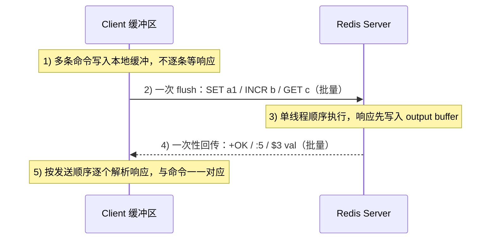

# 15 · Pipeline 与批量（Pipelining）

> 客户端把多条命令一次性发出、一次性收回全部响应，把 N 个网络往返（RTT）压成 1 个，用于批量场景大幅提吞吐。面试重要度：⭐⭐ 常考。

## 📖 核心原理

**要解决的问题是网络往返（RTT）**：普通请求是「一命令一次 RTT」的**请求-应答（Request/Response）**模型——客户端发一条命令、阻塞等待服务端响应回来，才发下一条。执行 N 条命令就要 N 个 RTT。而 Redis 本身单条命令执行是微秒级的，**真正的耗时往往是网络往返**：同机房 RTT 约 0.1~0.5ms、跨机房可达几十 ms。所以「循环里 `SET` 一万次」慢，不是慢在 Redis，而是慢在一万个 RTT 累加。

**Pipeline 的做法是「攒起来一起发」**：客户端把多条命令按 RESP 协议**先写进本地缓冲区**，攒够一批后**一次性 flush 到 socket**；服务端从内核 TCP 缓冲区把这批命令**依次读出、依次执行**，把每条命令的响应**也依次写回**缓冲区，最后一起发回客户端；客户端**按发送顺序**逐个读取响应。整个过程**只有 1 个 RTT**（严格说是命令批和响应批各走一趟网络）。

**关键认知：Pipeline 省的是「网络往返时间」，不是「命令执行时间」**。服务端该执行的命令一条都不少、还是单线程顺序跑；节省的纯粹是「发一条等一条」的 N-1 次空等。所以 Pipeline 对**命令多、每条又轻**的批量场景收益最大；对单条重命令（如大 `KEYS`、大 `SORT`）没意义。

**服务端要为 Pipeline 缓冲响应**：因为客户端不读、连着发，服务端所有响应先堆在**输出缓冲区（output buffer）** 里等着一起发。这引出 Pipeline 的核心代价——**批次过大时服务端内存和延迟都会被顶起来**（见「注意事项」）。这也是为什么 Pipeline 不需要 Redis 任何特殊支持：它纯粹是**客户端行为 + TCP 全双工**的结果，服务端只是照常读命令、回响应。

## 🔄 原理图 / 流程剖析

**普通模式 N 次 RTT vs Pipeline 1 次 RTT**：

```
【普通请求-应答】3 条命令 = 3 个 RTT          【Pipeline】3 条命令 = 1 个 RTT
Client          Server                        Client              Server
  │  SET a 1  ──────▶│                          │ SET a 1          │
  │◀────── OK        │  ① RTT                    │ SET b 2  ┐一次性  │
  │  SET b 2  ──────▶│                          │ SET c 3  ┘全发出─▶│  读3条
  │◀────── OK        │  ② RTT                    │                  │  依次执行
  │  SET c 3  ──────▶│                          │                  │  攒3个响应
  │◀────── OK        │  ③ RTT                    │◀── OK OK OK ─────│  一次性回
  ▼                  ▼                          ▼                  ▼
 总耗时 ≈ 3 × RTT + 3 × 执行            总耗时 ≈ 1 × RTT + 3 × 执行
        └── RTT 随命令数线性增长 ──┘            └── RTT 与命令数无关（常数）──┘
```

**Pipeline 全双工时序（客户端不等即发，服务端读到即处理）**：



## 🔑 面试要点

- **Pipeline 解决的是 RTT，不是执行速度**：把 N 个「发一条等一条」的往返压成 1 个往返，服务端执行的命令数不变。收益 ≈ 省掉 (N-1) 次 RTT。
- **纯客户端技术，Redis 无需特殊支持**：靠客户端缓冲批量发 + TCP 全双工实现；服务端只是照常顺序读命令、把响应堆进 output buffer 一起回。
- **Pipeline ≠ 事务**：Pipeline **不保证原子性、不保证隔离**，批次中间可能穿插其它客户端的命令；`MULTI/EXEC` 才保证这批命令「连续执行不被打断」。二者可叠加。
- **Pipeline ≠ mget/mset 等原生批量命令**：`MGET/MSET/HMSET` 是**单条命令带多参数**（原子、一个命令）；Pipeline 是把**多条不同命令**打包（非原子、N 个命令）。
- **批次要分批（chunk）**：一次别塞太多命令，否则占服务端 output buffer 内存、阻塞后续客户端、响应堆积；常见每批 100~1000 条，几万条要拆开发。
- **Cluster 模式要按 slot / 节点分组**：一次 Pipeline 面向一个连接（一个节点），跨 slot 的 key 不能混在同一批发给同一节点，需先按 key 所属节点分桶再各自 Pipeline。
- **顺序对应**：响应严格按命令发送顺序返回，客户端靠「顺序」把响应和命令配对，不是靠 ID。

## ❓ 高频面试题

**Q：Pipeline 和事务 MULTI/EXEC 到底有什么区别？能一起用吗？**
A：本质不同。**Pipeline 是「网络优化」**——只把多条命令攒起来一次发、一次收，目的是省 RTT；它**不保证原子性、不保证隔离**：这批命令在服务端会按序执行，但**中间完全可能被其它客户端的命令穿插**，其中一条失败也不影响其它条。**MULTI/EXEC 是「执行语义」**——`EXEC` 时把入队的命令**连续、不被打断**地一次性执行（单线程期间不穿插别人的命令），提供的是「一批命令的隔离/打包执行」，但注意它也不是回滚型事务（命令语法错才整批不执行，运行时错误如对 String 做 `LPUSH` 会照常执行其它条、不回滚）。二者**正交、可叠加**：实践中常把 `MULTI ... 命令 ... EXEC` 整体放进一个 Pipeline 发出——既省 RTT（1 个 RTT 发完整个事务），又拿到 EXEC 的连续执行语义。一句话：**Pipeline 管「怎么发」，事务管「怎么执行」。**

**Q：有了 MGET/MSET 这种批量命令，为什么还要 Pipeline？**
A：适用面不同。`MGET/MSET/HMSET` 是**同一种操作的批量**——它是**一条命令带多个参数**，天然原子（一个命令在单线程里一次执行完）。但它**只能干一件事**：`MGET` 只能批量读 String，没法在一次调用里混合 `SET`+`INCR`+`EXPIRE`+`LPUSH`。Pipeline 则是**把多条不同命令打包**，能把任意异构命令攒一批发出，代价是**非原子**（N 个独立命令，中间可被穿插、部分失败不影响其它）。所以：批量读写同类简单 KV 优先用原生批量命令（原子且更省协议开销）；需要一次发一堆**不同**命令时用 Pipeline。两者也能组合：Pipeline 里塞多个 `MGET`。

**Q：Pipeline 一次发几万条命令会有什么问题？怎么解决？**
A：会出问题。① **服务端 output buffer 内存暴涨**——客户端不读、连着发，所有响应先堆在服务端输出缓冲区等一起发，几万条大响应可能把内存顶上去甚至触发 `client-output-buffer-limit` 断连；② **阻塞其它客户端**——Redis 单线程顺序处理，这一大批命令会占住处理循环，拖慢同期其它客户端的延迟（长尾）；③ **客户端也要缓冲全部响应**，内存同样承压。解决办法是**分批（chunking）**：把几万条拆成每批 100~1000 条，发一批收一批再发下一批，用「多个中等 RTT」换「内存平稳 + 不长时间独占服务端」。这是吞吐与内存/延迟的权衡。

## ⚠️ 易错点 / 加分项

- **误区**：以为 Pipeline 保证原子性或事务性。它只是「批量发送」，**中间可被其它客户端命令穿插、单条失败不回滚**；要原子/连续执行请配合 `MULTI/EXEC`（可包在 Pipeline 里一起发）。
- **误区**：把 Pipeline 当成能加速单条重命令。它只压缩 RTT，对「命令少但每条重」（大 `SORT`、大 range）毫无帮助，甚至因缓冲响应更占内存。
- **踩坑**：Cluster 下把跨 slot 的 key 塞进同一批发给同一节点会报 `CROSSSLOT` 或落错节点。正确做法是**先按 key 所属节点分桶**，每个节点各自开一个 Pipeline；用 hash tag `{...}` 可强制相关 key 同 slot。
- **踩坑**：一批塞太多导致服务端 output buffer 撑爆、连接被 `client-output-buffer-limit` 关掉，或引起明显延迟长尾。生产务必**分批 + 控制单批大小**。
- **加分点**：Pipeline 收益还受 **Nagle 算法 / `TCP_NODELAY`** 影响——客户端库通常关掉 Nagle 避免小包被延迟合并；批量 flush 本身也天然减少了小包。
- **加分点**：与 Redis 6 的**多线程 I/O**（见 `01-overview.md`）区分——多线程 I/O 优化的是服务端**读写 socket、解析协议**的并行，命令执行仍单线程；Pipeline 优化的是**客户端到服务端的往返次数**，两者是不同层面的加速，不冲突。
- **面试怎么答**：先点出瓶颈是 RTT 不是执行 → Pipeline 攒批一次发一次收把 N 个 RTT 压成 1 个 → 强调纯客户端技术、不保证原子性 → 对比事务（执行语义）和原生批量命令（单命令原子） → 补一句分批与 Cluster 分组的工程注意点，层次就出来了。
