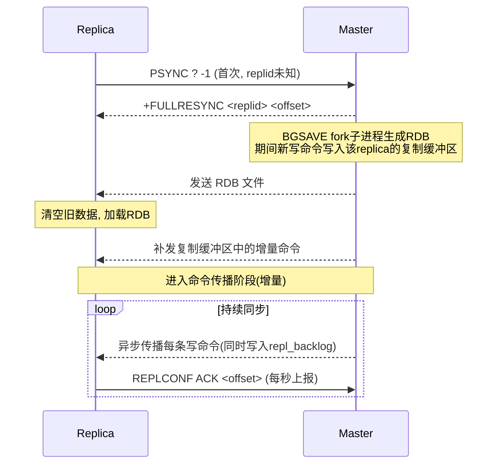
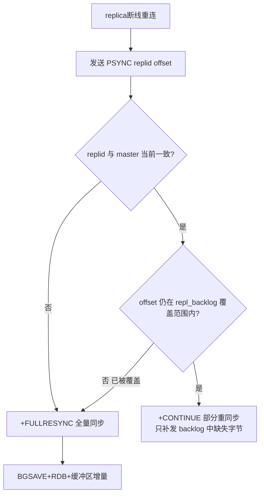

# 16 · 主从复制（Master-Slave Replication）

> 一主多从异步复制：主写从读、故障后可切换；全量同步（RDB 快照 + 复制缓冲区）打底，增量同步（部分重同步 + 复制积压缓冲区）扛断线重连。面试重要度 ⭐⭐⭐ 高频。

## 📖 核心原理

主从复制是 Redis 高可用与读扩展的基石：一个 master 可以挂多个 replica，master 负责写，数据变更实时同步给 replica，replica 一般只读。它是**异步复制**——master 处理完写命令、发给客户端 OK 之后，才把命令传播给 replica，所以主从之间存在**复制延迟**，master 宕机时未同步的写会丢。这是 Redis 为了高性能做的取舍，理解这一点是回答"数据一致性"类问题的关键。

复制分两个阶段。**全量同步（full resync）**：replica 首次连上 master、或断线太久无法增量时触发。master 执行 `BGSAVE` fork 子进程生成 RDB 快照，同时把这期间的新写命令缓存到该 replica 专属的**复制缓冲区（replication buffer / client output buffer）**；RDB 传给 replica 落盘并加载，再把缓冲的增量命令补发过去，追平数据。**增量/命令传播（command propagation）**：全量之后 master 每执行一条写命令就异步传播给所有 replica，保持持续同步。

**部分重同步（partial resync，psync）** 是 2.8+ 的关键优化，解决"网络抖动一下就要全量"的问题。三个核心状态量：
- **replication ID（replid）**：master 的一次数据集"世代"标识，40 位十六进制。replica 记住自己复制的是哪个 replid。
- **offset（复制偏移量）**：master 和 replica 各自维护一个字节偏移，master 每传播 N 字节命令流 offset 就 +N。两者 offset 之差就是复制延迟量。
- **repl_backlog（复制积压缓冲区）**：master 端一个固定大小的**环形缓冲区**（默认 1MB，`repl-backlog-size`），命令流在传播给 replica 的同时也写一份进 backlog。

replica 断线重连时发 `PSYNC <replid> <offset>`。master 判断：replid 匹配 **且** 请求的 offset 还在 backlog 覆盖范围内 → 回 `+CONTINUE`，只补发 backlog 里缺的那段字节（部分重同步）；否则回 `+FULLRESYNC`，走全量。所以 backlog 越大、断线容忍时间越长。

Redis 4.0 还引入 **PSYNC2**：解决主从切换后新 master 换了 replid 导致全体 replica 被迫全量的问题——通过 `replid2`（继承自旧 master 的 replid）让切换后仍能部分重同步。

## 🔄 原理图 / 流程剖析

全量 + 增量同步整体流程：

断线重连时的部分 vs 全量判定：

| 概念 | 作用 | 关键参数/默认 |
|---|---|---|
| 复制缓冲区 (replication buffer) | 全量期间/传播时暂存要发给**某个** replica 的命令，per-replica | `client-output-buffer-limit replica` |
| repl_backlog（复制积压缓冲区） | master 全局**一个**环形缓冲，支撑部分重同步 | `repl-backlog-size` 默认 1MB |
| replid / offset | 数据世代标识 + 字节偏移，判定能否部分重同步 | `INFO replication` 可看 |

## 🔑 面试要点

- **全量同步三要素**：fork 子进程 `BGSAVE` 生成 RDB → 传输并加载 RDB → 补发复制缓冲区里的增量命令。触发时机：首次连接、或 offset 已被 backlog 覆盖无法增量。
- **增量同步（命令传播）**：全量后 master 把每条写命令异步转发给所有 replica；同一份命令流也写进 repl_backlog。
- **部分重同步靠三个量**：`replid`（世代）+ `offset`（偏移）+ `repl_backlog`（环形缓冲）。`PSYNC replid offset`，命中就 `+CONTINUE` 补发字节段，否则 `+FULLRESYNC`。
- **为什么读写分离**：读多写少场景下，多 replica 分摊读流量、水平扩展读能力；但受复制延迟限制，强一致读要读 master。
- **一致性是最终一致，非强一致**：异步复制，master 宕机会丢已 ACK 给客户端但未传播到 replica 的写。可用 `WAIT numreplicas timeout` 做半同步式增强，但仍非强一致。
- **无盘复制**：`repl-diskless-sync yes` 让 master 直接把 RDB 通过 socket 发给 replica，跳过磁盘落盘，适合磁盘慢网络快的场景。
- **主从拓扑**：可级联（replica 再挂 sub-replica，`replica-read-only`），分摊 master 的复制压力。

## ❓ 高频面试题

**Q：为什么断线重连有时全量、有时增量？backlog 满了会怎样？**
A：重连时 replica 发 `PSYNC <replid> <offset>`。若 replid 与 master 当前不一致（如发生过主从切换且未走 PSYNC2），或请求的 offset 已经被环形 backlog 覆盖（断线太久、写入量超过 backlog 容量），就只能全量。backlog 是固定大小环形缓冲，被新数据覆盖后旧偏移就取不到了。生产上要根据"最大可能断线时长 × 写入速率"调大 `repl-backlog-size`，否则频繁全量会拖垮 master（反复 fork + 传大 RDB）。

**Q：主从复制会丢数据吗？如何缓解？**
A：会。异步复制下 master 回复客户端后才传播，宕机时这批未传播的写就丢了；哨兵故障转移选了落后的 replica 当新主也会丢。缓解手段：① `min-replicas-to-write`/`min-replicas-max-lag` 让 master 在健康 replica 不足时拒绝写，牺牲可用性换一致性；② `WAIT N timeout` 阻塞到 N 个 replica 确认；③ 关键数据配合 AOF `appendfsync everysec`。但本质上 Redis 不提供强一致，要强一致得上 Raft 类系统。

**Q：全量同步期间 master 新来的写会丢吗？**
A：不会。master fork 出子进程做 RDB 的同时，会把这段时间的新写命令持续写入该 replica 的**复制缓冲区**；RDB 发完加载完，再把缓冲区里积压的命令补发给 replica，从而无缝衔接到命令传播阶段。但若这期间写入量暴涨、缓冲区超过 `client-output-buffer-limit`，master 会断开该 replica 连接，导致本次全量失败并重来——这是大 key 或写洪峰下全量"死循环"的常见诱因。

## ⚠️ 易错点 / 加分项

- **误区："主从同步是同步复制"**。默认是异步，`REPLCONF ACK` 只是 replica 定期上报进度，不阻塞 master 写路径。
- **replication buffer 与 repl_backlog 不是一回事**：前者 per-replica、服务全量期间/输出；后者是 master 全局唯一的环形缓冲、服务部分重同步。混为一谈是常见失分点。
- **replica 只读但仍会过期**：4.0+ replica 不主动删过期 key，等 master 传 `DEL`/`UNLINK` 过来，读到逻辑过期的 key 返回 nil（避免主从不一致）。
- **PSYNC2（4.0）加分**：主从切换后新 master 用 `replid2` 记住旧世代，让 replica 免于全量；能讲出这个说明读过 changelog。
- **大 RDB + 无盘 = 慎重**：无盘复制下若多个 replica 同时全量，master 的 socket 发送压力大；`repl-diskless-sync-delay` 用来攒一批 replica 一起发。
- **级联复制的延迟叠加**：sub-replica 的数据延迟 = master→replica 延迟 + replica→sub-replica 延迟，读写分离读到 sub-replica 时脏读窗口更大。
