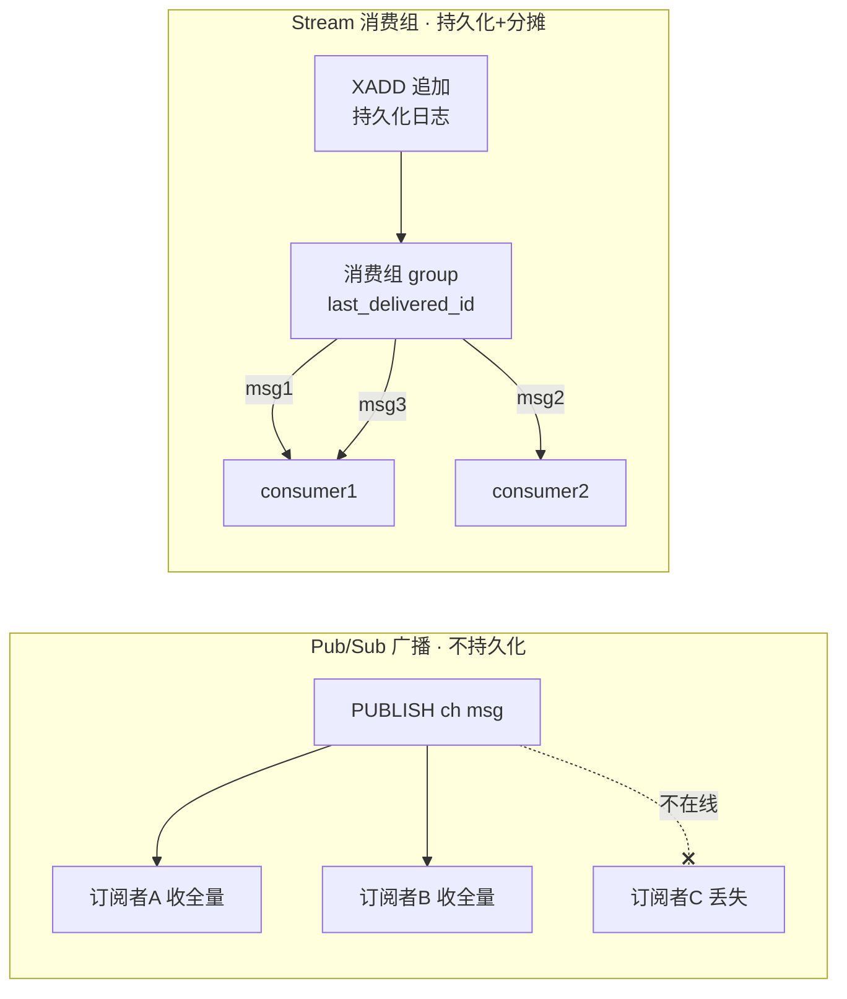
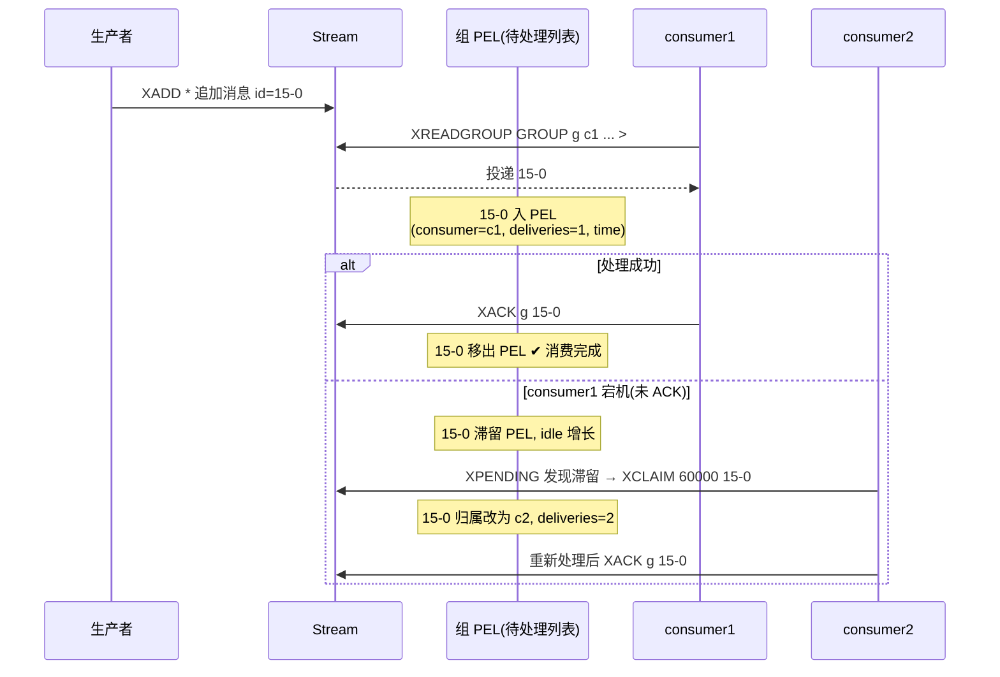

# 16 · 发布订阅与 Stream（Pub/Sub & Stream）

> Pub/Sub 是「即发即弃、订阅者不在线就丢」的实时广播；Stream（5.0+）是 Redis 原生的**持久化消息队列**，带唯一 ID、消费组、ACK 与待处理列表。面试重要度：⭐⭐ 常考。

## 📖 核心原理

**Pub/Sub 发布订阅**：一种**解耦的广播模型**。发布者 `PUBLISH channel message` 把消息发到某个**频道（channel）**，所有 `SUBSCRIBE channel` 订阅了该频道的客户端**同时**收到一份拷贝（多播/fan-out）。`PSUBSCRIBE news.*` 支持**模式订阅**（glob 风格通配 `*`、`?`、`[...]`），一个模式能匹配多个频道。其本质是维护两张字典：`pubsub_channels`（频道 → 订阅它的客户端链表）与 `pubsub_patterns`（模式 → 客户端链表）；`PUBLISH` 时遍历这两张表，把消息直接写进每个匹配客户端的输出缓冲区。

Pub/Sub 的关键特征——也是它的**软肋**：**消息完全不持久化**。Redis 收到 `PUBLISH` 后，只往「**此刻在线**」的订阅者推送，推完就丢，服务端不留任何副本。因此：**订阅者不在线（没连上/断线/晚订阅）就永久丢失这条消息**；**没有 ACK 确认**机制，发出去就不管了；**没有消费组**概念，N 个订阅者各收到全量消息（是广播不是分摊）；也**无法回溯**历史消息。此外订阅者消费慢时消息堆在其**客户端输出缓冲区**，超过 `client-output-buffer-limit pubsub`（默认 `32mb 8mb 60`）会被 Redis 强制断开。所以 Pub/Sub 只适合**实时通知类**、允许丢失的场景（在线状态推送、配置变更广播、简单聊天室），不能当可靠 MQ 用。

> 补充：Redis 7.0 新增 **Sharded Pub/Sub**（`SSUBSCRIBE`/`SPUBLISH`），让 Cluster 下消息只在 key 所属分片内传播，避免消息在集群所有节点间广播的放大问题。Keyspace Notification（键空间通知）也是基于 Pub/Sub 实现的，同样不可靠。

**★ Stream（5.0+，重点）**：Redis 5.0 引入的**原生消息队列数据结构**，专门补齐 Pub/Sub 与 List 做队列的短板。核心特性：

- **消息持久化**：Stream 是一个**只追加（append-only）**的日志结构，消息进入后常驻内存并随 RDB/AOF 落盘（见 [07-persistence-aof.md]），不会因订阅者不在线而丢失，可反复读、可回溯。
- **每条消息有全局唯一 ID**：默认 ID 形如 `1699999999999-0`，即 `毫秒时间戳-同毫秒内序号`，**单调递增**且天然有序，可用于精确定位、分页、去重。`XADD key * ...` 中的 `*` 让 Redis 自动生成 ID。
- **底层结构 Rax + listpack**：Stream 用**基数树（Rax，radix tree）**以消息 ID 为键做索引，每个 Rax 叶子节点挂一个 **listpack**，批量存放该区间的多条消息条目（field-value 对）。这样既能按 ID 二分定位（`XRANGE` 高效范围读），又能用 listpack 紧凑存储省内存。
- **支持多播 + 消费组两种消费模型**：既能像 Pub/Sub 一样多个消费者各读全量（`XREAD`），又能像 Kafka 一样用消费组把消息**分摊**给组内成员。

**Stream 基本命令**：`XADD stream * field value ...` 追加一条消息（返回其 ID）；`XLEN` 看长度；`XRANGE stream - +` 按 ID 区间正序读（`-`/`+` 为最小/最大 ID），`XREVRANGE` 逆序；`XREAD COUNT 10 BLOCK 5000 STREAMS stream $` **阻塞式**读取，`$` 表示「只读此刻之后新到的消息」，`BLOCK 0` 永久阻塞——这就是最简单的「实时消费」。`XDEL` 删指定 ID，`XTRIM`/`MAXLEN` 裁剪长度。

**消费组 Consumer Group（XGROUP/XREADGROUP）**：Stream 的精华。`XGROUP CREATE stream groupname $` 创建一个消费组，`$` 表示从「当前最新」开始消费（`0` 表示从头）。组内可有多个**消费者（consumer）**，用 `XREADGROUP GROUP g c1 COUNT 10 STREAMS stream >` 读取，`>` 是特殊 ID，含义「给我组内**从未投递过**的新消息」。核心语义：**同一条消息在一个组内只会被投递给一个消费者**（组间相互独立、各自拿全量）——多个消费者由此**分摊/负载均衡**处理同一条流，实现横向扩展消费能力。每个组维护一个 `last_delivered_id`（本组投递到哪了），保证不重复投递。

**ACK 确认（XACK）+ 待处理列表 PEL（Pending Entries List）**：这是 Stream 「不丢消息」的关键。消息通过 `XREADGROUP` 投递给某消费者后，**并非立刻完成**，而是被放入该组的 **PEL（Pending Entries List，待处理列表）**——记录「已投递、但尚未确认」的消息 ID、投递给了哪个消费者、投递时间、投递次数。消费者处理成功后必须显式 `XACK stream group id` 确认，该消息才从 PEL 移除，视为真正消费完成。若消费者在 ACK 之前**宕机**，消息仍留在 PEL 里不会丢；用 `XPENDING stream group` 可查看积压的待处理消息，再用 `XCLAIM stream group newconsumer 60000 id`（或 5.0.0+ 的 `XAUTOCLAIM`）把「空闲超过 60s 的消息」**转移（claim）**给另一个健康的消费者重新处理，实现**故障转移**。这套 `投递→PEL→XACK→XCLAIM` 机制提供了**至少一次（at-least-once）**投递语义（消费者需自己保证幂等，因为 XCLAIM 重投可能导致重复）。

**MAXLEN 裁剪**：Stream 只追加、会无限增长吃内存，必须裁剪。`XADD stream MAXLEN 10000 * ...` 在追加时限制长度约为 1 万条，超出则淘汰最旧消息；用 `~`（`MAXLEN ~ 10000`）表示**近似裁剪**——不精确删到刚好 1 万，而是配合 listpack 节点边界批量删，效率更高（生产推荐）。也可 `MINID` 按 ID/时间裁剪（如只保留最近 1 小时）。或事后单独执行 `XTRIM`。注意：**裁剪掉的消息即使在某个消费组 PEL 里未 ACK 也会被物理删除**，PEL 中会留下「已不存在的悬空 ID」。

## 🔄 原理图 / 流程剖析

**Pub/Sub vs Stream 消费组数据流**：



**Stream 消费组 + PEL + XACK/XCLAIM 生命周期**：



**PEL 结构示意（每个消费组一份，记录未确认消息）**：

```
Consumer Group "g1"
  last_delivered_id = 20-0        ← 本组已投递到哪
  PEL (Pending Entries List):
  ┌──────────┬───────────┬──────────────┬────────────┐
  │ msg ID   │ consumer  │ delivery_time│ delivery_cnt│
  ├──────────┼───────────┼──────────────┼────────────┤
  │ 15-0     │ c1        │ 16:00:01     │ 1           │ ← 待 XACK
  │ 18-0     │ c2        │ 16:00:03     │ 2           │ ← 被 XCLAIM 过
  └──────────┴───────────┴──────────────┴────────────┘
  每个 consumer 还有各自的子 PEL 视图，XACK 后条目移除
```

## 🔑 面试要点

- **Pub/Sub = 即发即弃的广播**：消息不持久化、无 ACK、无消费组、无回溯，**订阅者不在线就永久丢**；只适合实时通知等可容忍丢失的场景。
- **`SUBSCRIBE`（精确频道）/ `PSUBSCRIBE`（模式通配）/ `PUBLISH`** 是三个核心命令；7.0 的 Sharded Pub/Sub（`SSUBSCRIBE`）解决 Cluster 广播放大。
- **Stream 是 Redis 原生 MQ**：只追加日志、消息持久化（随 RDB/AOF 落盘）、每条有单调递增唯一 ID、底层 Rax + listpack。
- **消费组语义**：`XREADGROUP ... >` 读新消息，**一条消息在一个组内只投递给一个消费者**（分摊），组间各拿全量；`last_delivered_id` 防重复投递。
- **不丢消息三件套**：投递即入 **PEL** → 处理完 `XACK` 移出 → 消费者宕机用 `XPENDING`+`XCLAIM`/`XAUTOCLAIM` 转移，提供**至少一次**语义（需业务幂等）。
- **`MAXLEN`/`MINID` 裁剪**控制内存，生产用 `~` 近似裁剪更高效；裁剪会物理删消息，PEL 可能留悬空 ID。
- **选型一句话**：要广播且可丢 → Pub/Sub；要轻量可靠队列/消费组/回溯 → Stream；要强可靠/高吞吐/多副本 → 上专业 MQ（Kafka/RocketMQ）。

## ❓ 高频面试题

**Q：Redis 的 Pub/Sub 和 Stream 有什么区别？为什么有了 Pub/Sub 还要出 Stream？**
A：核心差在**可靠性与消费模型**。Pub/Sub 是纯广播、**消息不持久化**：`PUBLISH` 时只推给此刻在线的订阅者，推完即丢，订阅者不在线就永久丢失，没有 ACK、没有消费组、不能回溯——只能做「允许丢」的实时通知。Stream 是 5.0 引入的**持久化消息队列**：消息以只追加日志形式常驻并落盘，每条有唯一递增 ID，可反复读、可回溯；更重要的是它有**消费组 + PEL + XACK/XCLAIM**，能把消息分摊给多个消费者、确认消费、消费者宕机还能把未 ACK 的消息转移重试。所以 Stream 补齐了 Pub/Sub「会丢消息、无消费组、无确认」这三大短板，是 Redis 真正能当轻量 MQ 用的结构。

**Q：Stream 怎么保证消息不丢？PEL 和 XACK/XCLAIM 分别起什么作用？**
A：靠「持久化 + 待确认追踪」两层。第一层，消息本身随 RDB/AOF 持久化，服务端不会像 Pub/Sub 那样丢。第二层是消费侧的可靠性：消息通过 `XREADGROUP` 投递给消费者后不算完成，会进入该消费组的 **PEL（Pending Entries List）**，记录「已投递未确认」的消息 ID、归属消费者、投递时间和次数；消费者处理成功后必须 `XACK` 才把它移出 PEL。如果消费者在 ACK 前宕机，消息仍滞留 PEL 不丢，其他消费者用 `XPENDING` 发现积压、用 `XCLAIM`/`XAUTOCLAIM` 把「空闲超时」的消息转移到自己名下重新处理。整体是**至少一次**语义，所以消费逻辑必须**幂等**（XCLAIM 重投会重复消费）。要注意：`MAXLEN` 裁剪会物理删消息，即便它还在 PEL 未 ACK，会留下悬空 ID。

**Q：为什么不推荐拿 Redis 当专业消息队列用？什么场景可以用 Stream？**
A：Redis 定位是内存数据库，做 MQ 有先天限制：① **数据在内存**，Stream 无限追加要靠 `MAXLEN` 裁剪，留不下海量历史消息，容量远不及 Kafka 的磁盘日志；② **可靠性没有强副本保证**——主从是**异步复制**，主宕机 failover 时未同步到从的消息会丢，做不到 Kafka ISR 那种多副本强一致；③ **吞吐与堆积能力**不如专业 MQ，大量堆积会挤占宝贵内存甚至触发淘汰；④ 缺少分区（partition）级别的水平扩展、事务消息、死信队列等企业特性。所以对**订单/支付等不容丢失、超大吞吐、长期留存**的场景应上 Kafka/RocketMQ。而 Stream 适合**轻量、可容忍偶发丢失**的场景：任务分发、削峰的异步任务队列、事件通知、IoT 数据采集、聊天消息缓存等——用它省掉引入一套 MQ 中间件的成本。

## 📊 Stream vs Pub/Sub vs List(做队列) vs Kafka 对比

| 维度 | Pub/Sub | List(LPUSH/BRPOP) | Stream | Kafka |
|---|---|---|---|---|
| 消息持久化 | ❌ 即发即弃 | ✅ 随 RDB/AOF | ✅ 随 RDB/AOF | ✅ 磁盘日志(海量) |
| 消费组/分摊 | ❌ 只广播 | ⚠️ 一条被一个消费者抢到(天然分摊)但无组 | ✅ 消费组分摊 | ✅ Consumer Group + 分区 |
| 多播(各拿全量) | ✅ 广播 | ❌ | ✅ 多组各拿全量 | ✅ 多组 |
| ACK 确认 | ❌ | ❌ 弹出即消费,崩了就丢 | ✅ XACK + PEL | ✅ offset 提交 |
| 消息回溯/重放 | ❌ | ❌ 弹出即删 | ✅ 按 ID 范围读 | ✅ 按 offset/时间 |
| 消费者宕机重试 | ❌ | ❌ | ✅ XCLAIM/XAUTOCLAIM | ✅ 重平衡+offset |
| 顺序 | 无保证 | FIFO | ID 全局有序 | 分区内有序 |
| 副本/强可靠 | ❌ | 异步复制,可能丢 | 异步复制,可能丢 | ✅ ISR 多副本强保证 |
| 吞吐/容量 | 内存,低 | 内存,低 | 内存,受 MAXLEN 限 | 磁盘,极高 |
| 适用场景 | 实时通知、广播、键空间通知 | 简单可靠性要求低的任务队列 | 轻量可靠队列、事件流、需消费组 | 大吞吐、长留存、强可靠的核心链路 |

> List 做队列的经典用法见 [02-data-types.md]：`LPUSH` 入队 + `BRPOP` 阻塞出队。它比 Pub/Sub 强在「消息不丢、离线也能后取」，但**弹出即删、无 ACK**——消费者取到后崩溃这条消息就没了，且无法多消费者协同、无回溯。Stream 正是为解决这些而生。

## ⚠️ 易错点 / 加分项

- **误区**：以为 Pub/Sub 能当可靠消息队列。它不持久化、订阅者离线就丢、消费慢还会因输出缓冲区超限被断开（`client-output-buffer-limit pubsub`），**任何不容丢的场景都不能用**。
- **误区**：以为 `XREAD` 和 `XREADGROUP` 一样。`XREAD` 是**独立多播读**（每个客户端自己记读到哪、各拿全量），`XREADGROUP` 才有**消费组分摊 + PEL 追踪**；`>` 只在 XREADGROUP 里表示「组内未投递的新消息」，给具体 ID 则是读该消费者 PEL 中的历史待处理消息（用于重启后续传）。
- **踩坑**：Stream 只增不减，忘了 `MAXLEN`/`MINID` 裁剪会**无限吃内存**直至触发淘汰或 OOM；生产用 `MAXLEN ~ N` 近似裁剪（配合 listpack 边界，性能好）。
- **踩坑**：Stream 是**至少一次**语义，`XCLAIM` 转移和消费者重复读会造成**重复消费**，业务侧必须做**幂等**（如按消息 ID 去重）。
- **踩坑**：裁剪会物理删消息，哪怕它还在某组 PEL 未 ACK，导致 PEL 出现「指向已删消息的悬空 ID」——设计 `MAXLEN` 时要留足于消费速度的余量。
- **加分点**：主从**异步复制**下，主宕机 failover 会丢失未同步到从的 Stream 消息/ACK 状态，这是 Redis 做 MQ 的可靠性天花板；对比 Kafka ISR 多副本，能点出这一层就是资深水准。
- **加分点**：Cluster 下普通 Pub/Sub 消息会在**所有节点间广播**造成放大，7.0 的 **Sharded Pub/Sub**（`SSUBSCRIBE`/`SPUBLISH`）把传播限制在 key 所在分片内解决此问题。
- **面试怎么答**：先定性 Pub/Sub=不可靠广播、Stream=可靠轻量 MQ → 讲 Stream 消费组分摊语义 → 讲 PEL+XACK+XCLAIM 的不丢机制与至少一次语义 → 用对比表和 Kafka 划清边界、给「别把 Redis 当专业 MQ」的结论，层层递进即到位。
