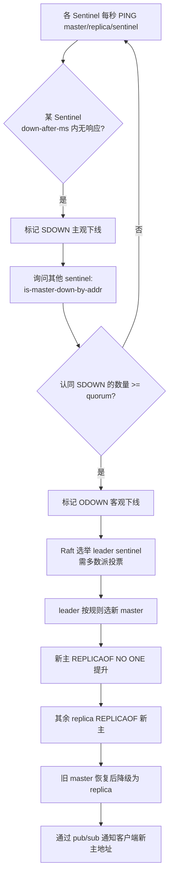

# 17 · 哨兵（Sentinel）

> 一套独立进程集群，负责监控主从、故障时自动选主并切换、通知客户端；主观下线 SDOWN → 客观下线 ODOWN → Raft 选 leader → 选新主 → 切换。面试重要度 ⭐⭐⭐ 高频。

## 📖 核心原理

主从复制解决了读扩展和数据冗余，但 master 宕机需要**人工**把某个 replica 提升为主、改配置、通知客户端——太慢。Sentinel（哨兵）就是把这套故障转移自动化的分布式系统。它是独立于数据节点的进程，本身也组成集群（生产至少 3 个、奇数个），四大职责：**监控（Monitoring）**、**通知（Notification）**、**自动故障转移（Automatic failover）**、**配置提供者（Configuration provider，客户端向 sentinel 问当前 master 地址）**。

**监控机制**：每个 sentinel 每秒向所有被监控的 master、replica、其他 sentinel 发 `PING`。它还通过订阅 master 的 `__sentinel__:hello` 频道自动发现其他 sentinel 和 replica——你只需在配置里写 master 地址，拓扑靠 gossip 式的 hello 消息自动补全。

**两级下线判定**是核心考点：
- **主观下线（SDOWN, Subjectively Down）**：单个 sentinel 在 `down-after-milliseconds` 内收不到某节点有效 PING 回复，它**自己认为**该节点挂了。这是一家之言，可能是网络抖动。
- **客观下线（ODOWN, Objectively Down）**：只对 master 有意义。当足够多的 sentinel（达到 `quorum` 配置值）都判定该 master SDOWN，它们通过 `SENTINEL is-master-down-by-addr` 互相询问确认后，达成"客观下线"共识，才真正触发故障转移。

**故障转移**：ODOWN 后，sentinel 们要先选出一个 **leader sentinel** 来主持这次转移（避免多个 sentinel 同时乱切）。选举用 **Raft 算法**的简化版：每个 sentinel 有 `configEpoch`（纪元），发起者向其他 sentinel 拉票，先拿到**多数派**（majority，> sentinel 总数的一半）票的成为 leader。注意：触发故障转移需要 `quorum` 个 SDOWN，但选 leader 需要**多数派**投票，两者是不同门槛——这也是为什么 sentinel 要奇数且 ≥3。

leader 选定后按规则挑选新 master、执行 `REPLICAOF NO ONE` 提升它、让其余 replica `REPLICAOF 新主`、并持续把旧 master 标记为 replica（恢复后自动变从）。

## 🔄 原理图 / 流程剖析

完整故障转移流程：

选新 master 的优先级规则（依次）：

| 阶段 | 判定 | 需要的票数 |
|---|---|---|
| SDOWN | 单个 sentinel 独立判定 | 1（自己） |
| ODOWN | 多个 sentinel 达成共识 | `quorum` 个 |
| 选 leader | Raft 拉票 | **多数派** majority（总数/2+1） |

## 🔑 面试要点

- **哨兵四职责**：监控、通知、自动故障转移、配置提供者（客户端问它要 master 地址）。
- **SDOWN vs ODOWN**：SDOWN 是单节点主观判定（`down-after-milliseconds`）；ODOWN 是达到 `quorum` 个 sentinel 共识、**仅针对 master**，是触发故障转移的前提。
- **两个门槛别混**：触发转移看 `quorum`；选 leader sentinel 看**多数派**。所以哨兵要 ≥3 且奇数，否则脑裂时选不出 leader。
- **选新主规则**：过滤不健康 replica → `replica-priority` 小者优先（0 表示禁选）→ 复制 offset 最大（数据最全）→ run_id 字典序最小。
- **Raft 选举 leader**：靠 `configEpoch` 纪元 + 拉票，先得多数票者主持本轮 failover，保证同一时刻只有一个 sentinel 切换。
- **客户端如何感知**：客户端连 sentinel，启动时 `SENTINEL get-master-addr-by-name` 拿主地址；订阅 `+switch-master` 事件，切主后收到通知重连新主。Jedis/Lettuce 的 sentinel 模式内置了这套逻辑。
- **哨兵不分片**：它只做高可用，数据仍是单 master 全量，容量/写受单机限制——要分片得上 Cluster。

## ❓ 高频面试题

**Q：quorum 和"多数派"是一回事吗？配 5 个哨兵 quorum=2 会怎样？**
A：不是。`quorum` 是判定 master **客观下线**所需的 sentinel 认同数，可以小于多数派；而真正执行 failover 的 leader sentinel 必须获得**多数派**（5 个里至少 3 个）授权。所以 quorum=2 时，只要 2 个 sentinel 觉得挂了就宣布 ODOWN，但接下来选 leader 仍需 3 票——若此时只有 2 个 sentinel 存活，能宣布 ODOWN 却选不出 leader，failover 卡住。这就是"quorum 控制敏感度、多数派控制授权"的双门槛设计。

**Q：哨兵怎么避免脑裂导致双主写入丢数据？**
A：脑裂指网络分区让旧 master 与部分客户端在一侧、sentinel+新 master 在另一侧，旧 master 仍接收写，切换后这些写丢失。缓解：给 master 配 `min-replicas-to-write 1` + `min-replicas-max-lag 10`，即 master 发现健康 replica 不足或延迟过大时**主动拒绝写**，牺牲少数派侧的可用性来限制脑裂丢数据窗口。这是 CAP 里偏向 CP 的取舍。

**Q：故障转移期间客户端会发生什么？如何做到少损失？**
A：转移窗口内（从 ODOWN 到新主就绪，通常数秒）写不可用。客户端配置正确时会：连不上旧主 → 报错/重试 → 收到 sentinel 的 `+switch-master` 通知或主动向 sentinel 重新查询 master → 连新主。要点是客户端必须走 sentinel 模式而非硬编码 IP，且实现重连退避。可通过调小 `down-after-milliseconds` 和 `failover-timeout` 缩短窗口，但太小会误判抖动。

## ⚠️ 易错点 / 加分项

- **误区：哨兵能解决容量/写扩展**。它只保高可用，数据不分片，写和内存仍是单 master 瓶颈。
- **`replica-priority=0` 的 replica 永不被选为主**，常用于纯备份/异地灾备节点——面试提到能加分。
- **offset 最大者优先，是"少丢数据"的关键**：选复制进度最快的 replica 当新主，能最大限度减少异步复制丢的量。
- **哨兵自身要奇数且分散部署**：全放一台机器，机器挂了哨兵集群也挂；跨机架/可用区部署才有意义。
- **`down-after-milliseconds` 是双刃剑**：调小切换快但易被网络抖动误判触发无谓 failover（failover 本身有代价，全量同步风险）。
- **failover 后配置会被 sentinel 改写**：它会 `SENTINEL SET` 并重写 sentinel 配置文件与各节点的 `replicaof`，别手动和它抢改配置。
- **`configEpoch`（纪元）** 单调递增，用于给每次 failover 版本化、解决旧 leader 复活后的冲突——能讲出 Raft 里 term 的类比是资深信号。
