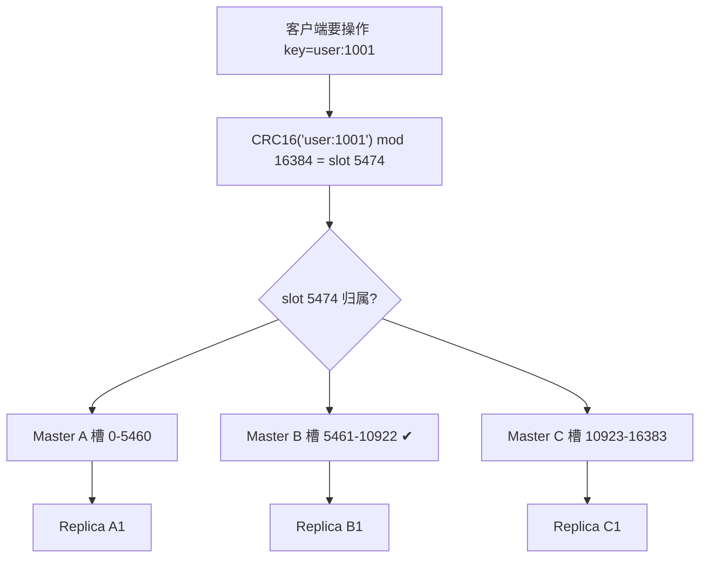
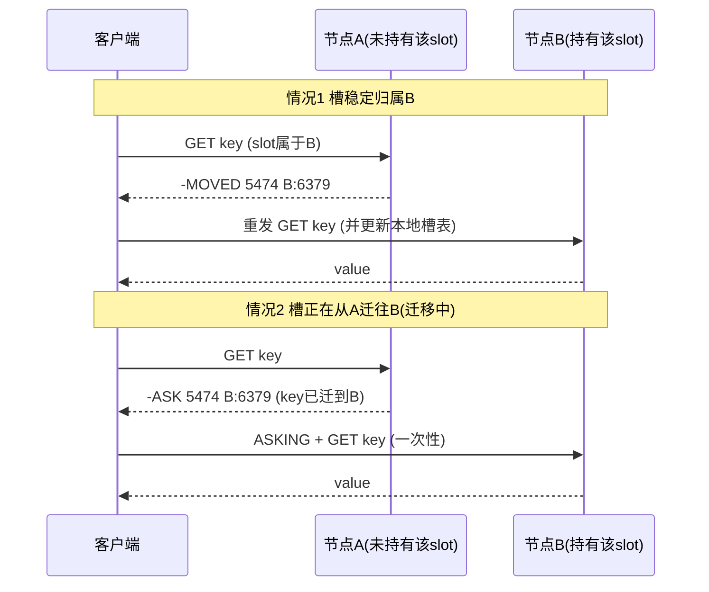

# 19 · 集群（Redis Cluster）

> 去中心化分片方案：16384 个 hash slot 均分到多个 master，CRC16 分槽，gossip 传播拓扑，MOVED/ASK 重定向，每个分片自带主从做故障转移。面试重要度 ⭐⭐⭐ 高频（重头）。

## 📖 核心原理

哨兵解决了高可用但不解决容量和写扩展——数据仍全量在一个 master。Redis Cluster 是官方的**去中心化分布式**方案：把数据水平切分到多个 master 上，每个 master 挂 replica 做故障转移，没有中心代理，客户端直连、节点间靠 gossip 协议自治。

**分槽（sharding）机制**：Cluster 把整个 key 空间划分为固定的 **16384 个 hash slot**。每个 key 归属哪个 slot 由 `CRC16(key) mod 16384` 决定；每个 master 负责一段 slot 区间（如 node A 管 0–5460）。数据落在哪个节点，取决于它的 slot 归谁。增删节点时**迁移的是 slot**（连同 slot 里的 key），而不是重新哈希全部数据——这是一致性哈希思想的简化落地，扩缩容只搬动部分数据。

**为什么是 16384（2^14）而不是 65536**：作者 antirez 的原始回答有三点。① 节点间用 gossip 交换槽位归属，心跳包里带一个 bitmap 表示"我负责哪些槽"，16384 bit = 2KB，65536 bit = 8KB，心跳包过大浪费带宽（心跳很频繁）。② Cluster 设计上不建议超过 ~1000 个节点，16384 槽足够把 key 均匀分散到千级节点。③ 槽位 bitmap 在节点少时压缩率高，16384 更省。核心就一句：**16384 在心跳带宽和分片粒度之间取平衡**。

**去中心化 gossip 协议**：没有配置中心，每个节点都保存整个集群的拓扑视图（谁负责哪些槽、谁是谁的主/从、谁疑似下线）。节点间通过**集群总线端口（数据端口 +10000）**用二进制 gossip 协议周期性交换 `PING/PONG`，每次随机挑几个节点带上部分其他节点的状态传播。拓扑变更（上下线、槽迁移、failover）最终一致地扩散到全网。

**故障检测与转移**：类似 sentinel 但内建在节点里。节点标记疑似故障为 `PFAIL`（possible fail，主观），通过 gossip 收集到超过半数 master 都认为某 master `PFAIL` 则升级为 `FAIL`（客观）。该 master 的 replica 发起选举，其余 master 投票（每个纪元每主一票），得多数票的 replica 提升为新 master 接管其 slot。

## 🔄 原理图 / 流程剖析

分槽与命令路由：

MOVED vs ASK 重定向（客户端连错节点时）：

MOVED 与 ASK 的本质区别：

| | MOVED | ASK |
|---|---|---|
| 含义 | 槽已**永久**属于目标节点 | 槽正在**迁移中**，该 key 临时在目标节点 |
| 客户端行为 | **更新本地 slot→node 映射**，后续直连 | **仅本次**转发，需先发 `ASKING`，不更新映射 |
| 语义 | 拓扑已稳定 | 拓扑迁移的过渡态 |

## 🔑 面试要点

- **16384 slot + CRC16**：`slot = CRC16(key) % 16384`，slot 分配给 master，扩缩容迁移 slot 而非 rehash 全量。
- **为什么 16384**：心跳 bitmap 带宽（2KB vs 8KB）、集群规模上限 ~1000 节点、bitmap 压缩率，综合平衡。
- **去中心化 gossip**：无中心节点，每节点持全局拓扑，集群总线端口（port+10000）用 PING/PONG 传播状态，最终一致。
- **MOVED（永久重定向，更新客户端槽表）vs ASK（迁移中临时重定向，需 `ASKING` 前缀，不更新槽表）**——高频区分点。
- **hash tag**：`{}` 内的内容参与 CRC16，如 `user:{1001}:name` 与 `user:{1001}:age` 落同一 slot，保证多 key 操作/事务/Lua 可用。跨 slot 的 `MSET`/事务会报 `CROSSSLOT`。
- **故障转移内建**：PFAIL（主观）→ 半数 master 认同 → FAIL（客观）→ replica 拉票，纪元内多数票者上位，无需外部哨兵。
- **智能客户端**：JedisCluster/Lettuce 启动时拉 `CLUSTER SLOTS` 缓存槽表，本地直算 slot 直连目标节点，仅在 MOVED 时刷新，几乎零重定向开销。

## ❓ 高频面试题

**Q：Cluster、Sentinel、Codis 怎么选？各自定位？**
A：**Sentinel** = 高可用，不分片，单 master 容量，适合数据量不大但要自动故障转移。**Cluster** = 官方去中心化分片 + 高可用，无中心代理、客户端直连，水平扩展写和容量，但多 key 操作受 slot 约束、运维略复杂。**Codis** = 豌豆荚开源的中心化代理方案（proxy + zookeeper/etcd 存槽表），客户端无感知（连 proxy 像连单机）、迁移平滑、支持异步迁移大 key，但多一跳代理有延迟、需额外维护 proxy 和配置中心。趋势是新项目用官方 Cluster，历史大规模集群仍有用 Codis 的。核心权衡：去中心化（Cluster，省一跳但客户端要智能）vs 代理化（Codis，客户端简单但多一跳、多组件）。

**Q：Cluster 扩容时槽迁移怎么保证不丢数据、迁移中的 key 怎么读？**
A：迁移以 slot 为单位、key 为粒度逐个 `MIGRATE`（原子的 dump→restore→del）。迁移中 slot 处于源节点 `MIGRATING`、目标节点 `IMPORTING` 状态：客户端访问该 slot 的 key 时，若 key 还在源节点，正常返回；若 key 已迁走，源节点回 **ASK** 让客户端带 `ASKING` 去目标节点取。因为单个 key 的迁移是原子的，且用 ASK 处理过渡态，所以迁移全程可读写不丢数据。全部 key 迁完后广播 slot 归属变更，之后走 MOVED。

**Q：Cluster 为什么至少 3 主？多 key 命令有什么限制？**
A：至少 3 主是因为故障判定和选举需要 master 多数派——2 主无法在 1 主挂掉时形成多数。加上每主 1 从做故障转移，生产最小是 3 主 3 从 6 节点。多 key 限制：`MSET`/`SUNION`/事务/Lua 涉及的所有 key 必须在**同一 slot**，否则报 `CROSSSLOT`。解决靠 **hash tag** `{}` 把相关 key 强制路由到同 slot。这是分片架构的固有约束——数据分散了，跨片原子操作就做不了。

## ⚠️ 易错点 / 加分项

- **误区：Cluster 用一致性哈希**。它用的是**固定 16384 槽**的哈希槽（hash slot），不是环形一致性哈希；槽是固定的、可显式分配和迁移，比一致性哈希更可控。
- **ASK 必须先发 `ASKING`**：直接向目标节点请求一个尚未正式归它的 slot 的 key 会被 MOVED 弹回源节点，形成"乒乓"。`ASKING` 是一次性令牌，告诉目标节点"这个迁移中的 key 请破例响应我一次"。
- **hash tag 只取第一个 `{}`**：`{a}{b}` 只有 `a` 参与计算；用错会导致本想同槽的 key 散开。
- **Cluster 下 `SELECT` 无效，只有 db0**：多库特性在 Cluster 里被禁用。
- **gossip 有传播延迟**：拓扑变更不是瞬时全网可见，短暂窗口内不同节点视图可能不一致，客户端靠 MOVED/ASK 纠偏。
- **replica 不自动分担读**：默认读也走 master；要读 replica 需客户端发 `READONLY`，且承担复制延迟带来的脏读。
- **大 key 是 Cluster 迁移杀手**：`MIGRATE` 单 key 迁移会阻塞，超大 key 迁移超 `cluster-node-timeout` 可能被判故障，扩容前要先治理大 key。
