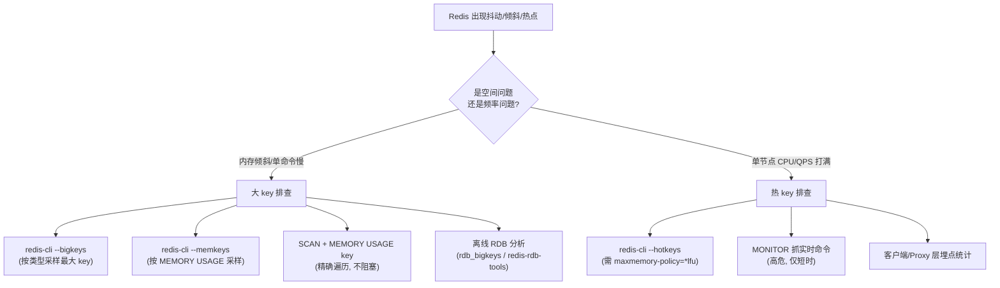

# 20 · 大 key 与热 key（Big Key & Hot Key）

> 大 key 是「单个 value 体积/元素过大」，热 key 是「单个 key 访问量过高」；前者压垮内存与单次操作耗时，后者压垮单节点流量。二者是 Redis 生产事故的高频根因。面试重要度：⭐⭐⭐ 高频重点。

## 📖 核心原理

**大 key（Big Key）——「量」的问题。** 指单个 key 对应的 value 占用内存过大，或集合类元素数量过多。业界经验阈值（非硬性）：`String` 类型 value > 10KB（严格些 > 1KB 就该警惕），`Hash`/`List`/`Set`/`ZSet` 元素个数 > 5000 或整体 > 10MB 属于大 key，元素达到百万级则是典型「巨型 key」。注意大 key 有两个维度：**总内存大**（一个 500MB 的 String）和**元素多**（一个 100 万字段的 Hash，即使总量不大，遍历/删除照样慢）。

大 key 的危害本质来自 Redis 的**单线程模型**（命令处理主线程串行执行，见 `01-overview.md`）：

- **阻塞其它请求**：对大 key 做 `HGETALL`/`LRANGE 0 -1`/`SMEMBERS`/`DEL` 这类 O(N) 操作，主线程会被单条命令长时间占用，期间所有其它客户端请求排队，表现为整体 P99 飙升甚至「假死」。
- **内存分布不均（数据倾斜）**：Cluster 下 key 按 CRC16 分到 16384 个 slot，大 key 会让它所在的那个节点内存远高于其它节点，扩容也无法均衡（一个 key 不可拆分到多 slot），造成木桶效应。
- **网络拥塞**：一次读取几百 MB 的 value，会瞬间打满该连接乃至网卡带宽，`redis-cli` 拉一个大 key 就可能拖慢整机。
- **删除大 key 卡顿**：`DEL` 是**同步删除**——它不仅要从字典移除 key，还要**同步释放** value 底层所有子对象的内存。删一个百万元素的 Hash，主线程要逐个 free 内存，可能阻塞数百毫秒到秒级。这是大 key 最隐蔽的杀手：平时不碰它没事，一删就抖动。

**热 key（Hot Key）——「频」的问题。** 指某个 key 在短时间内被极高频访问，如秒杀爆款商品详情、微博热搜话题、首页 banner 配置。热 key 的危害与大 key 正交：

- **单节点/单 slot 压力集中**：一个 key 只属于一个 slot、只落在一个主节点上。无论集群多少节点，对这个 key 的所有请求都打到**同一个 CPU 核心**（单线程）上，该节点 QPS 被单 key 打满而其它节点空闲。
- **Cluster 无法靠分片分摊**：分片是按 key 打散的，但热点是**单个 key 内部**的流量，分片对单 key 无能为力——这是热 key 和大 key 治理思路都绕不开的关键点。
- **雪崩放大**：热 key 若恰好过期（缓存击穿，见 `12-cache-problems.md` 如存在），瞬间大量请求穿透到 DB，可能压垮后端。热 key + 大 key 叠加（热点又是大 value）是最坏组合。

**一个易混点**：大 key 看的是 value 的**空间**，热 key 看的是访问的**频率**，二者独立。一个 1 字节的计数器 key 可以是超级热 key，一个从不被访问的 500MB key 是纯大 key。定位工具和治理手段也完全不同。

## 🔄 原理图 / 流程剖析

**大 key vs 热 key 定位思路：**



**同步 DEL vs 异步 UNLINK 释放内存：**

```mermaid
flowchart LR
    subgraph DEL["DEL bigkey（同步）"]
        A1[主线程移除 key] --> A2[主线程逐个 free<br/>百万子对象内存] --> A3[期间阻塞所有请求]
    end
    subgraph UNLINK["UNLINK bigkey（异步 4.0+）"]
        B1[主线程移除 key<br/>O(1) 逻辑摘除] --> B2[评估释放成本] --> B3[丢给 lazyfree<br/>后台线程慢慢 free] --> B4[主线程立即返回]
    end
```

`UNLINK` 会先估算释放代价（元素数 × 单位成本），只有代价大才丢后台线程，小对象仍同步删（避免线程调度反而更慢）。

## 🔑 面试要点

- **大 key = value 空间大或元素多**（String > 10KB、集合元素百万级）；**热 key = 单 key 访问频率极高**（秒杀商品、热搜）。二者正交，工具和治理都不同。
- **大 key 四大危害**：单线程下 O(N) 操作阻塞其它请求、Cluster 内存倾斜（一个 key 不可跨 slot）、大 value 网络拥塞、**同步 `DEL` 释放内存卡顿**。
- **大 key 定位**：`redis-cli --bigkeys`（分类型采样最大 key，但只报「最大」不报「多大算大」）、`--memkeys`（按内存采样）、`SCAN` + `MEMORY USAGE key`（精确、非阻塞、生产推荐）、离线 RDB 分析工具。
- **大 key 治理**：结构拆分（大 Hash 按 field hash 拆成多个 key/分片）、`UNLINK` 异步删（4.0+ lazyfree 后台释放）、压缩序列化、选对数据结构。
- **热 key 危害**：所有请求打到同一节点同一核心，Cluster 分片对单 key 无效，易叠加缓存击穿。
- **热 key 定位**：`redis-cli --hotkeys`（依赖 LFU 策略）、`MONITOR`（高危仅短时用）、客户端/Proxy 层埋点。
- **热 key 治理**：本地多级缓存扛读（JVM 进程内缓存，见 `../../java-learning`）、多副本打散（同数据写 N 个后缀 key 分散到不同 slot/节点）、读写分离靠从库分摊读、限流兜底。
- **`--bigkeys`/`--hotkeys` 都是采样式**，不是全量，只能定位「相对最大/最热」，精确排查要靠 `SCAN` + `MEMORY USAGE` 或离线 RDB。

## ❓ 高频面试题

**Q：为什么删除一个大 key 会阻塞 Redis？怎么优化？**
A：因为 `DEL` 是**同步删除**，且删除不只是从全局字典摘掉 key（那步是 O(1)），关键在于要**同步释放 value 底层每一个子对象的内存**。删一个百万字段的 Hash，主线程要循环 free 一百万块内存，Redis 单线程期间无法处理任何其它请求，阻塞可达数百毫秒甚至秒级。优化用 **`UNLINK`（4.0+）**：它先把 key 从字典逻辑摘除（O(1) 立即对客户端不可见），再把真正的内存释放丢给 **lazyfree 后台线程**异步慢慢做，主线程立即返回。还可以打开相关自动惰性释放开关：`lazyfree-lazy-expire`（过期删）、`lazyfree-lazy-eviction`（淘汰删）、`lazyfree-lazy-server-del`（`rename` 等隐式删）、`lazyfree-lazy-user-del yes`（让 `DEL` 行为等同 `UNLINK`）。注意 `UNLINK` 对小 key 仍同步删，因为丢线程的调度开销比直接删还大。

**Q：Cluster 集群下有大 key / 热 key，为什么加机器扩容也解决不了？**
A：因为 Redis 分片粒度是 **key**，而大 key/热 key 的问题都发生在**单个 key 内部**。大 key：一个 key 只能落在一个 slot / 一个节点，无法拆到多节点，扩容只会让它继续压在原节点上，造成内存倾斜（木桶效应）。热 key：对单个 key 的所有请求由 CRC16 固定路由到同一节点同一核心，其它节点再空闲也分担不了。所以扩容（加节点）对「单 key 热/大」无效，必须从**应用层**破题：大 key 主动拆成多个子 key 让它们散到不同 slot；热 key 用本地缓存把读挡在 Redis 之前，或把同一份数据写成 N 个带随机后缀的副本 key（`hotkey:1`…`hotkey:N`）分散到不同节点，读时随机选一个。

**Q：`redis-cli --bigkeys` 能完全信任吗？它有什么局限？生产上怎么精确排查大 key？**
A：不能完全信任。`--bigkeys` 底层是 `SCAN` 遍历 + 对每个 key 按**类型**记录「目前见过的最大」，它只告诉你每种类型里最大的那个 key 是谁、有多少元素/多大，是**采样式、相对值**，不会告诉你「超过阈值的所有大 key 列表」，而且它衡量集合类是按**元素个数**而非实际内存（一个字段很多但值都很短的 Hash 未必真占内存）。生产精确排查：用 `SCAN` 分批游标遍历（不阻塞，见 `08-*` 或渐进式 rehash 相关），对每个 key 执行 `MEMORY USAGE key`（返回该 key 含底层结构的实际字节数）自行设阈值筛选；或者用 `--memkeys`（按内存而非元素数采样）；最推荐**离线分析 RDB**（`redis-rdb-tools`、`rdb` 等工具），对备份文件全量扫描，零线上影响还能出报表。

**Q：热 key 用「多副本打散」方案，一致性怎么保证？**
A：多副本打散是把同一份数据冗余写成 `key#1`…`key#N` 共 N 份，客户端读时随机取一份，从而把流量分散到不同 slot/节点。代价是**写放大与一致性**：更新时要同时更新 N 个副本，无法原子，存在短暂不一致窗口。所以它只适合**读多写极少、且能容忍秒级不一致**的热点（如爆款商品的静态详情、配置项）。若要求强一致，优先用**本地缓存 + 合理过期 + 变更时主动失效**，把读挡在本地；写频繁的热点不适合副本打散，应考虑合并写（如计数类用本地聚合后批量刷）或分段（把一个热 key 计数拆成 N 个分片 key 求和）。

## ⚠️ 易错点 / 加分项

- **误区**：以为「大 key = 内存大」。集合类**元素多但每个值很小**同样是大 key——它的杀伤在 O(N) 遍历和删除耗时，`MEMORY USAGE` 值不一定大但一样致命，排查要同时看内存和元素数（`HLEN`/`LLEN`/`SCARD`/`ZCARD`）。
- **踩坑**：直接对大 key 用 `KEYS *`、`HGETALL`、`SMEMBERS`、`DEL` 一把梭。生产应改用 `SCAN`/`HSCAN`/`SSCAN` 游标分批读、`UNLINK` 异步删；`--bigkeys` 本身也别在业务高峰跑（虽是 SCAN，但仍占主线程 CPU）。
- **踩坑**：`MONITOR` 抓热 key 时长时间开着。`MONITOR` 会把每条命令都推给该连接，**本身就是性能杀手**（可致吞吐下降 50%+），只能在极短时间窗口应急用，绝不能常驻。
- **加分点**：`redis-cli --hotkeys` **依赖 LFU**——必须先把 `maxmemory-policy` 设为 `allkeys-lfu`/`volatile-lfu`（见 `10-eviction.md`），它才能通过 `OBJECT FREQ` 读到访问频率计数；默认 LRU 策略下 `--hotkeys` 不可用。
- **加分点**：从源头预防大 key——设计时对集合类做**容量上限**（如超过 5000 元素就分桶到新 key），String 存大对象前先评估是否该放对象存储（OSS/S3）而 Redis 只存指针。大 key 拆分后还能顺带利用 `listpack`（7.x 起 ziplist 全面换为 listpack，见 `01-overview.md`）在小集合下的紧凑内存布局。
- **面试怎么答**：先分清「大 key 是空间维度、热 key 是频率维度」两条独立主线 → 各自讲单线程/单节点导致的危害 → 定位工具（采样式 `--bigkeys`/`--hotkeys` vs 精确 `SCAN`+`MEMORY USAGE`/离线 RDB）→ 治理（大 key 拆分 + `UNLINK` 异步删；热 key 本地缓存 + 多副本打散）→ 点出「Cluster 扩容救不了单 key 热/大」这个本质，就是资深深度。
