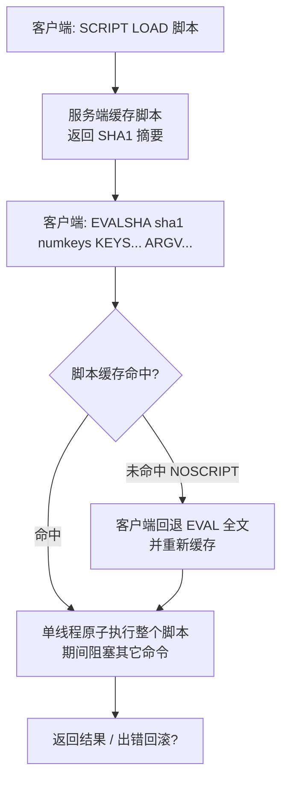

# 21 · Lua 脚本（Lua Scripting）

> 把一段 Lua 逻辑发到服务端**原子执行**，天然打包「读-改-写」复合操作；比 `MULTI/EXEC` 更灵活、可复用，是分布式锁、限流、原子扣减的首选。面试重要度：⭐⭐ 常考。

## 📖 核心原理

**为什么要有脚本**：客户端做「先读再判断再写」（比如比对锁值再删）时，读和写之间存在网络往返，两步之间可能被其它客户端插入，产生竞态。Redis 从 2.6 起内置 **Lua 解释器**，让你把这段逻辑发到服务端一次性跑完，中间不产生网络往返、也不被别的命令插入——把复合操作变成一个不可分割的整体。

**EVAL：直接传脚本执行**。语法 `EVAL script numkeys key [key ...] arg [arg ...]`。`numkeys` 告诉 Redis 后面前几个参数是 key（进入 `KEYS[]` 数组，下标从 1 开始），其余进入 `ARGV[]`。之所以要显式区分 key，是因为 **Cluster 模式要靠 key 计算 slot** 做路由和校验（所有 key 必须落在同一节点/同一 slot，否则报 `CROSSSLOT`），把 key 硬编码进脚本正文会让集群无法定位。

```lua
-- EVAL "return redis.call('SET', KEYS[1], ARGV[1])" 1 mykey hello
-- KEYS[1] = "mykey"，ARGV[1] = "hello"
```

**EVALSHA：传 SHA 复用省带宽**。每次 `EVAL` 都把整段脚本正文（可能几百上千字节）通过网络发一遍很浪费。做法是先用 `SCRIPT LOAD script` 把脚本缓存到服务端的**脚本缓存**里，返回该脚本的 **SHA1 摘要**（40 位十六进制）；之后只需 `EVALSHA sha1 numkeys ...`，网络上只传 40 字节的 SHA。客户端（如 Jedis/Lettuce/Redisson）通常封装成：**先 `EVALSHA`，若返回 `NOSCRIPT`（缓存未命中，比如服务重启或执行过 `SCRIPT FLUSH`）再回退到 `EVAL` 并重新缓存**。注意脚本缓存是运行态的、不进 RDB，重启即失。

**★ 原子性（重点）**：Redis **主线程单线程执行整个脚本，从第一条命令到最后一条命令期间不会被任何其它客户端的命令打断**——脚本执行时其它请求都在排队。所以脚本内的「读-改-写」是天然原子的，不会出现「读到旧值→别人改了→我再写」的竞态。这正是脚本最大的价值：**把多步逻辑收敛成一个原子单元**。代价是——单线程既是原子性的来源，也是风险的来源：脚本跑得慢就阻塞了全库（见下）。

**`redis.call` vs `redis.pcall`**：`redis.call` 执行 Redis 命令，若命令报错（如对 String 执行 `LPUSH`）会**直接抛出异常、终止脚本**并把错误返回给客户端；`redis.pcall`（protected call）则**捕获错误、以 Lua table 形式返回**（含 `err` 字段），让脚本自己判断和兜底、继续往下跑。需要事务式「出错即整体失败」用 `call`，需要自行处理错误分支用 `pcall`。

## 🔄 原理图 / 流程剖析

EVALSHA 复用与回退流程：



**易被误解的一点——脚本不保证「回滚」**：Lua 的原子性指「不被打断、要么整段执行」，**不是数据库事务的 ACID 回滚**。若脚本执行到第 3 条命令时因逻辑/类型错误中断，前 2 条已经生效的写**不会被撤销**（和 `MULTI/EXEC` 一样没有回滚，见 [14-transaction](14-transaction.md)）。所以脚本里要把「校验」放在「写入」之前。

## 🔑 面试要点

- **EVAL 传脚本正文 + numkeys + KEYS/ARGV**；`numkeys` 划分 key 与普通参数，key 单列是为 Cluster 路由（同 slot）。
- **SCRIPT LOAD → SHA → EVALSHA**：脚本只在首次传全文，后续传 40 字节 SHA 省带宽；客户端封装「EVALSHA 失败(`NOSCRIPT`)回退 EVAL」。脚本缓存不持久化，重启失效。
- **★ 原子性来自单线程整脚本执行、期间不被打断**，天然适合「读-改-写」复合原子操作；但**没有回滚**，出错不撤销已执行的写。
- **`redis.call` 出错即终止脚本**；**`redis.pcall` 捕获错误返回 table**，脚本自行处理。
- **脚本必须短快**：执行期间阻塞所有客户端，禁止慢逻辑、大循环、死循环；`lua-time-limit`（默认 5s）只是超时后允许 `SCRIPT KILL`（无写时），并不会自动中断有写的脚本。
- **非确定性命令要小心主从/AOF 一致性**：7.0 起默认 **effects replication**（只复制脚本产生的写效果，而非脚本本身），基本消除了旧版「脚本内用随机/时间导致主从数据分叉」的问题。
- **Redis 7.0 Functions（FUNCTION）** 是比 EVAL 更工程化、可持久化的服务端脚本方案（下文一句带过）。

## ❓ 高频面试题

**Q：Lua 脚本为什么是原子的？和 `MULTI/EXEC` 事务比，该用哪个？**
A：原子性来自 Redis **单线程执行整个脚本、中途不插入其它命令**，所以脚本里的多步操作对外表现为一个不可分割的整体。和事务相比：`MULTI/EXEC` 只是把命令**排队后一次性顺序执行**，命令之间不能拿前一条的返回值做判断、也没有 `if/for` 逻辑（`WATCH` 只能做乐观锁 CAS，冲突了整段作废需重试）；Lua 则可以**读到中间结果、写条件分支、循环**，还能 `SCRIPT LOAD` 复用。所以凡是「读出来判断再决定怎么写」的原子操作（比对锁值再删、检查库存再扣、限流计数），实践中**几乎都用 Lua 而不是事务**。两者共同的坑是**都不支持回滚**，出错不撤销已执行的写。

**Q：写一个原子扣减库存 / 分布式锁释放的脚本。**
A：分布式锁「比对 value 再释放」——不能用 `GET` + 客户端判断 + `DEL`（三步有竞态，可能删掉别人续期后的锁，见 [13-distributed-lock](13-distributed-lock.md)），要用脚本一步原子完成：

```lua
-- KEYS[1]=锁 key, ARGV[1]=当前客户端唯一标识(uuid)
-- 只有锁还是自己持有时才删，避免误删别人的锁
if redis.call('GET', KEYS[1]) == ARGV[1] then
    return redis.call('DEL', KEYS[1])
else
    return 0
end
```

原子扣减库存（校验在前、写在后，库存不足直接拒绝，杜绝超卖）：

```lua
-- KEYS[1]=库存 key, ARGV[1]=本次扣减数量
local stock = tonumber(redis.call('GET', KEYS[1]))
if stock == nil or stock < tonumber(ARGV[1]) then
    return -1                       -- 库存不足
end
return redis.call('DECRBY', KEYS[1], ARGV[1])   -- 返回扣减后余量
```

**Q：脚本里用了 `math.random` 或系统时间，主从会不会数据不一致？**
A：会有隐患，但看版本。旧版（<7.0 默认）走 **verbatim/script replication**——把整段脚本原样复制给从库和 AOF 重放，从库**重新执行一遍脚本**；若脚本内含随机数、`TIME`、`SRANDMEMBER` 等非确定性来源，主从各跑一次结果就不同，导致数据分叉。旧版为此要求脚本里若要用随机必须先 `redis.replicate_commands()` 切换成「复制写效果」模式，并在生成随机前调 `redis.set_repl(...)`。**Redis 5.0 起、7.0 作为默认**改为 **effects replication**：主库执行脚本后，把它**实际产生的写命令**（确定的最终效果）复制给从库和 AOF，从库不再重跑脚本，非确定性问题基本消除。加分点：即便如此，也建议随机种子/时间戳从 `ARGV` 传入，保证可复现与可测试。

## ⚠️ 易错点 / 加分项

- **误区：以为 Lua 有事务回滚**。它只保证「不被打断地整段执行」，脚本中途报错**已写入的不会回滚**——所以务必「先校验后写入」，把可能失败的判断放最前面。
- **踩坑：脚本写慢逻辑或大循环**。单线程执行期间**阻塞所有客户端**，一个 `for` 扫百万元素能让整个实例卡死；`SCRIPT KILL` 只能杀「还没产生写」的脚本，一旦脚本已经写过数据就只能 `SHUTDOWN NOSAVE` 强杀，代价极大。脚本要短、快、可预测。
- **踩坑：Cluster 下 `numkeys` 写错或多个 key 不同 slot**。所有被访问的 key 必须通过 `KEYS[]` 传入且同 slot（可用 hash tag `{...}` 强制同槽），否则 `CROSSSLOT` 报错；在脚本里硬编码 key 名会让集群无法路由。
- **加分点：EVALSHA 的 `NOSCRIPT` 回退要客户端处理好**。主从切换、`SCRIPT FLUSH`、实例重启都会清空脚本缓存，若客户端只发 EVALSHA 不回退 EVAL，就会大面积 `NOSCRIPT` 失败；成熟客户端（Redisson、Lettuce）已内置回退与自动重载。
- **加分点：Redis 7.0 的 Functions（FUNCTION）**。相较 EVAL/EVALSHA 的「运行态脚本缓存、重启即失」，Functions 是**以库（library）为单位注册、随 RDB/AOF 持久化、也随主从复制**的服务端脚本方案，用 `FUNCTION LOAD` 注册、`FCALL` 调用，把脚本当成数据库里的一等公民管理，更适合作为长期沉淀的服务端业务逻辑；一句话记：**Functions ≈ 可持久化、可复制、按库组织的升级版 EVAL**。
- **面试怎么答**：先点原子性来自单线程整脚本执行 → 对比事务讲清「可读中间值+条件分支+复用」的优势 → 给分布式锁/扣减库存的可运行脚本 → 补「无回滚、必须短快、Cluster 同 slot、非确定性用 7.0 effects replication」四个坑 → 最后一句带出 Functions，层次就到位了。
