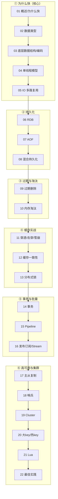

# Redis 面试知识合集 🔴（资深级别）

> 基于 **Redis 7.x** 主线，系统梳理"为什么快、数据结构、持久化、过期淘汰、缓存实战、分布式锁、主从/哨兵/Cluster"的**底层原理**。目标是资深/面试导向：讲透 how/why 与机制（单线程 + IO 多路复用、SDS/listpack/quicklist/skiplist 编码、RDB fork+COW、AOF 重写、混合持久化、Cache Aside 一致性、Redlock/看门狗、16384 槽重定向），不停留在命令罗列。涉及版本差异（`ziplist→listpack`、Redis 6 多线程 IO、混合持久化 4.0+）均会点明。

姊妹目录：[`../mysql`](../mysql) · 上层应用（Redisson/连接池/分布式锁业务侧）见 [`../../java-learning`](../../java-learning) · [`../../spring-learning`](../../spring-learning)。

---

## 一、知识点索引（推荐按编号顺序学习/复习）

| # | 知识点 | 一句话 | 重要度 |
|---|---|---|---|
| 01 | [Redis 概述·为什么快](01-overview.md) | 纯内存 + 单线程 + IO 多路复用 + 高效结构 + 全局哈希表 | ⭐⭐⭐ |
| 02 | [数据类型与应用场景](02-data-types.md) | 5 基本 + 4 扩展类型，计数/排行榜/锁/限流/去重/布隆 | ⭐⭐⭐ |
| 03 | [底层数据结构与编码](03-data-structures-internal.md) | SDS/listpack/quicklist/dict/intset/skiplist 与 redisObject 编码 | ⭐⭐⭐ |
| 04 | [单线程模型](04-single-thread-model.md) | 为什么单线程、瓶颈在内存/网络、Redis 6 多线程 IO | ⭐⭐⭐ |
| 05 | [IO 多路复用与事件循环](05-io-multiplexing.md) | epoll、文件事件处理器、Reactor、aeMain | ⭐⭐⭐ |
| 06 | [持久化·RDB 快照](06-persistence-rdb.md) | bgsave、fork + Copy-On-Write、触发时机、优缺点 | ⭐⭐⭐ |
| 07 | [持久化·AOF 日志](07-persistence-aof.md) | 命令追加、appendfsync 三策略、AOF 重写与缓冲 | ⭐⭐⭐ |
| 08 | [持久化·混合持久化](08-persistence-hybrid.md) | RDB 头 + AOF 增量，兼顾恢复速度与数据安全 | ⭐⭐⭐ |
| 09 | [过期删除策略](09-expiration.md) | 惰性删除 + 定期删除，过期 key 如何被清理 | ⭐⭐⭐ |
| 10 | [内存淘汰策略](10-eviction.md) | maxmemory-policy 8 种、LRU vs LFU 近似算法 | ⭐⭐⭐ |
| 11 | [缓存穿透/击穿/雪崩](11-cache-problems.md) | 三大问题成因与布隆过滤器/互斥锁/随机过期解法 | ⭐⭐⭐ |
| 12 | [缓存与数据库一致性](12-cache-consistency.md) | Cache Aside、延迟双删、binlog 订阅 | ⭐⭐⭐ |
| 13 | [分布式锁](13-distributed-lock.md) | SET NX PX、Redlock、Redisson 看门狗 | ⭐⭐⭐ |
| 14 | [事务](14-transaction.md) | MULTI/EXEC/WATCH、为什么不支持回滚 | ⭐⭐ |
| 15 | [Pipeline 与批量](15-pipeline.md) | 减少 RTT、与事务/原子性的区别 | ⭐⭐ |
| 16 | [发布订阅与 Stream](16-pubsub-stream.md) | Pub/Sub、Stream 消息队列与消费组 | ⭐⭐ |
| 17 | [主从复制](17-replication.md) | 全量/增量同步、repl backlog、psync | ⭐⭐⭐ |
| 18 | [哨兵 Sentinel](18-sentinel.md) | 故障发现、主观/客观下线、故障转移选举 | ⭐⭐⭐ |
| 19 | [Cluster 集群](19-cluster.md) | 16384 槽、MOVED/ASK 重定向、去中心化 | ⭐⭐⭐ |
| 20 | [大 key 与热 key](20-bigkey-hotkey.md) | 定位、危害与拆分/本地缓存/多副本治理 | ⭐⭐⭐ |
| 21 | [Lua 脚本](21-lua-scripting.md) | 原子性、EVAL/EVALSHA、与事务对比 | ⭐⭐ |
| 22 | [实战与最佳实践](22-best-practices.md) | 键设计、慢查询、连接池、监控与踩坑清单 | ⭐⭐ |

> 01~08 为"为什么快 + 底层结构 + 持久化"主线（本册重点），09~22 为过期淘汰/缓存实战/分布式/集群进阶。

---

## 二、学习路线图

---

## 三、资深面试冲刺清单（必须能手撕）

- **为什么快**：纯内存 + 单线程避免上下文切换/锁竞争 + IO 多路复用（epoll）+ 高效数据结构 + 全局哈希表 O(1) 定位。
- **底层结构**：SDS 相比 C 字符串的优势；`ziplist→listpack`（7.0）为什么替换；quicklist、dict 渐进式 rehash、跳表 vs B+树；每种类型"小用紧凑编码、大用指针结构"的转换阈值。
- **单线程与多线程**：为什么核心命令单线程执行；Redis 6 多线程 IO 只并行网络读写、命令仍单线程。
- **持久化**：RDB fork + Copy-On-Write 原理与 fork 卡顿；AOF 三种 `appendfsync` + 重写 + 两个缓冲区；混合持久化 RDB 头 + AOF 增量的加载流程。
- **过期与淘汰**：惰性 + 定期删除、8 种 `maxmemory-policy`、近似 LRU 与 LFU。
- **缓存实战**：穿透（布隆/空值）、击穿（互斥锁/逻辑过期）、雪崩（随机 TTL/多级缓存）、一致性（Cache Aside + 延迟双删 + binlog 订阅）、分布式锁（Redlock、看门狗续期）。
- **集群**：主从全量/增量同步、哨兵故障转移选举、Cluster 16384 槽与 MOVED/ASK 重定向。

> 规范见 [`../_CONVENTIONS.md`](../_CONVENTIONS.md)。
